# Project: VOLTRONIX

**Document Type:** Architecture + Learning Case Study  
**Part A:** Project Understanding  
**Part B:** Engineering Learning Guide  
**Purpose:** Understand, maintain, scale and independently build similar applications  
**Source of Truth:** Current repository

> Inspection scope: all current source-controlled application code, configuration, documentation, Git history and public-asset inventory were inspected. Generated `.next/`, installed `node_modules/`, Git internals and binary image pixels are intentionally not treated as authored source. This document describes the working tree, including its current uncommitted storefront refinements.

## Status language

- **IMPLEMENTED** means working code exists in this repository.
- **PARTIALLY IMPLEMENTED** means a useful shell, contract or mock exists, but a production dependency or workflow is absent.
- **PLANNED** means it is described by the Markdown blueprints but has no running implementation here.

# PART A — UNDERSTAND THE VOLTRONIX PROJECT

## A1. Project overview

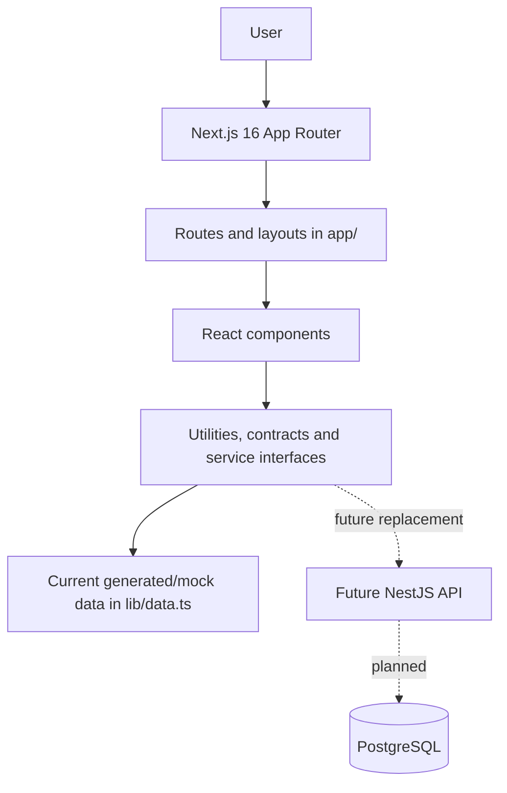

VOLTRONIX is currently a **frontend-first, quote-oriented electrical and gadget marketplace prototype**. It is a credible shopping interface, but it is not yet a transactional ecommerce system.

### IMPLEMENTED

- Next.js App Router storefront with home, category, search, product, cart, quote review and enquiry pages.
- A generated electrical catalogue plus a 30-item gadget seed catalogue.
- Central customer-facing category mapping with Electrical and Gadgets departments.
- Adaptive category/search filters, URL-based sorting and 12-item pagination.
- Product detail pages, local illustrative images, quantity controls, related products and recently viewed products.
- Browser-persisted quote cart using `skuId + quantity` identities.
- Honest BDT/quote-required presentation and pre-filled WhatsApp quotation messages.
- Interactive React Three Fiber/WebGL circuit hero with a non-WebGL fallback.
- SEO foundations: metadata, canonical helper, sitemap, robots, Open Graph, Product and Breadcrumb JSON-LD.
- Responsive read-only dashboard shell and catalogue-readiness views.
- Transport-neutral contracts and mock service interfaces that demonstrate a future API boundary.

### PARTIALLY IMPLEMENTED

- **Cart:** useful and persistent in one browser, but it has no server identity, customer account, stock validation or authoritative price validation.
- **Checkout:** collects quote-request details and opens WhatsApp; it cannot create an order or payment.
- **Product/SKU architecture:** contract types support `Product -> SKU[] -> Variant[]`, but every legacy product currently becomes exactly one default SKU with no selectable variants.
- **Service architecture:** interfaces and mock implementations exist, but most route pages still call `lib/data.ts` directly. Only cart restoration consumes the shared `cartService` facade.
- **Dashboard:** navigation, tables and catalogue-quality reports work, but operational modules deliberately show “not connected” states.
- **SEO:** code is present, but production canonical URLs and sitemap entries require `NEXT_PUBLIC_SITE_URL`.

### PLANNED

- NestJS backend and PostgreSQL.
- Real product, category, brand, price, supplier and stock records.
- Authentication and role-based access control.
- Product/SKU/image CRUD and validated CSV imports.
- Inventory balances, reservations and movement ledger.
- Orders, payments, verified webhooks, fulfillment, returns and refunds.
- Courier, object-storage/CDN, notifications, accounting export, monitoring and backups.

### Maturity assessment

The repository is best described as a **strong frontend prototype and weak production-commerce system**. Browsing and quote intent are coherent. Business truth—price, stock, customer, order, payment and audit history—does not exist on a server.

There is no `backend/` directory. NestJS is an intended architecture from `ROADMAP.md`, `OPERATIONS.md` and `DATA_MODEL.md`, not an installed or running subsystem.

## A2. File and folder architecture

```text
VOLTRONIX/
├── app/                       route tree, layouts, metadata and route UI
│   ├── category/[slug]/       dynamic catalogue listings
│   ├── product/[id]/          dynamic product details
│   ├── search/                query-driven listing
│   ├── cart/, checkout/       client quote flow
│   ├── dashboard/             internal read-only preview
│   └── ...                    account and enquiry routes
├── components/
│   ├── home/                  hero, categories, trust strip, WebGL scene
│   ├── catalog/               filter/sort/category controls
│   ├── product/               gallery and specification presentation
│   ├── dashboard/             reusable internal UI primitives
│   ├── seo/                   safe JSON-LD output
│   └── ui/                    selected reusable animated controls
├── lib/
│   ├── catalog/               product type, navigation, images, gadgets
│   ├── contracts/             future backend-facing domain types
│   ├── services/              interfaces and current mock implementations
│   ├── adapters/              legacy model compatibility bridge
│   ├── dashboard/             catalogue-readiness selectors
│   └── data/filter/SEO/etc.   current domain logic
├── public/                    browser-served icons and product illustrations
├── assets/reference/          design/product references, not served at runtime
├── docs/                      architecture notes
└── *.md                       guardrails and future operating blueprints
```

### Important responsibilities

| Location | Responsibility | Input | Output / consumers | Why it exists |
|---|---|---|---|---|
| `app/layout.tsx` | Root layout and global metadata | `children` | HTML shell, JSON-LD and `CartProvider` for every route | One global application boundary |
| `app/page.tsx` | Homepage composition | catalogue selectors | Hero, category browser, three 8-item showcases and CTAs | Curated discovery, not full catalogue |
| `app/category/[slug]/page.tsx` | Dynamic category/hub page | `params.slug`, `searchParams` | Filtered/sorted/paginated `ProductGrid` | One implementation serves all public categories |
| `app/product/[id]/page.tsx` | Dynamic product detail | slug or ID | Gallery, facts, actions, specs and related items | Customer decision page |
| `app/search/page.tsx` | Full catalogue search | query-string state | Search results with same filter pipeline | Shareable, browser-native catalogue state |
| `components/site-header.tsx` | Search, department navigation and cart count | central navigation + cart context | Desktop/mobile header | Shared navigation without duplicated category definitions |
| `components/product-card.tsx` | Compact reusable product summary | legacy `Product` | Link and quote/cart action | Reused by home, category, search and related sections |
| `components/cart-provider.tsx` | Shared client cart state | product and quantity | context operations, count and subtotal | Small state need; no Redux necessary |
| `lib/data.ts` | Current catalogue compatibility source | static tuples + gadget seed | search/category/product selectors | Preserves stable IDs/SKUs/slugs while backend is absent |
| `lib/catalog/navigation.ts` | Public taxonomy | raw source-category names | hubs, leaves, links and lookup helpers | Prevents route/category drift |
| `lib/facet-config.ts` | Canonical filter definitions | category slugs | filter keys, labels, units and sort choices | Makes filters data-driven |
| `lib/catalog-filter.ts` | Pure listing pipeline | products + URL params | parsed filters, facets, sorting and pages | Reusable, deterministic, testable logic |
| `lib/contracts/` | Transport-free future domain model | TypeScript types | mock services and later HTTP clients | Decouples UI thinking from a future API transport |
| `lib/services/` | Service interfaces/facade | contract requests | current mock services; later HTTP services | Planned replacement seam |
| `lib/adapters/legacy-product-adapter.ts` | Flat-product compatibility | legacy `Product` | contract `Product` with one default SKU | Avoids a risky one-shot migration |
| `lib/whatsapp.ts` | Central communication templates | product/cart/form data | encoded `wa.me` URLs | Consistent quotation handoff |
| `public/products/generated/` | Local category illustrations | static assets | `next/image` | No product-image hotlinking |
| `components/home/lumen-circuit/` | Actual Three.js implementation | circuit state and pointer events | interactive Canvas | Isolates fragile WebGL code |
| `lib/dashboard/catalog-data.ts` | Dashboard readiness projections | current catalogue | metrics, tables, filters and pages | Shows honest catalogue gaps without fake operations |

`assets/reference/` contains screenshots and source references. It is not a public runtime folder. Root Markdown files describe intent and guardrails; when a document conflicts with code, the current code is authoritative.

## A3. Application boot and Next.js flow

`pnpm dev` runs `next dev`. In this project the sequence is:

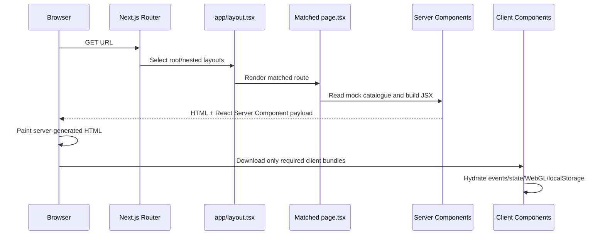

### How this repository uses App Router concepts

- `app/layout.tsx` is the required root layout. It imports `globals.css`, exports site metadata and wraps every route with `CartProvider`.
- A folder containing `page.tsx` becomes a URL. For example, `app/cart/page.tsx` becomes `/cart`.
- `app/category/[slug]/page.tsx` and `app/product/[id]/page.tsx` are dynamic routes. Square brackets declare a parameter.
- In Next.js 16, this code types `params` and `searchParams` as Promises and awaits them.
- Files without `'use client'` are Server Components by default. Homepage, category, search and product pages calculate static/mock data on the server side.
- Client Components include header interaction, forms, cart, image gallery, WebGL, animated buttons and recently viewed state. They use `'use client'` because they require hooks, events, `window`, `localStorage` or Canvas.
- `generateStaticParams()` enumerates category slugs and the 176 visible product slugs for pre-rendering.
- `notFound()` selects `app/not-found.tsx` when a category or product lookup fails.
- `loading.tsx` supplies route loading UI; `error.tsx` supplies a client error boundary.
- Hydration attaches React behavior to server-generated markup. Browser-dependent reads are in effects or `ssr: false` boundaries, reducing mismatch risk.

Static generation is especially suitable here because current data is a source file. Search and category routes can still be rendered dynamically when their query strings vary. Once a real API exists, caching/revalidation decisions must be revisited.

## A4. Routing

“Server” below means the route page is a Server Component; it may render nested Client Components.

| URL | File | Page boundary | Params / search params | Current data | Main components | Purpose |
|---|---|---|---|---|---|---|
| `/` | `app/page.tsx` | Server | none | `products`, priority/trending selectors | `SiteHeader`, `Hero`, `CategoryBrowser`, `Showcase`, footer | Curated discovery |
| `/category/[slug]` | `app/category/[slug]/page.tsx` | Server | `slug`; facets, `sort`, `page` | central navigation + `lib/data.ts` | selector, filters, sort, grid | Leaf or department catalogue |
| `/category/electrical` | same dynamic route | Server | hub slug | 146 visible electrical items | same | All electrical department |
| `/category/gadgets` | same dynamic route | Server | hub slug | 30 gadget items | same | All gadgets department |
| `/product/[id]` | `app/product/[id]/page.tsx` | Server | ID or slug | `getProduct()` | gallery, purchase actions, specs, related/recent | Product decision |
| `/search` | `app/search/page.tsx` | Server | `q`, facets, `sort`, `page` | `searchProducts()` | filters, sort, grid | Full search/catalogue |
| `/cart` | `app/cart/page.tsx` | Client | none | cart context/localStorage | quote lines and summary | Review product intent |
| `/checkout` | `app/checkout/page.tsx` | Client | none | cart context + form state | contact form and summary | Prepare WhatsApp quote request |
| `/price-challenge` | `app/price-challenge/page.tsx` | Client | none | local form state | form + WhatsApp builder | Ask for price review |
| `/solutions` | `app/solutions/page.tsx` | Client | none | local form state | project form | Project/BOQ enquiry |
| `/wholesale` | `app/wholesale/page.tsx` | Server | none | static content | header/footer + WhatsApp link | Bulk enquiry entry |
| `/account` | `app/account/page.tsx` | Server | none | static placeholder | header/footer | Honest “not connected” account state |
| `/dashboard` | `app/dashboard/page.tsx` | Server | none | dashboard catalogue projections | metrics and readiness table | Read-only overview |
| `/dashboard/products` | `app/dashboard/products/page.tsx` | Server | `q`, readiness, `page` | `lib/dashboard/catalog-data.ts` | filter bar, table, pagination | Product data-quality preview |
| `/dashboard/reports` | `app/dashboard/reports/page.tsx` | Server | none | catalogue readiness | metrics and category table | Completeness report |
| `/dashboard/inventory` | route page | Server | none | none | `OperationUnavailable` | Mock empty state |
| `/dashboard/orders` | route page | Server | none | none | `OperationUnavailable` | Mock empty state |
| `/dashboard/purchases` | route page | Server | none | none | `OperationUnavailable` | Mock empty state |
| `/dashboard/suppliers` | route page | Server | none | none | `OperationUnavailable` | Mock empty state |
| `/dashboard/customers` | route page | Server | none | none | `OperationUnavailable` | Mock empty state |
| `/dashboard/quotes` | route page | Server | none | none | `OperationUnavailable` | Mock empty state |
| `/dashboard/settings` | route page | Server | none | hardcoded integration rows | `DataTable` | Read-only future boundaries |
| `/robots.txt` | `app/robots.ts` | metadata route | none | SEO helper | none | Crawler policy |
| `/sitemap.xml` | `app/sitemap.ts` | metadata route | none | public routes/catalogue | none | Discovery when domain configured |
| `/opengraph-image` | `app/opengraph-image.tsx` | generated image route | none | static brand content | `ImageResponse` | Social preview |

Nested `layout.tsx` files for account/cart/checkout/search/dashboard add route-specific metadata or shell behavior. There are no API routes or server actions.

## A5. Page and layout architecture

### Homepage

`SiteHeader -> Hero -> TrustStrip -> CategoryBrowser -> Most Popular -> Gadget Essentials -> Trending Now -> pricing/project CTAs -> SiteFooter`.

The homepage intentionally limits each showcase to eight items. A `Set` in `app/page.tsx` prevents duplication across the three product groups. `CategoryBrowser` swaps between nine Electrical cards and six Gadget cards without adding catalogue-scale content to the home page.

### Category/search

`Header -> breadcrumb/title -> compact category selector -> responsive filter/listing grid -> SortSelect -> ActiveFilters -> ProductGrid -> pagination -> Footer`.

At large sizes the filter is a sticky 260px sidebar. On smaller sizes it becomes a native `<details>` disclosure. Product grids are two columns on mobile, three from `md`, and four from `xl`, capped at 1320px for controlled card width.

### Product

`Header -> breadcrumb -> gallery + product information -> price/availability/actions -> specification table -> related products -> recently viewed -> Footer`.

The main product area changes from one column to a two-column layout at `lg`. The illustration label explicitly warns that the category image may not depict the exact model.

### Cart/checkout

Both become two-column layouts on large screens: editable lines/form on the left and a sticky-like summary block on the right. Mobile keeps a single linear reading order.

### Dashboard

`app/dashboard/layout.tsx -> DashboardLayout -> Sidebar + sticky Topbar + route content`. Desktop reserves 18rem for the sidebar; mobile uses a controlled overlay drawer. Tables are horizontally scrollable when necessary.

Global spacing relies on `.container-shell`: at most 1440px, with 20px side space on desktop and 14px on mobile. Page-level Tailwind classes define vertical rhythm rather than one global section component.

## A6. Component architecture

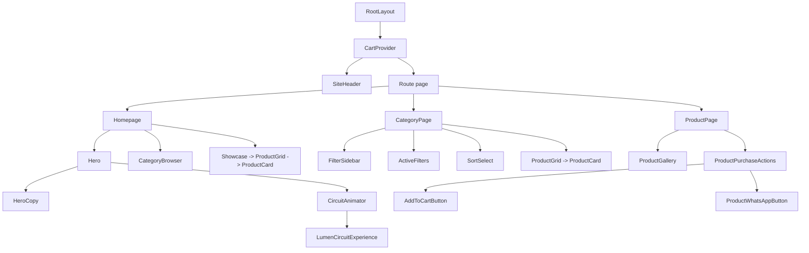

### Classification

| Class | Components | Main inputs/state |
|---|---|---|
| Layout/navigation | `SiteHeader`, `SiteFooter`, dashboard shell/topbar/sidebar | header search text, open menu, pathname, cart count |
| Catalogue | `CategorySelector`, `FilterSidebar`, `ActiveFilters`, `SortSelect`, `ProductGrid`, `ProductCard` | product arrays and URL-derived params |
| Product | `ProductGallery`, `ProductSpecifications`, `ProductPurchaseActions`, `RecentlyViewedProducts` | one product, image/quantity/recent state |
| Client state | `CartProvider` | shared cart lines, hydration status, localStorage |
| UI/animation | `ElectricButton`, `BrandLogo`, `AddToCartButton` | deterministic animation state and click feedback |
| Home | `Hero`, `HeroCopy`, `CircuitAnimator`, `CategoryBrowser`, `TrustStrip`, `Showcase` | active department, pointer/circuit state |
| Dashboard primitives | `DataTable`, `FilterBar`, `MetricCard`, `StatusBadge`, `EmptyState`, pagination/header/layout components | generic typed rows and presentation props |
| Forms | quote review, project and price-challenge route components | local controlled inputs; no persistence |

Good boundaries are visible: pure data transforms live under `lib`, reusable presentation under `components`, and route composition under `app`. The main inconsistency is that service abstractions are newer than the pages, so direct `lib/data.ts` imports remain.

## A7. Product, SKU, variant and catalogue

### Current display model — IMPLEMENTED

`lib/catalog/types.ts` defines a flat `Product` with:

- identity: `id`, `sku`, `name`, `slug`;
- classification: raw `category`, `subcategory`, tags, priority and trending;
- content: descriptions, brand, applications and specifications;
- structured adaptive-filter values in `attributes`;
- image object with primary, gallery and search hint;
- BDT pricing with nullable cost/selling price;
- nullable availability plus a broad `stockMode` display hint;
- supplier placeholders and active status.

`lib/data.ts` converts a stable ordered tuple list into deterministic IDs (`item-003`), SKUs (`VLT-0003`) and slugs. It intentionally publishes every second row within each raw category, leaving 146 electrical items visible while retaining the full source order. All 30 gadget seeds are visible, for 176 visible products.

### Backend-facing contract — PARTIALLY IMPLEMENTED

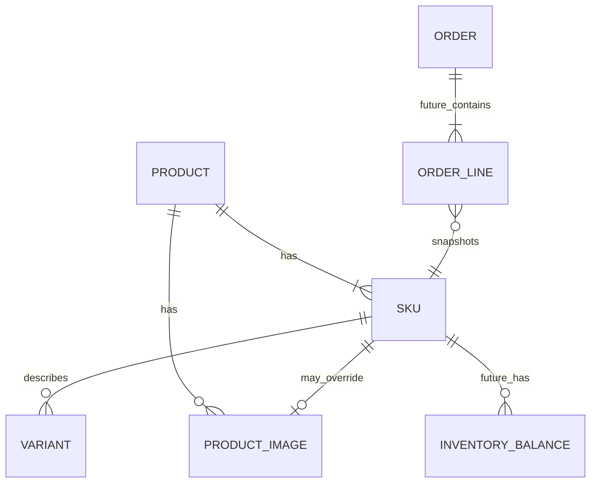

`lib/contracts/catalog.ts` defines `Product`, `SKU`, `Variant` and `ProductImage`. `legacyProductToCatalogProduct()` maps one current flat product to one default SKU. The SKU ID equals the stable legacy SKU code. `variants` is always empty today.

### Evidence-based examples

- Current `2.5 sqmm Single Core Copper Wire` is a separate flat item (`VLT-0003`) with inferred `cable_size_mm2: 2.5`, conductor Copper and type Wire.
- Current `3 Core Flexible Cable` is another flat item (`VLT-0007`) with `cores: 3`. The repository does **not** model “2.5mm² + 3 core” as two options of one cable product.
- Current catalogue has individual 1P MCB rows and one combined “Common 2P MCB: 16A, 20A, 32A, 40A” source row. It does **not** yet model a parent MCB with selectable 32A/2P SKU.

The future correct model is:

```text
Cable product
  -> size 2.5mm² + 3 cores + colour + length
  -> one unique sellable SKU

MCB product
  -> 32A + 2 pole + curve + breaking capacity
  -> one unique sellable SKU
```

Price and stock belong to that SKU, not merely to the marketing product.

## A8. Category and Gadgets architecture

There are three classification layers:

1. **Raw/source category** stored on each product, such as `House Wiring & Cable`.
2. **Public navigation category** mapping one or more raw categories to a stable customer slug.
3. **Department hub** aggregating public categories into Electrical or Gadgets.

Tags are search helpers; they are not the primary category relationship. There is no database category entity or alias table yet.

```text
Electrical (/category/electrical) — 146 visible items
├── Electrical & Wiring
├── Switches & Sockets
├── Lighting & Fans
├── Circuit Protection
├── Tools & Testers
├── Electronics & Repair
├── Power & Backup
├── Smart Electrical
└── Home Solutions

Gadgets (/category/gadgets) — 30 visible items
├── Mobile Accessories — 5
├── Charging & Power — 5
├── Computer & Desk — 5
├── Wearables & Personal Care — 5
├── Portable Fans & Lights — 5
└── Device Care & Utility — 5
```

`leafNavigationCategories` is the authoritative leaf list. `electricalCategories`, `gadgetCategories`, aggregate hubs and `catalogueNavigationGroups` derive from it. Header, homepage, route generation, filtering and sitemap reuse those values.

This solves a common 404 problem: UI labels and slugs no longer need separate hardcoded arrays. The remaining future need is a database-level category table plus explicit redirect/alias history when public slugs change.

## A9. Filtering, search and pagination

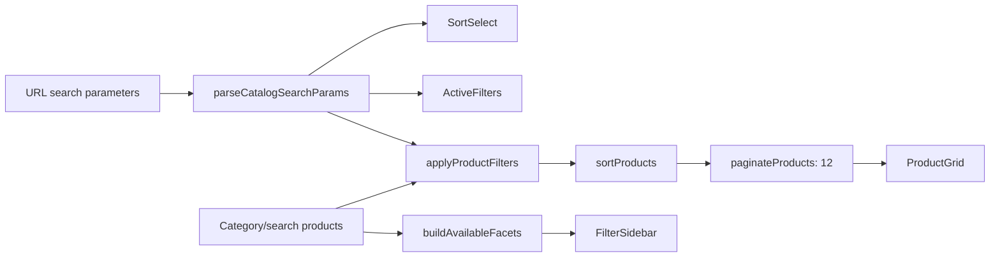

### Canonical behavior

- `facetConfig` defines key, label, type, unit, applicable category slugs and optional option cap.
- `facetKeys` prevents arbitrary query keys from becoming filters.
- A category sees only configured facets that have at least two values in the current source products.
- Checkbox values for the same key are OR conditions; different keys are AND conditions.
- Options include counts calculated from the category/search result before selected filters are applied.
- The filter form uses GET, so state is shareable, bookmarkable and browser-navigation friendly.
- `ActiveFilters` creates removable URL chips; `SortSelect` preserves filters while changing sort.
- Invalid/non-positive pages become 1. Oversized pages clamp to the last page.
- Price sorting is disabled/falls back when a result set has no confirmed prices.

Example:

```text
/category/electrical-wiring
  ?cable_size_mm2=2.5
  &cores=3
  &sort=price_asc
  &page=2
```

Interpretation:

1. Validate the `electrical-wiring` category and obtain its raw source categories.
2. Parse `cable_size_mm2` and `cores` because they are canonical facet keys.
3. Keep products with size `2.5` **and** core count `3`.
4. Sort priced matches ascending, with missing prices placed last.
5. Return the second 12-item slice, clamped safely if it does not exist.

With current mock rows this exact combination may produce no product, because size and core counts often exist on separate flat source entries. That is a data-model limitation, not a parser defect.

This design is backend-friendly at the URL/UX level, but the computation itself is in-memory. A NestJS endpoint will eventually need to validate the same canonical keys and implement database/search-index filtering plus counts.

## A10. Product page

`app/product/[id]/page.tsx` accepts an ID or slug, calls `getProduct()`, and invokes `notFound()` for a miss. It also creates per-product metadata and, when a production site URL exists, Product and Breadcrumb JSON-LD.

### Current product-detail flow — IMPLEMENTED

1. Resolve product and its public category.
2. Create an honest summary through `getProductSummary()` rather than presenting generated text as verified technical truth.
3. Show `ProductGallery`, which de-duplicates primary/gallery paths and flags generated/fallback imagery as illustrative.
4. Show title, SKU, optional brand, public category and up to four technical highlights.
5. Show BDT price or `Request price`, plus unverified-availability language.
6. `ProductPurchaseActions` owns quantity state from 1–99.
7. `AddToCartButton` adds to the frontend quote/cart and gives temporary visible/screen-reader feedback.
8. `ProductWhatsAppButton` opens a message containing product, SKU, quantity and current page URL.
9. `ProductSpecifications` renders identity plus structured attributes/specifications.
10. Same-raw-category related products and browser-stored recently viewed products follow.

There is no variant selector because the current legacy product has one SKU. The future selection sequence is:

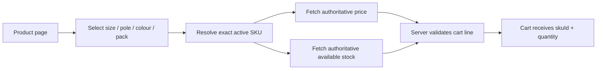

Never calculate a variant SKU by trusting display labels alone. The API must return an actual SKU record for the chosen option combination.

## A11. Cart and checkout

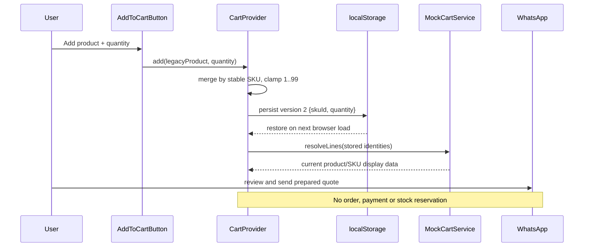

### Actual state

`CartProvider` is a client Context containing lines, `add`, `setQty`, `remove`, `clear`, count, subtotal and hydration state. It stores only versioned `{skuId, quantity}` data under `voltronix-cart`; legacy v1 product-ID lines are migrated when read. Invalid JSON or unavailable storage safely produces an empty cart.

Quantities are integer-clamped to 1–99. The visible subtotal uses `sellingPrice * qty`. A null price contributes zero to the **priced subtotal**, while separate quote-required counts prevent a misleading zero-price claim.

The current provider duplicates some mock-service subtotal logic for responsive local state. That is acceptable for a demo, but a production system must treat the browser subtotal as an estimate.

### Checkout reality

`app/checkout/page.tsx` is a controlled form that puts name, phone, delivery area and notes into a WhatsApp draft. It does not persist those contact fields. `CheckoutPreview.orderSubmissionAvailable` is literally typed `false` in the future-facing contract, and the visible page does not currently consume `checkoutService`.

Production contract:

```text
Frontend sends: skuId + quantity (+ customer intent)
Backend resolves: active SKU, price, promotions, stock, tax and shipping
Backend returns: validated lines and totals
Backend transaction creates: order + reservation + idempotency record
```

The frontend price is never authoritative because it can be stale, cached or deliberately edited in browser memory.

### Known cart edge cases

- An extremely early click before asynchronous restore finishes could be overwritten by restored state.
- No cross-tab `storage` synchronization exists.
- A visually disabled checkout `Link` uses CSS pointer blocking but lacks complete keyboard-disabled semantics.
- Browser storage is device/browser specific and not a customer account.

## A12. Three.js hero

The repository does **not** use an iframe or a public standalone Three.js HTML file. The real path is:

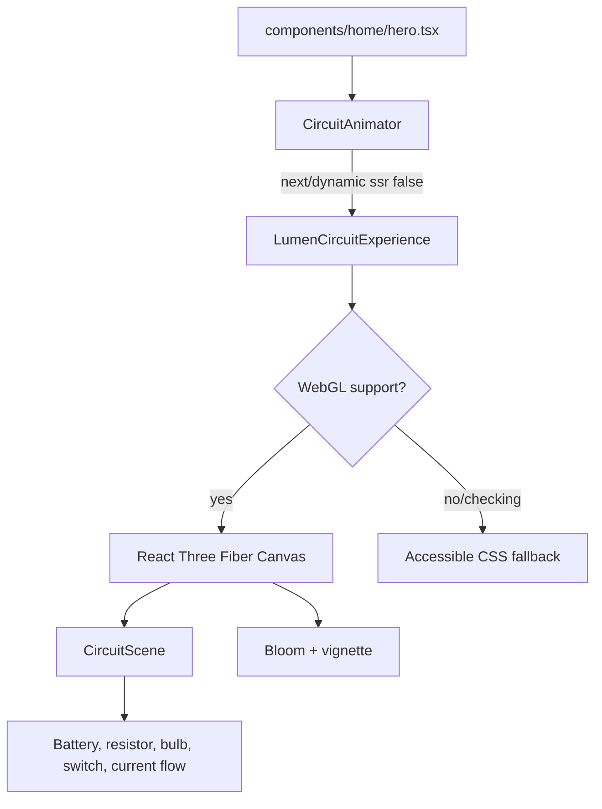

`CircuitAnimator` dynamically imports the experience with `{ ssr: false }`, so WebGL and browser APIs never execute during server rendering. `LumenCircuitExperience` manages a coarse state machine: `off -> arming -> on -> disarming`. It exposes a semantic switch and polite status output.

`scene.tsx` composes lighting, camera drift, board, wires and circuit parts. `circuit-parts.tsx` uses `useFrame` for material/lever/electron updates. `geometry.ts` creates deterministic paths; `stone-texture.ts` creates deterministic procedural textures and disposes resources. Reduced motion lowers device pixel ratio and shortens transitions. WebGL detection provides a usable fallback.

Performance choices already present include DPR limited to 1–1.5, postprocessing multisampling disabled, one dynamic client chunk and controlled bloom. Remaining cost: the 3D chunk still loads on homepage entry rather than near-viewport/idle, and the whole `Hero` wrapper is a Client Component even though much of its layout is static.

No `Math.random()`, `Date.now()` or external Three.js CDN usage appears in application source. The small “Live circuit flow” overlay can conflict semantically with the circuit’s initial “open” status.

## A13. Styling and UI system

### Actual system

- Tailwind CSS 3 scans `app/`, `components/` and an unused `ui/` glob.
- `app/globals.css` imports Tailwind layers, site variables, base element rules, `.container-shell`, typography helpers, focus utilities and the custom brand-spark CSS.
- `tailwind.config.ts` extends brand blue, neutral supplier surfaces, Rajdhani display type and Chivo/Inter body type.
- `hero-copy.module.css` and `lumen-circuit.module.css` contain locally scoped animation/3D styles.
- Google Fonts are loaded with a runtime CSS `@import`, not `next/font` or local files.

Main breakpoints follow Tailwind defaults (`sm`, `md`, `lg`, `xl`). Common design language is dark navy, white/off-white surfaces, blue commerce action and restrained borders/shadows. Some older semantic class names remain: the custom Tailwind `yellow` token currently maps to blue, which is misleading for maintainers.

### Interaction primitives

- `ElectricButton` is a deterministic Framer Motion Link/button with a short scan shine, five fixed spark positions and reduced-motion support. It is used for selected hero/home CTAs, not globally.
- `AddToCartButton` is a separate specialized control: it swaps to a check/Added label, darkens briefly and applies subtle hover/tap movement. Its `electric` prop currently changes minimum width; it does not delegate to `ElectricButton`.
- `BrandLogo` calculates pointer location/direction/velocity and writes CSS custom properties. Fixed SVG arc frames and CSS particles produce the logo current effect without random render values.

Tradeoff: the current system is fast to edit and avoids a large component library, but repeated raw Tailwind strings mean buttons/fields/surfaces are not yet fully standardized.

## A14. Packages and build tooling

Versions below are resolved from `pnpm-lock.yaml`; caret ranges in `package.json` can be lower.

| Package | Resolved version | Purpose | Where used | Essential now? | Notes |
|---|---:|---|---|---|---|
| `next` | 16.3.3 | App Router, rendering, routes, metadata, Image/Link | whole app | Yes | Requires Node >=20.9 |
| `react` / `react-dom` | 19.2.4 | component/runtime model | whole app | Yes | package range starts at 19.1 |
| `typescript` | 5.9.3 | strict source checking | `.ts/.tsx` | Yes | `allowJs: false`, `noEmit: true` |
| `tailwindcss` | 3.4.19 | utility styling | app/components | Yes | processed through PostCSS |
| `postcss` | 8.5.6 | CSS transform pipeline | build | Yes | tooling only |
| `autoprefixer` | 10.5.4 | vendor CSS prefixes | build | Yes | tooling only |
| `lucide-react` | 0.468.0 | interface icons | storefront/dashboard | Yes | explicitly imported icons |
| `framer-motion` | 13.1.1 | selected CTA/add/hero motion | client controls | Yes for current UX | could be replaced only with deliberate CSS work |
| `three` | 0.180.0 | WebGL scene primitives | hero | Yes for current hero | large but genuinely used |
| `@react-three/fiber` | 9.7.0 | React renderer for Three.js | hero Canvas/useFrame | Yes | client-only |
| `@react-three/drei` | 10.7.8 | Three helpers | hero scene | Yes | genuinely imported |
| `postprocessing` | 6.39.4 | effects foundation | hero | Yes | peer of R3F effects |
| `@react-three/postprocessing` | 3.1.1 | React Bloom/Vignette | hero | Yes | client-only |
| `@types/node/react/react-dom/three` | current lock versions | editor/compiler typing | build/dev | Yes for development | no browser runtime cost |

Tooling files:

- `package.json` defines `dev`, `build`, `start`, `typecheck`.
- `pnpm-lock.yaml` freezes the actual dependency graph; commit it.
- `pnpm-workspace.yaml` currently provides a package release-age exception, not a multi-package monorepo layout.
- `node_modules/` is installed third-party code and ignored by Git.
- `.next/` is compiled/cache output and ignored by Git. Deleting it is a safe cache reset; it is rebuilt.
- `tsconfig.json` uses strict TypeScript, bundler resolution and `@/*` root aliases.
- `next.config.mjs` currently sets `images.unoptimized: true`.
- `postcss.config.mjs` wires Tailwind and Autoprefixer.
- `components.json` describes shadcn-compatible aliases, but no full shadcn component set is present.

Gaps: no `packageManager` field, Node `engines`/version file, ESLint, Prettier, unit test, browser test or CI configuration.

## A15. State management

| State kind | Actual example | Owner | Persistence/shareability |
|---|---|---|---|
| URL state | query, filters, sort, page | Next router/search params | shareable/bookmarkable |
| Server-derived state | category matches, facets, product lookup, metadata | Server Components/pure lib functions | recalculated per render/build |
| Local React state | menu, tabs, gallery, quantity, form fields, animation stage | nearest Client Component | lost on unmount/reload |
| Shared React state | cart lines/count/subtotal | `CartProvider` Context | shared within one tab tree |
| Browser state | cart and recent products | localStorage | one browser/device |
| Render-loop state | Three material/camera/current values | refs/useFrame | transient, avoids React renders per frame |

Redux is unnecessary now. There is one small shared domain (cart), and URL state already handles catalogue controls. Zustand might help only if several unrelated client features start sharing complex state. TanStack Query becomes useful after a real HTTP API exists and server-state caching/refetching is needed. Redux is justified only when complex, auditable client workflows truly benefit from reducers/devtools—not simply because the app is ecommerce.

Rule of thumb: server truth belongs in the backend/query cache, shareable catalogue state belongs in the URL, temporary input belongs locally, and small app-wide UI state can use Context.

## A16. Dashboard

| Module | Status | What actually works |
|---|---|---|
| Shell/sidebar/topbar/loading/error | **IMPLEMENTED** | responsive internal layout and route awareness |
| Overview | **PARTIALLY IMPLEMENTED** | catalogue-derived readiness metrics/category table only |
| Products | **PARTIALLY IMPLEMENTED** | read-only product table, GET search, readiness filter, 12-row pagination |
| Reports | **PARTIALLY IMPLEMENTED** | catalogue completeness; no sales/finance/inventory reports |
| Settings | **MOCK** | hardcoded list of five unconnected integrations |
| Inventory | **MOCK** | explicit empty state |
| Orders | **MOCK** | explicit empty state |
| Purchases | **MOCK** | explicit empty state |
| Suppliers | **MOCK** | explicit empty state |
| Customers | **MOCK** | explicit empty state |
| Quotes | **MOCK** | explicit empty state; WhatsApp requests create no records |
| Product CRUD/import/media | **PLANNED** | no create/edit/delete/upload workflow |
| Auth/RBAC | **PLANNED** | permission strings exist, but nothing checks them |
| Returns/payments/delivery/audit/users | **PLANNED/ABSENT** | documented only |

Actual data flow:

```text
lib/data.ts visible Product[]
  -> lib/dashboard/catalog-data.ts projections
  -> pure readiness/search/pagination helpers
  -> Server Component pages
  -> read-only HTML
```

`DashboardService` and `MockDashboardService` define a second, async path, but current pages do not use it. They also disagree with page helpers on types and default page size (20 in service, 12 in UI). This should be consolidated before connecting NestJS.

Every dashboard route is publicly reachable. `noindex` prevents search indexing; it is not authentication. Before any real data or mutation is connected, enforce backend authentication/authorization. The latest product direction favors two roles—Super Admin and Operations Manager—but that decision is not yet represented in code/docs. Keep granular permissions under those role bundles.

## A17. Current challenges and technical debt

### Confirmed problem stories

1. **Category/navigation drift risk**  
   Cause: category labels, raw groups and URLs can diverge when hardcoded in multiple places.  
   Symptom: historically easy to create undiscoverable categories or invalid links.  
   Current solution: `lib/catalog/navigation.ts` derives leaves, hubs and navigation groups centrally.  
   Why it works: routes and discovery consume the same slugs/source mappings.  
   Lesson: identity and presentation can vary, but the mapping must have one owner.

2. **Long homepage/catalogue dumping**  
   Cause: treating homepage as a complete listing.  
   Symptom: repeated product sections and weak discovery hierarchy.  
   Current solution: category tabs plus three deterministic eight-item previews.  
   Lesson: homepage is discovery; pagination belongs to listing routes.

3. **Three.js SSR/hydration risk**  
   Cause: WebGL, `window` and renderer state cannot execute on the server.  
   Current solution: `next/dynamic` with `ssr: false`, client boundary, deterministic scene data and fallback.  
   Lesson: isolate browser-only subsystems rather than making the whole application client-only.

4. **Filter type/build errors**  
   Cause: accessing optional discriminated-union properties such as `unit`/`maxOptions` without narrowing.  
   Current solution: `'property' in definition` narrowing in `buildAvailableFacets()`.  
   Lesson: literal configuration arrays are powerful, but TypeScript must see safe narrowing.

5. **Search query type errors**  
   Cause: creating `{q: string} | {q?: undefined}` where utilities require `Record<string,string>`.  
   Current solution: explicitly typed `extras: Record<string,string>`.  
   Lesson: normalize optional URL values at the route boundary.

Git history proves the quote-first/dashboard foundation (`76d53fc`) and gadget/navigation work (`9effb9e`). It does not prove every anecdotal cache, CSS or hydration failure, so unverified histories are not presented as fact.

### Debt table

| Priority | Issue | Why it matters | When to fix |
|---|---|---|---|
| P0 | No real catalogue/order/inventory source of truth | blocks safe transactions | before public ordering |
| P0 | Dashboard has no auth/RBAC/audit enforcement | real data/actions would be exposed | before connecting dashboard backend |
| P0 | Prices, stock, brands and product accuracy unverified | cannot make commercial promises | before launch |
| P0 | No server order/payment/idempotency/reservation flow | oversell/duplicate/payment risk | before real checkout |
| P1 | Pages bypass service interfaces | NestJS integration would touch many consumers | before API connection |
| P1 | Two Product models and two dashboard readiness paths | drift and developer confusion | during backend-ready frontend phase |
| P1 | Large gadget PNGs + `images.unoptimized` | roughly 11.6MB source assets; slow mobile loads | next performance pass |
| P1 | Missing automated tests/CI/lint | regressions depend on manual QA | before backend expansion |
| P1 | Cart restore race and no cross-tab sync | possible early interaction/state inconsistency | before relying on saved cart |
| P1 | Business forms lack robust length/format/server validation | malformed/oversized WhatsApp payloads | before public campaign |
| P1 | Legal/support policy pages absent | operational and trust requirement | before launch |
| P2 | Facet counts are not conditional on active filters | counts can be less intuitive | after real catalogue/search API |
| P2 | `newest` derives from ID digits, not time | misleading sort semantics | when timestamps exist |
| P2 | Dashboard hub/leaf report rows overlap | totals cannot be summed | next dashboard iteration |
| P2 | Unused `CategoryCardGrid` and unused service exports | noise and uncertain ownership | controlled cleanup after current work commits |
| P2 | Runtime Google Fonts import | external request/privacy/performance cost | performance/branding pass |
| P2 | Incomplete disabled-Link semantics | keyboard-accessibility gap | next accessibility pass |
| P3 | Duplicate/drifting planning Markdown | intent can contradict code | documentation governance pass |
| P3 | English-only storefront | limits local-market accessibility | after content strategy |

## A18. Current architecture summary

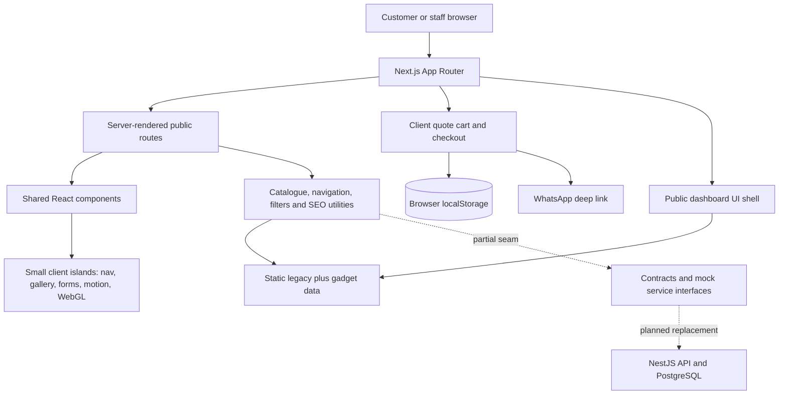

### Implemented versus planned matrix

| Area | Implemented now | Partial | Planned |
|---|---|---|---|
| Discovery | homepage, nav, categories, search | illustrative catalogue | real merchandising/search index |
| Product | detail/spec/related/metadata | one default SKU adapter | variants, real media/brand/specs |
| Cart | Context, localStorage, quantities, quote totals | browser-only identity | server/customer cart |
| Checkout | WhatsApp quote review | contact form only | order/payment/fulfillment |
| Dashboard | shell, read-only catalogue quality | service vocabulary | protected operational system |
| Data | stable mock generation | contracts/adapters/mocks | NestJS/PostgreSQL |
| SEO | metadata, schema, robots, gated sitemap | needs real domain/content | redirects, analytics, production audit |
| Operations | honest documentation | none executable | inventory/orders/payments/audit/backups |

### Ten strongest decisions

1. Central public navigation mapping.
2. Stable source order protects IDs/SKUs/slugs.
3. Quote-only states do not invent prices or stock.
4. Cart persistence stores SKU identity/quantity, not authoritative price.
5. URL state owns filters/sort/pagination.
6. Pure filter and dashboard projection functions are separable from UI.
7. Browser-only WebGL is isolated behind `ssr: false`.
8. Generated imagery is local, deterministic and labelled illustrative.
9. Future contracts/adapters allow incremental migration.
10. Dashboard empty states refuse to fabricate operations.

### Ten things not to break

1. Stable product source ordering and existing public slugs.
2. `navigation.ts` as the category membership source.
3. Empty/`all`/`best` search semantics.
4. 12-item category/search pagination and URL preservation.
5. Quote-required treatment for null prices.
6. SKU-based cart persistence and v1 migration.
7. No real-order/payment claim.
8. WebGL SSR boundary, fallback and reduced motion.
9. Product links and local image fallbacks.
10. Frontend-only boundary until a deliberate backend phase.

### Highest-risk areas

- The large ordered tuple catalogue: a reorder changes public identities.
- The WebGL scene: GPU lifecycle and SSR mistakes can break the homepage.
- The legacy/future Product duality: careless migration can break cards/cart/routes.
- Central navigation changes: they affect header, category pages, sitemap, reports and images.
- A future dashboard connection without auth/guards/audit.
- Real checkout without atomic stock and idempotent payment logic.

### Readiness assessment

These are reasoned engineering estimates, not measured business certifications:

- **Frontend quote-prototype readiness: ~85%.** Core browsing, responsive UX, quote cart, honest checkout and required routes work; automated tests, real content and some accessibility/performance hardening remain.
- **Backend-integration readiness: ~40%.** Contracts, mocks and an adapter exist, but most pages bypass them and no HTTP/error/loading policy is established.
- **Production ecommerce readiness: ~20%.** The UI is ahead of the business system; real catalogue truth, auth, orders, inventory, payment, operations, legal, monitoring and backups are absent.

The correct next architectural step is not more decorative UI. It is to freeze frontend behavior, consolidate service consumption, prepare 50 verified products/SKUs/images, then connect a protected NestJS modular monolith.

# PART B — TEACH ME USING THIS PROJECT

The best way to learn from VOLTRONIX is to trace one real user journey at a time, change one boundary, predict the result, and verify it. Do not begin with the Three.js scene or a full backend rewrite.

## B1. Next.js learning path

Each row follows: what, why, where, how, mistakes and verification.

| Concept | What and why | Where/how in VOLTRONIX | When / when not | Common mistake | How to verify |
|---|---|---|---|---|---|
| React vs Next.js | React builds component trees; Next.js adds routing, server rendering, bundling, metadata and deployment conventions. | `ProductCard` is React; `app/product/[id]/page.tsx`, `generateMetadata` and routing are Next.js. | Use React concepts inside Next; do not treat Next as a different UI language. | Making everything client-side as in a plain SPA. | Remove no code: trace which file creates the route versus reusable JSX. |
| App Router | File-system router under `app/`. It makes route ownership visible. | Every `page.tsx`, `layout.tsx`, `loading.tsx`, `error.tsx`, `not-found.tsx`. | Use for modern Next projects. | Inventing manual route tables for page navigation. | Map folders to URLs and run the built route list. |
| `layout.tsx` | Persistent wrapper for a route subtree. | Root imports global CSS/metadata and wraps `CartProvider`; dashboard layout owns its shell. | Put shared chrome/providers here. | Putting page-specific data or huge client state in root layout. | Navigate between child pages and confirm shell/provider continuity. |
| `page.tsx` | Public route entry component. | `app/page.tsx` is `/`; `app/cart/page.tsx` is `/cart`. | Use only for route composition. | Hiding reusable domain logic inside pages. | Locate URL by following its directory. |
| Nested routes | Subfolders represent URL segments. | `app/dashboard/products/page.tsx` -> `/dashboard/products`. | Use when UI and URL hierarchy agree. | Deep folders without meaningful URL/domain hierarchy. | Check inherited dashboard layout while changing child route. |
| Dynamic routes | `[segment]` captures variable URLs. | `[slug]` category and `[id]` product routes. | Use for entity/catalogue pages. | Accepting any value without validating it. | Open valid and invalid slugs; invalid should render not-found/noindex. |
| Server Components | Default components rendered outside the browser; reduce client JS and can read server data. | Home/category/search/product/dashboard pages. Current data is imported from files. | Prefer for data reading/static composition. | Adding hooks or `window` without a client boundary. | Search files without `'use client'`; inspect browser bundle/interaction boundaries. |
| Client Components | Browser-hydrated components with hooks/events/browser APIs. | header, cart, gallery, forms, animations, WebGL. | Use for genuine interaction. | Marking a high-level subtree client just because one child is interactive. | Search `'use client'` and name the hook/browser API requiring it. |
| `'use client'` | Module boundary declaring that file and imports enter client graph. | First line of `CartProvider`, `SiteHeader`, `LumenCircuitExperience`. | Put it at the smallest useful interactive boundary. | Assuming it means “render only in browser”; initial HTML can still be pre-rendered. | Temporarily reason whether props are serializable and browser APIs are guarded. |
| SSR | Rendering request HTML on the server. Improves first content and SEO. | Dynamic search/category paths may be server-rendered; WebGL is excluded. | Useful for query-dependent/public pages. | Accessing localStorage during render or producing random server/client markup. | Build, load with JS throttled, monitor hydration console errors. |
| Static generation | Pre-render known pages at build. Fast and cacheable. | 17 category params and 176 visible product params. | Good for stable catalogue content. | Forgetting revalidation/invalidation once data changes via backend. | `pnpm build` shows static/SSG paths. |
| Hydration | Browser React attaches behavior to server HTML. | Header menus, cart buttons and gallery become interactive after load. | Required only for interactive client islands. | Server/browser first render differs due time/random/storage. | Check console, use reduced motion, reload with stored cart. |
| `params` | Dynamic path values. | `{slug}` or `{id}` awaited in Next 16 pages. | For path identity. | Confusing `/product/x` path identity with `?id=x` query state. | Log mentally from URL to lookup; test valid/missing entity. |
| `searchParams` | Query-string inputs. | search query, facets, sort/page and dashboard product filters. | For shareable listing state. | Trusting raw arrays/strings or losing params during pagination. | Copy a filtered URL into a new tab and confirm same view. |
| `generateStaticParams` | Lists dynamic values to prebuild. | categories use navigation entries; products use visible products. | For known finite public records. | Generating from a different taxonomy than links. | Compare generated list with sitemap and navigation source. |
| `notFound()` | Stops a route and renders the not-found boundary. | category/product lookup misses. | For truly absent records. | Using it for empty valid filters. | Invalid slug shows `This page is not available`; empty filters show a normal empty state. |
| `Link` | Client-side navigation with accessible anchor semantics. | cards, header, breadcrumbs, pagination. | Internal navigation. | Using a Link as disabled button only through CSS. | Keyboard-navigate and inspect final href/query. |
| `Image` | Next image component handles sizing/layout and normally optimization. | product cards/gallery/cart. | Local/durable product media. | Missing `fill` parent positioning/sizes or disabling optimization without compensating assets. | Check layout shift, network size and broken URLs. |
| Metadata | Titles/descriptions/social/robots data. | root, category/product generators, nested noindex layouts. | Every indexable business route needs intentional metadata. | Publishing localhost canonical or fake `Offer`. | Inspect page head and structured-data validator on staging. |
| `public/` | Files served from URL root. | `/products/generated/...`, icons and fallbacks. | Static public assets. | Importing as filesystem paths or placing secrets/source references there. | Open the `/products/...` URL directly. |
| Environment variables | Deployment-specific configuration. | `NEXT_PUBLIC_SITE_URL` gates public SEO URLs. | `NEXT_PUBLIC_*` only for values safe to expose to browsers. | Putting database/payment secrets in public variables or Git. | Inspect production environment and built client source exposure. |

### A practical reading exercise

Trace `/category/electrical-wiring?cable_size_mm2=2.5&page=2` from browser URL to `[slug]/page.tsx`, awaited params, central category lookup, parser, filters, pagination, ProductGrid and Link output. Then explain which operations happen on the server and which controls hydrate in the browser. If you can do that without guessing, you understand the core App Router architecture.

## B2. Frontend architecture skills

### Component boundaries

**What/why:** a component should own one coherent UI/state responsibility. This limits change blast radius.  
**Where:** `ProductPurchaseActions` owns quantity; `AddToCartButton` owns add feedback; `CartProvider` owns shared lines.  
**When:** extract when behavior repeats or has its own state/testing boundary. Do not extract every `<div>`.  
**Mistake:** generic components with dozens of unrelated boolean props.  
**Verify:** changing quantity presentation should not require editing storage logic.

### State ownership

Place state at the lowest common owner:

- tab selection in `CategoryBrowser`;
- active gallery image in `ProductGallery`;
- cart in root `CartProvider` because header/cart/checkout use it;
- filters in the URL because they must survive navigation/share.

Moving everything into Context makes dependencies invisible. Keeping cross-page state in one local card makes it inaccessible. Choose based on lifetime and consumers.

### Contracts and services

Contracts describe data meaning; services describe operations; implementations decide transport. `CatalogService` says what the UI needs without saying “HTTP” or “mock file”. A future `HttpCatalogService` should satisfy the same interface.

Current migration path:

```text
legacy Product UI
  ↕ compatibility adapter
future Product/SKU contract
  ↕ CatalogService interface
mock implementation now / HTTP implementation later
```

Before backend integration, make page loaders consume a single application-facing service/selector layer. Do it one route at a time; do not rewrite every ProductCard simultaneously.

### Deciding where new code belongs

| New concern | Correct owner |
|---|---|
| New route composition/metadata | `app/<route>/` |
| Reusable rendered interface | `components/` domain folder |
| Client hook/event/browser state | smallest `'use client'` component |
| Pure catalog calculation | `lib/catalog*` |
| Public taxonomy | `lib/catalog/navigation.ts` |
| Backend-facing shape | `lib/contracts/` |
| Operation boundary | `lib/services/` |
| Current fake implementation | `lib/services/mock/` |
| Durable image | object storage later; `public/` only during prototype |
| Database/business invariant | future NestJS domain/service + PostgreSQL constraint/transaction |

## B3. API/backend readiness

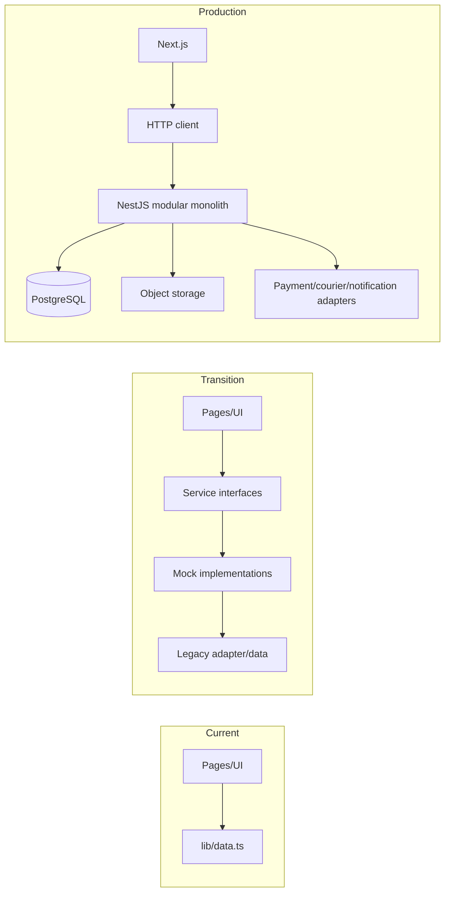

### Existing service vocabulary

- `CatalogService`: list products and resolve product/SKU identities.
- `CartService`: resolve SKU lines and summaries.
- `CheckoutService`: preview only; no order creation.
- `DashboardService`: catalogue overview/readiness.
- `OrderService`: **not present**; define only when real order use cases begin.

### Refactor before NestJS

1. Freeze versioned Product/SKU/list/filter/cart response contracts with backend stakeholders.
2. Decide whether Server Components call NestJS directly server-to-server or through a typed HTTP module; do not call endpoints ad hoc in UI components.
3. Move category/search/product reads behind one catalogue application layer.
4. Consolidate dashboard’s direct selectors with `DashboardService` and one pagination model.
5. Define consistent error types, unavailable/empty distinction, timeouts and loading policy.
6. Add automated tests around pure filters, adapters, cart normalization and WhatsApp builders before swapping data source.
7. Keep a mock service for fast frontend development and contract tests.
8. Add an order service only with server validation, idempotency and atomic reservation.

DTO thinking means accepting explicit validated input—not passing the whole UI object. Example request: `{ skuId, quantity }`; example response: resolved SKU, current Money, verified stock state and validation messages.

## B4. SEO

| Area | Status | Evidence/action |
|---|---|---|
| Global title/description/keywords | IMPLEMENTED | `app/layout.tsx` |
| Category metadata | IMPLEMENTED | `generateMetadata` in category route |
| Product metadata | IMPLEMENTED | product route + concise helper |
| Canonicals | PARTIAL | emitted only with `NEXT_PUBLIC_SITE_URL` |
| Clean stable slugs | IMPLEMENTED for mock | generated/stable source order; production review still needed |
| Sitemap | PARTIAL | 4 pages + 17 categories + 176 products = 197 entries when domain is set |
| Robots/noindex | IMPLEMENTED | search/account/cart/checkout/dashboard excluded |
| Open Graph | IMPLEMENTED | root and product/category values; generated image route |
| Product JSON-LD | IMPLEMENTED carefully | no fake Offer because price/stock unverified |
| Breadcrumb JSON-LD | IMPLEMENTED | product pages when URLs are configured |
| Image alt | IMPLEMENTED basics | product name; decorative thumbs empty |
| Internal linking | IMPLEMENTED basics | department/category/cards/related/recent |
| Filter/pagination canonical strategy | BEFORE PRODUCTION | canonicals currently target route paths, not a deliberate facet-index policy |
| Dedicated metadata for solutions/wholesale/price challenge | MISSING | currently inherits broad root metadata |
| Redirects for changed product/category slugs | MISSING | needs persistent alias table/backend |
| Analytics/Search Console | BEFORE PRODUCTION | not determinable/configured in repository |
| Review/rating schema | LATER only with real data | never fabricate it |

Reusable workflow: choose search intent -> verify unique slug -> write factual title/description -> add canonical -> add meaningful internal links -> add only truthful structured data -> optimize image/alt -> decide index/noindex for filters -> include in sitemap -> validate rendered HTML/schema -> monitor coverage and search queries after release.

## B5. Performance optimization

Optimize from measurements, not anxiety. Record a baseline in production mode, use Lighthouse/Web Vitals, inspect network/bundle output and profile React/GPU before changing architecture.

| Area/problem | How to measure | Correct next solution | Tradeoff |
|---|---|---|---|
| Large gadget PNGs | network transfer and LCP on category/home | convert exact assets to compressed WebP/AVIF and set dimensions | quality/encoding work |
| `images.unoptimized: true` | compare bytes/cache behavior | enable Next optimization on supported host or build multiple optimized assets/CDN | infrastructure/cost |
| Three.js startup bundle/GPU | bundle analyzer, performance/GPU trace, low-end device | consider viewport/idle loading, retain fallback and reduced motion | delayed interactivity |
| Excess Client Components | inspect client bundle and hydration CPU | move static wrappers/layout back to server, keep client islands | boundary/prop complexity |
| Google Fonts `@import` | waterfall/render blocking | use `next/font` or self-host licensed font | repository/build asset work |
| In-memory 176-item facets | server render time | fine now; later database/search-engine aggregation | backend complexity |
| Client rerenders | React Profiler | memoize only expensive proven hotspots; keep WebGL state in refs | premature memoization adds complexity |
| Request waterfalls | none currently (`fetch` absent) | later parallelize independent server requests and cache stable catalogue data | freshness control |
| Static/dynamic caching | build output and response headers | product/category revalidation after backend mutations | invalidation complexity |
| Dependencies | bundle analyzer | keep Three packages because used; remove only proven unused code/deps | visual feature loss if careless |

Pagination is already a performance feature: category/search render 12 cards instead of the full catalogue. Static product pages are efficient for current file data. Do not introduce global state or a search engine until volume and measurements justify it.

## B6. Deployment

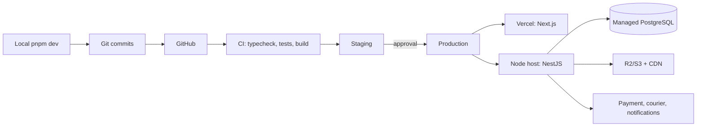

Recommended domains:

```text
www.voltronix...  -> Next.js storefront
api.voltronix...  -> NestJS HTTPS API
admin route/domain -> protected dashboard
```

Local/staging/production need separate databases, storage buckets and payment credentials. CORS should allow only required origins and methods; same-site HttpOnly session cookies require deliberate domain/SameSite/Secure configuration.

CI should install with frozen lockfile, typecheck, run tests, build and deploy an immutable artifact. Database migrations run as controlled release steps with backups and backward-compatible sequencing. Health checks cover process, database and critical dependencies. Rollback must restore the previous application artifact; database rollback requires planned forward/backward migration safety.

Never commit `.env*.local`, database URLs, JWT/session secrets, payment/courier keys, webhook secrets, private storage credentials, admin passwords, production exports or customer data. `NEXT_PUBLIC_*` is visible to anyone downloading browser JavaScript.

## B7. Production readiness

### P0 — blocks launch

- Replace mock catalogue with verified products/SKUs, exact images, current prices and stock truth.
- Protected backend, PostgreSQL constraints and validated DTOs.
- Admin authentication, granular RBAC and audit logs.
- Idempotent order creation and atomic SKU stock reservation.
- Verified payment/COD process; never browser-only confirmation.
- Order dashboard and manual fulfillment path.
- Tested database/media backups and restore.
- Terms, privacy, return/refund, delivery and contact/support pages.

### P1 — before launch

- Validated catalogue import with duplicate-SKU rejection and dry run.
- Monitoring, structured logs, uptime and webhook-failure alerts.
- Staging environment and end-to-end order/payment/cancellation tests.
- Image optimization/CDN and mobile performance budget.
- Customer transactional confirmation and support process.
- Security headers, rate limits, input/file validation and secret rotation plan.
- Accessibility pass for navigation, forms, disabled states and dashboard drawer.
- Domain-specific metadata/canonicals and search-engine validation.

### P2 — soon after launch

- Supplier/purchase-order/receiving workflow.
- Returns/refunds with physical-condition and money-flow separation.
- Courier integration and COD reconciliation.
- Accounting export/reconciliation.
- Better faceted counts/search, saved customer cart/account history.
- Automated operational reports and catalogue QA.

### P3 — later

- B2B price lists/credit, promotions, advanced recommendations.
- Multiple warehouses and advanced allocation.
- Native apps, multi-vendor logic or microservices only after scale proves need.

Build passing is necessary but not proof of production readiness. The repository currently proves frontend behavior, not business operations.

## B8. Future NestJS and database architecture

**Status: PLANNED.** There is no `backend/` directory, database client, ORM schema, API route or server action in the current repository. The contracts and mock services are preparation points, not a working backend.

### Learning lens

- **WHAT:** a NestJS modular monolith owns business rules and exposes an HTTP API; PostgreSQL stores durable, relational truth.
- **WHY:** price, stock, orders, permissions and payments cannot safely be decided by browser state or static files.
- **WHERE IN VOLTRONIX:** `lib/contracts/*` shows proposed boundary types; `lib/services/*` and `lib/services/mock/*` show the first adapter seam; `lib/data.ts` is the current mock catalogue source.
- **HOW IT WORKS:** the Next.js application sends validated requests, NestJS coordinates domain services and transactions, and PostgreSQL enforces keys and constraints.
- **WHEN TO USE:** once real catalogue editing, stock, customer orders or authenticated operations are introduced.
- **WHEN NOT TO USE:** do not add it merely to serve the present static demo; a backend adds deployment, security and operational responsibility.
- **COMMON MISTAKES:** copying frontend types blindly into entities, using product IDs where SKU IDs are required, changing stock without a movement ledger, or splitting into microservices too early.
- **HOW TO VERIFY:** contract tests, database constraints, transaction tests, authorization tests, migration tests and end-to-end order scenarios.

### Recommended system boundary

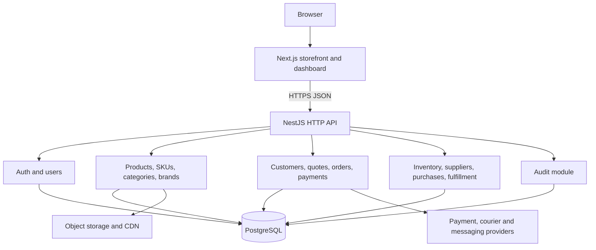

Keep this as one deployable NestJS application initially. Modules create clear ownership without the distributed transactions, networking failures, observability overhead and deployment coordination of microservices.

### Module map

| Module | Owns | Important rules |
|---|---|---|
| `auth` | login, session/refresh lifecycle, password reset | credentials and token rotation |
| `users` | staff identity, roles and permissions | disabled users cannot operate |
| `products` | shared product identity and copy | product is not a purchasable variant |
| `skus` | purchasable variants and unique codes | SKU code unique; immutable references after use |
| `categories` | taxonomy, slugs and hierarchy | unique stable slug; safe reassignment |
| `brands` | normalized brand records | no free-text duplication |
| `inventory` | stock balances, reservations and movements | no silent stock mutation |
| `orders` | order aggregate and order items | idempotent create; server prices |
| `payments` | attempts, provider events, refunds | webhook idempotency and reconciliation |
| `customers` | contact/profile/address records | privacy and controlled access |
| `suppliers` | supplier records and terms | auditable changes |
| `purchases` | purchase orders and receiving | receiving generates movements |
| `quotes` | quote request, revision and acceptance | version prices and expiry |
| `fulfillment` | pick, pack, ship, delivery/return | explicit state transitions |
| `audit` | actor/action/entity/change metadata | append-only, searchable evidence |

### Relational model

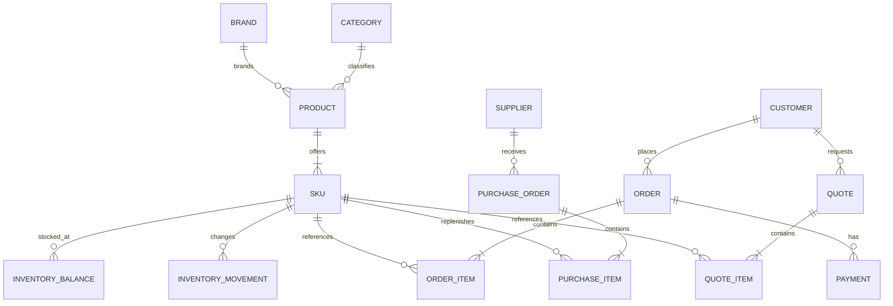

The current `Product` contract already separates `skus`, but the legacy adapter normally produces one SKU per listing. In production, a cable product could own SKUs for combinations such as `2.5 mm² × 3 core`; an MCB product could own `32 A × 2 pole`. Order items should snapshot the accepted name, SKU code, unit price, discount and tax while retaining the SKU foreign key. Historical invoices must not change when catalogue copy changes.

### Inventory truth and movements

For a SKU at a location:

```text
available = on_hand - reserved
```

- `on_hand`: physically present stock.
- `reserved`: stock held for open orders.
- `available`: what may still be promised.
- `InventoryMovement`: an append-only reasoned delta, such as purchase receipt, order shipment, return, damage or approved adjustment.

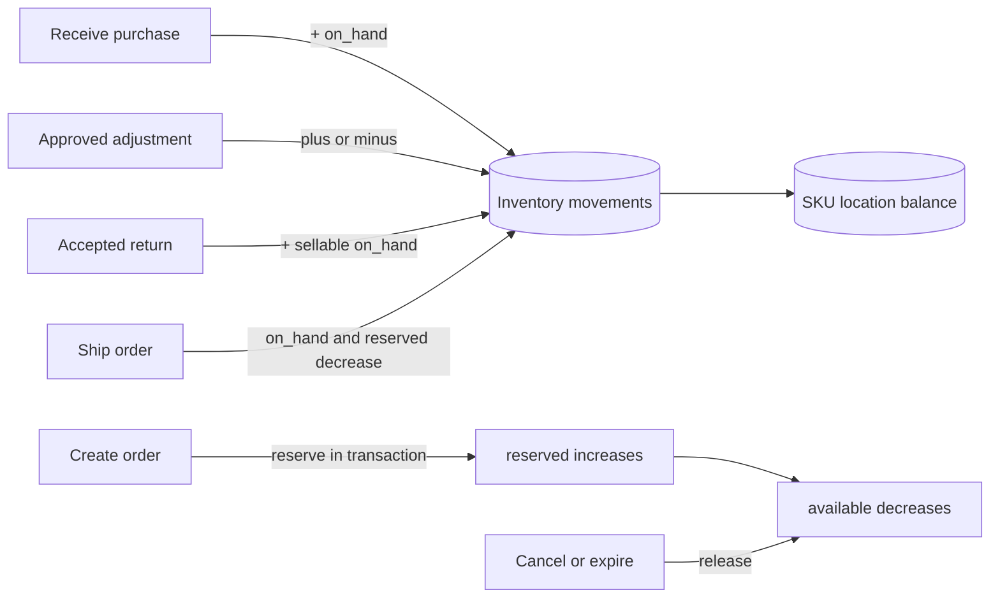

Reservation must lock/check the relevant balance in the same database transaction as order creation. A dashboard stock edit should become an authorized adjustment command with reason and audit entry—not a direct overwrite.

### Order state machine

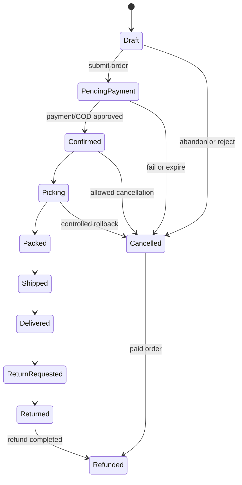

The exact state names are a business decision and are **not determinable from the current repository**. What matters is that transitions are explicit, authorized and side-effect aware: releasing reservations, recording money movement, notifying customers and writing audit logs. Do not represent payment, fulfillment and return status as one ambiguous field if they can change independently.

### Migration sequence

1. Freeze and version the TypeScript contracts needed by the UI.
2. Scaffold one NestJS modular monolith and a PostgreSQL development database.
3. Implement category/product/SKU read APIs first; swap `CatalogService` adapter without changing pages.
4. Add protected catalogue write operations and audit logs.
5. Add inventory ledger and transactional reservation.
6. Add customer/order aggregates and idempotency keys.
7. Add payment/provider webhooks only after order consistency exists.
8. Move dashboard modules from unavailable/mock states one vertical slice at a time.

## B9. Security and authentication

**Status: PLANNED.** Every current dashboard URL is publicly reachable. `noindex` metadata reduces search indexing; it does not authenticate or authorize anyone. No current role label or hidden control provides security.

### Learning lens

- **WHAT:** authentication proves identity; authorization decides what that identity may do; audit records what it did.
- **WHY:** operational screens can change prices, stock, orders and customer data—high-impact business state.
- **WHERE IN VOLTRONIX:** `/dashboard/*` and `components/dashboard/*` are UI foundations only. The two desired business roles are not enforced in code.
- **HOW IT WORKS:** a backend verifies credentials/session, guards each endpoint by permission, validates the request and logs sensitive mutations.
- **WHEN TO USE:** before exposing any real dashboard data or mutation.
- **WHEN NOT TO USE:** never treat client-only route guards, disabled buttons or TypeScript types as enforcement.
- **COMMON MISTAKES:** storing tokens in `localStorage`, trusting a role sent by the browser, broad CORS, weak password hashes, logging secrets, or checking only page access rather than every endpoint.
- **HOW TO VERIFY:** unauthenticated/forbidden API tests, permission-matrix tests, cookie inspection, CSRF/CORS tests, rate-limit tests and audit-log review.

### Recommended two-role model

| Role | Recommended permissions |
|---|---|
| **Super Admin** | all operations plus staff/role management, security settings, integrations, audit access and destructive catalogue/system actions |
| **Operations Manager** | products/SKUs, inventory, orders, purchases, suppliers, customers, quotes, fulfillment and operational reports; no staff roles, authentication policy, secrets/integrations or security settings |

Back the labels with granular permissions such as `product.write`, `inventory.adjust`, `order.cancel`, `refund.approve`, `user.manage` and `audit.read`. Roles are named bundles of permissions. This prevents a future third role from requiring authorization logic to be rewritten.

### Session flow

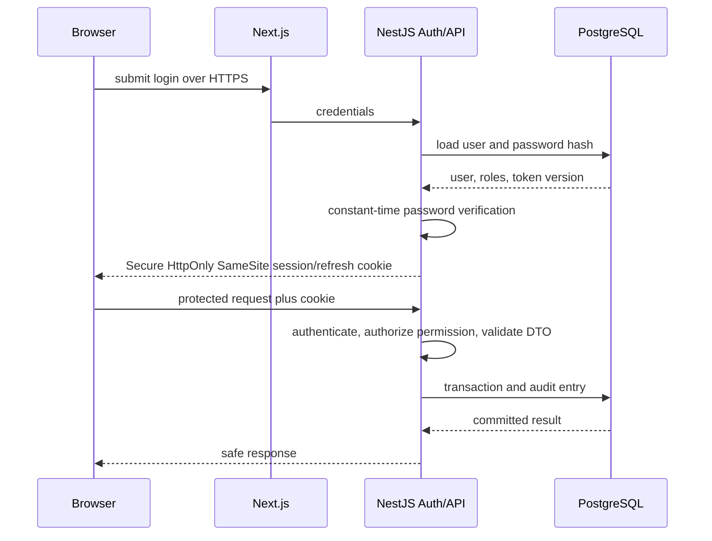

### Controls to understand

| Control | Practical meaning for VOLTRONIX |
|---|---|
| Password hashing | Argon2id or a current approved equivalent with unique salts; never encryption/plain text |
| Session/JWT | short-lived access plus safely rotated refresh/session state; choose deliberately, not by trend |
| HttpOnly cookie | JavaScript cannot read it; use `Secure` and appropriate `SameSite`; address CSRF for cookie auth |
| Guards | NestJS guard verifies identity and required permission before controller logic |
| Validation | DTO whitelist, length/range/enum checks, SKU uniqueness and file validation on the server |
| CORS | allow only required frontend origins, headers, methods and credential mode |
| Rate limiting | tighter limits for login, reset, quote and write endpoints; identify users/IPs safely |
| Secrets | server environment/secret manager only; never `NEXT_PUBLIC_*` or Git |
| Audit logs | actor, action, entity, before/after or reason, timestamp and request context; append-only access |
| Error handling | generic external authentication errors; structured internal logs without passwords/tokens/PII |

Authorization belongs at the API boundary and again inside sensitive domain operations. The frontend may hide unavailable actions for clarity, but a crafted HTTP request must still be rejected by NestJS.

## B10. Real ecommerce failure scenarios

These are production design exercises, not claims about current behavior. The present quote-first frontend does not implement real orders, payments or inventory.

| Failure | Cause | Prevention | Detection | Recovery |
|---|---|---|---|---|
| **Overselling** | two requests read the same available stock before either writes | transactionally lock/check SKU-location balance; reserve atomically; reject negative availability | invariant alert where `reserved > on_hand`; reservation conflict metrics | cancel/backorder with customer contact; release invalid reservations; investigate transaction path |
| **Stale stock shown** | cached UI or delayed sync | display freshness/availability language; validate again when quoting/ordering; event/revalidation strategy | compare catalogue response time/version with inventory source; conversion failures | refresh result, present alternatives, never confirm unavailable quantity |
| **Stale price used** | browser submits an old/static price | browser sends `skuId + quantity`; server loads current price and returns an accepted quote/checkout preview | log requested versus authoritative price/version; alert abnormal mismatch | require customer reconfirmation; honor only according to explicit business policy |
| **Duplicate checkout** | double click, retry or network uncertainty | client-generated idempotency key with a unique server constraint and stored response | duplicate-key counter and multiple orders with same cart/customer/time signature | return original result; merge/cancel only through auditable workflow |
| **Duplicate payment webhook** | provider retries until acknowledged | unique provider event ID; transactional inbox/idempotency record | duplicate event metric and reconciliation report | acknowledge already-processed event; never apply payment twice |
| **Payment/order mismatch** | amount/currency/order reference differs or state update partially fails | verify signed webhook and server-side expected amount/currency; transactional state transition | daily provider-to-ledger reconciliation and unmatched-event queue | quarantine event, block fulfillment, manual audited reconciliation/refund |
| **Cancelled order retains reserved stock** | cancellation changes status but skips inventory side effect | cancellation command releases reservation in the same transaction or reliable outbox workflow | ageing reservations and cancelled-order invariant checks | idempotent release job plus audit correction |
| **Bad refund flow** | order marked refunded before provider confirmation, or goods condition ignored | separate return, refund request and payment refund states; use idempotency and approval rules | provider reconciliation and stuck-refund queue | retry safely, investigate manually, compensate ledger/status with audit evidence |
| **Duplicate SKU import** | repeated spreadsheet row or unstable external code | database unique constraint on normalized SKU; validate and dry-run import; upsert by agreed identity | import rejection report and duplicate candidate scan | reject batch or isolate rows; controlled merge with reference migration |
| **Image loss** | files live on one app disk, unsafe delete or broken key replacement | object storage, stable keys, metadata records, versioning and backups; reference checks before delete | broken-image crawler, storage/database reconciliation | restore object/version; remap references; use safe placeholder temporarily |
| **Incorrect admin stock adjustment** | direct balance edit, typo or excessive permission | adjustment command with reason, bounds, approval for large changes and immutable movement | variance report, threshold alert and audit review | compensating movement—never delete/alter the original ledger event |
| **Failed database migration** | incompatible schema/code order, untested data, long lock | backup, staging copy, expand/migrate/contract sequence, transaction where supported | migration job failure, health/readiness errors and schema-version check | roll back application; run tested down/forward fix; restore only when necessary and rehearsed |
| **Backend downtime** | process, database or dependency outage | multiple instances where justified, timeouts, health checks, managed DB, graceful degradation | uptime probe, error/latency alerts and dependency dashboards | quote/contact fallback, retry only safe reads/idempotent writes, restore service and reconcile queued events |

### The recurring architecture pattern

1. **Make identity explicit:** unique SKU, order, event and idempotency keys.
2. **Protect invariants:** constraints and transactions, not UI assumptions.
3. **Record facts:** inventory/payment/audit ledgers rather than destructive overwrites.
4. **Design retries:** every external call or webhook can repeat or time out.
5. **Detect drift:** reconciliation jobs and invariant alerts.
6. **Recover deliberately:** compensating actions that preserve history.

For each new commerce feature, write its failure table before its controller. If prevention, detection and recovery are not clear, the happy-path implementation is incomplete.

## B11. How to add features yourself

### Reusable 12-step workflow

1. **Understand the business requirement.** Write the user, action, outcome, exclusions and acceptance examples.
2. **Identify the domain/data.** Decide whether the concept is a product, SKU, category, cart line, order, permission or presentation only.
3. **Find the existing architecture boundary.** Start with route → component → utility/contract/service/data. Search before creating a new abstraction.
4. **Decide server versus client.** Default to a Server Component; create the smallest client island only for events, hooks, browser APIs or persistent interactive state.
5. **Define the data contract.** Prefer stable IDs, nullable states and explicit enums; do not let a component invent domain shapes.
6. **Reuse existing components.** Match `ProductGrid`, `ProductCard`, filter primitives, dashboard primitives and SEO helpers where their contracts fit.
7. **Implement the smallest correct change.** Update the central source and all necessary consumers; avoid parallel hardcoded lists.
8. **Handle loading, error and empty states.** Treat these as product behavior, not decoration.
9. **Test edge cases.** Unknown IDs/slugs, empty input, null price, max quantity, repeated request, mobile and keyboard use.
10. **Run the production build.** The first meaningful type/build error is usually the most useful one.
11. **Check performance and security.** Measure relevant paths; validate/authorize on the server when state is real.
12. **Document the decision.** Record contract, invariant, tradeoff and follow-up—not a narration of code lines.

### Example 1: new category

| Lens | Action in this repository |
|---|---|
| WHAT/WHY | define the customer-recognizable grouping and which products genuinely belong |
| WHERE | central mapping in `lib/catalog/navigation.ts`; product source-category mapping in the same catalogue boundary |
| HOW | add one stable slug/label/description, map raw sources or tags, then let `getNavigationCategorySlugs`, `getCategory` and `productsByNavigationCategory` feed header, route and static params |
| WHEN | when it improves discovery and has enough coherent products |
| NOT TO USE | do not add a category only for one temporary campaign; use a showcase/tag if appropriate |
| MISTAKES | adding separate arrays to header, footer and home; changing slugs casually; overlapping hub counts without explaining them |
| VERIFY | URL resolves, metadata is correct, products belong, filter facets are relevant, mobile nav works, sitemap/static params include it, build passes |

### Example 2: new product

- Add current demo data through the existing catalogue source/adapter rather than inside a page component.
- Supply a unique product ID, correct source category, copy, local image path and explicit quote/availability state.
- Verify `getProduct`, search, category mapping, related items, image fallback and the product URL.
- Do not claim exact brand, price, stock or image match until verified. The current generated images are intentionally illustrative.

### Example 3: new SKU or variant

**Current limitation:** legacy display records normally adapt to a single SKU. A true variant feature should start in `lib/contracts/catalog.ts`, not by concatenating option strings inside `ProductPurchaseActions`.

1. Define variant axes and normalized values—for example cable size and cores.
2. Create unique SKUs for valid combinations only.
3. Make selection resolve exactly one SKU.
4. Derive price/stock/media from the resolved SKU.
5. Add `{ skuId, quantity }` to cart; never add an ambiguous product variant.
6. Test unavailable combinations, direct URL/state restore and price change.

### Example 4: new adaptive filter

Trace the full pipeline:

```text
lib/facet-config.ts
  -> canonical key, label, type, category scope, optional unit/limit
product attributes
  -> normalized values using the exact key
lib/catalog-filter.ts
  -> parse, match, count, serialize
components/catalog/filter-sidebar.tsx
  -> render options
components/catalog/active-filters.tsx
  -> removable chips
category/search page
  -> URL, sort, page reset and result verification
```

Use the current semantics intentionally: OR between values of the same key, AND between different keys. Decide whether counts should describe the unfiltered category (current behavior) or be recomputed against other active filters (future enhancement). Verify encoded URLs, duplicate values, unknown values and page reset.

### Example 5: new dashboard module

1. Define permission and operational state machine before the screen.
2. Add a contract in `lib/contracts/dashboard.ts` and a service method; use a mock adapter until the API exists.
3. Reuse `PageHeader`, `MetricCard`, `FilterBar`, `DataTable`, `StatusBadge`, pagination, loading, empty and error patterns.
4. Keep the page a Server Component if it only reads; isolate forms/table actions as Client Components.
5. On the backend, authorize each command and audit mutations.
6. Remove `OperationUnavailable` only when the complete read/action/error workflow exists—not when a table shell appears.

### Example 6: new SEO landing page

- First decide whether the page answers a durable search intent and deserves indexing.
- Give it one stable, human slug and unique title/description/canonical.
- Render useful server-visible content, relevant internal links and accurate breadcrumbs.
- Add it to `app/sitemap.ts` only when production URL/content are real.
- Do not index internal search, cart, checkout, account or dashboard pages.
- Validate source HTML, canonical, structured data and status code—not only the visual tab title.

### Example 7: new NestJS endpoint

For `POST /orders`, define the request as IDs and intent, for example lines of `{ skuId, quantity }` plus customer/delivery reference and an idempotency key. A DTO validates shape; a guard checks identity/permission; an application service loads authoritative SKU, price and stock; one transaction creates snapshots and reservations; an outbox schedules external work; the response exposes a safe order view. Test forbidden access, unknown/out-of-stock SKU, stale price confirmation, duplicates, rollback and retry.

The key lesson is placement: pages compose experiences, components render/collect interaction, contracts describe boundaries, services provide operations, adapters reach data, and the future backend enforces business truth.

## B12. Debugging guide

Debug from the first layer that can prove or disprove the symptom. Reproduce with an exact URL/input, inspect the narrow path, change one cause, and verify both the failure and a nearby success case.

### 404: route → slug → mapping → static params → `notFound`

1. **Route:** confirm the path corresponds to `app/category/[slug]/page.tsx` or `app/product/[id]/page.tsx`; filename brackets are significant.
2. **Value:** log/inspect the awaited `params`; do not assume display labels equal slugs.
3. **Mapping/data:** call/read `getCategory(slug)` or `getProduct(id)` against the central data source. A header link is not proof that the mapping exists.
4. **Static params:** inspect `generateStaticParams`. It enumerates build-time known category slugs/product IDs, but runtime lookup still decides validity.
5. **`notFound`:** find the exact branch that calls it and determine why lookup returned nothing.
6. **Verify:** test a known slug, the failed slug, an intentionally unknown slug, direct refresh and production build behavior.

The lesson from VOLTRONIX category work is to make one central navigation/category mapping feed both links and route discovery. Separate hardcoded lists drift into 404s.

### Filter bug: config → URL → parser → filtering → sorting → pagination

Use a concrete failing URL and follow it in order:

1. Does `lib/facet-config.ts` define the canonical key for this category?
2. Does the form produce the expected repeated URL parameters?
3. Does `parseCatalogSearchParams` retain, deduplicate and normalize the values?
4. Does `productValues` find those exact attributes on affected products?
5. Does `applyProductFilters` apply intended OR-within/AND-across semantics?
6. Does `sortProducts` handle null price correctly?
7. Does `paginateProducts` clamp/reset the page after result count changes?
8. Do `serializeFilterParams` and `catalogUrl` preserve search extras such as `q` without serializing `undefined`?

Inspect counts separately: current `buildAvailableFacets` computes options from the category/search product set before active filters. A count can therefore be correct under current design while differing from a marketplace-style conditional count.

### Hydration: server/client mismatch → browser APIs → time/randomness

Hydration means React attaches behavior to server-rendered HTML. The first browser render must structurally match that HTML.

- Search client components for `window`, `document`, `localStorage`, media queries, viewport measurements, time and randomness.
- Browser APIs belong in effects/event handlers or behind a client-only boundary. `CartProvider` restores storage in an effect and exposes `isHydrated`; `CircuitAnimator` dynamically loads WebGL with `ssr: false`.
- Never call `Math.random()` or `Date.now()` during render for visible structure. Current electric sparks use deterministic positions.
- A warning often points at the first observed mismatch, not the original cause. Reduce the component tree until it disappears.
- Verify clean server start, hard refresh, no-storage and stored-state cases, reduced motion and WebGL fallback.

### Missing styles: globals → Tailwind content → PostCSS → build

1. Confirm `app/layout.tsx` imports `app/globals.css`.
2. Confirm a class is literal/discoverable by Tailwind or safelisted; dynamically assembled class names can be omitted.
3. Check `tailwind.config.ts` content paths and tokens, then `postcss.config.mjs`.
4. Check CSS Module import/class spelling for files such as `hero-copy.module.css` and `lumen-circuit.module.css`.
5. Inspect cascade/specificity and responsive breakpoint, not only generated CSS existence.
6. Restart dev after configuration changes and verify a production build. Delete caches only after evidence identifies a stale cache; cache deletion is not a diagnosis.

### Build failure: find the first meaningful error

Run `pnpm build` from the directory containing `package.json`. Ignore cascades until the first root error is understood.

| Error class | Clue | Investigation |
|---|---|---|
| TypeScript | `TS####`, incompatible union/property | inspect inferred type and caller/callee contract; avoid silencing with `any` |
| Module/dependency | cannot resolve/import | package declaration, lockfile, path casing/alias and correct workspace |
| Next.js boundary | server/client import or serialization error | locate `'use client'`, browser API and non-serializable prop crossing |
| Static generation | failure on one path/param | identify generated slug/ID, lookup/null state and browser-only code |
| Configuration | Tailwind/PostCSS/Next config load | syntax/module format and installed compatible version |
| Runtime | build passes but request fails | browser/server console, stack, exact route/input and environment difference |

The earlier search typing failure is a useful pattern: an expression like `{ q: string } | { q?: undefined }` is not a `Record<string, string>`. The correct fix is to give extras an explicit `Record<string, string>` and use `{}` when absent—not to weaken every consumer.

### pnpm problems: manifest → lockfile → install → cache

1. Confirm `Get-Location`/`pwd` and inspect the local `package.json` scripts.
2. Use the repository's `pnpm-lock.yaml`; do not mix npm/yarn lockfiles.
3. Check the Node version against Next.js requirements (the installed Next version requires Node 20.9+).
4. If `node_modules` was intentionally removed, `pnpm install --frozen-lockfile` restores exactly the lockfile dependency graph.
5. If frozen install reports manifest/lock mismatch, review the diff before regenerating; do not blindly delete the lockfile.
6. `.next` is generated build cache and may be removed when proven stale, but dependency errors normally require dependency diagnosis.
7. Verify with `pnpm build`. The current project has no dedicated lint/test script, so build is important but insufficient.

### A repeatable debugging note

For every bug, write:

```text
Observed:
Expected:
Smallest reproducible URL/input:
First layer where actual differs:
Root cause:
Minimal fix:
Regression checks:
```

This separates evidence from guesses and makes future Git history useful.

## B13. My learning roadmap

Use the order below. “Ignore first” means defer it while learning that topic, not remove it from the project.

| # | Topic | What to learn | Where it appears / files to study | Ignore first | Small project exercise |
|---:|---|---|---|---|---|
| 1 | HTML/CSS | semantic landmarks, forms, links/buttons, box model, grid/flex, responsive and focus states | `app/layout.tsx`, `app/globals.css`, `components/product-card.tsx`, `components/site-header.tsx` | Three.js shaders and animation polish | reproduce one ProductCard as semantic static HTML/CSS at mobile and desktop widths |
| 2 | JavaScript | values, arrays/objects, functions, modules, map/filter/reduce, events, promises and browser APIs | `lib/data.ts`, `lib/catalog-filter.ts`, `lib/whatsapp.ts` | framework rendering internals | trace 5 products through filter → sort → paginate on paper, then write tiny console assertions |
| 3 | TypeScript | unions, interfaces/types, generics, narrowing, nullability, `Record`, readonly data and inference | `lib/catalog/types.ts`, `lib/contracts/*.ts`, `lib/catalog-filter.ts` | advanced conditional/type-level programming | add a local practice function that formats `Money | null` exhaustively; do not ship it |
| 4 | React | components, props, composition, state, events, effects, context, refs and render purity | `components/showcase.tsx`, `components/cart-provider.tsx`, `components/product-purchase-actions.tsx` | manual memoization until measured | draw the CartProvider state transitions and build a small quantity counter separately |
| 5 | Next.js App Router | file-based routing, layouts/pages, server rendering and framework conventions | all `app/`, especially `app/layout.tsx` and `app/page.tsx` | Pages Router and legacy data-fetch APIs | add a throwaway local learning route, observe layout composition, then remove it |
| 6 | Server vs Client Components | default server boundary, serialization, client islands, browser API placement and hydration | `app/category/[slug]/page.tsx`, `components/site-header.tsx`, `components/home/circuit-animator.tsx` | bundle micro-optimization | classify every homepage child S/C and explain why each client boundary is necessary |
| 7 | Routing and `searchParams` | dynamic params, URLSearchParams, stable slugs, `Link`, `generateStaticParams`, `notFound` | category/product dynamic pages, search page, `lib/catalog-filter.ts` | parallel/intercepted routes | manually decode and re-encode one multi-filter category URL; test unknown category/product |
| 8 | State | URL vs server data vs local UI vs shared/persisted state; ownership and derived state | `components/cart-provider.tsx`, `site-header.tsx`, filter pages, recently viewed | Redux/Zustand until Context or URL state becomes inadequate | make a state inventory for `/cart` and mark source of truth versus derived subtotal |
| 9 | Forms | controlled/uncontrolled inputs, labels, validation, pending/error/success and accessibility | checkout, price challenge and solutions pages; filter sidebar | large form libraries | specify client and future server validation for phone, quantity and message fields |
| 10 | REST API | resources, verbs, status codes, DTOs, pagination, idempotency and error envelopes | `lib/contracts/*`, `lib/services/*` as the intended seam | GraphQL and event streaming | design request/response/error examples for `GET /products` and `POST /quotes` |
| 11 | NestJS | modules, controllers, providers, dependency injection, pipes, guards, filters and testing | future only; map from `lib/services/catalog-service.ts` | microservices and CQRS frameworks | scaffold conceptually a Catalog module and identify controller/service/repository responsibilities |
| 12 | PostgreSQL | tables, keys, joins, indexes, constraints, transactions and isolation | future Product/SKU/inventory/order model in B8; no current DB files | exotic extensions and premature partitioning | write a schema sketch and queries for product SKUs plus available inventory |
| 13 | Prisma | schema, migrations, relations, generated client and transactions; evaluate against alternatives | PLANNED only; documentation may mention it, repository has no Prisma package/schema | advanced middleware/client extensions | model Product→SKU in a disposable learning project and test unique SKU constraint |
| 14 | Auth/RBAC | authentication vs authorization, sessions/cookies, hashing, permissions and guards | future dashboard protection; current `/dashboard/*` proves UI-only shell | social login and enterprise SSO | create the two-role permission matrix and 10 allowed/denied API test cases |
| 15 | Transactions | atomicity, locking, isolation, idempotency, outbox and retry safety | future stock reservation, order creation and webhook handling | distributed transactions | explain which writes must commit together when two users buy the last SKU |
| 16 | Inventory/order state machines | states, legal transitions, invariants, reservation/ledger and compensating actions | B8 diagrams; future `inventory`, `orders`, `fulfillment` modules | multi-warehouse optimization | simulate create → reserve → cancel and create → reserve → ship as ledger rows |
| 17 | SEO | metadata, canonical, crawl/index rules, sitemap, JSON-LD, alt/internal links | `lib/seo.ts`, `app/robots.ts`, `app/sitemap.ts`, product/category metadata, `components/seo/json-ld.tsx` | advanced international SEO | inspect rendered HTML for home/category/product/search and make an evidence checklist |
| 18 | Deployment | immutable builds, environments, secrets, CI/CD, migrations, health, logging and rollback | `package.json`, `next.config.mjs`, B6 deployment plan | Kubernetes | write a staging release checklist that can fail safely before production promotion |
| 19 | Production operations | monitoring, support, reconciliation, backups/restore, incident and legal processes | dashboard placeholders, B7 and B10; largely PLANNED | automation before manual process is understood | run a tabletop scenario for duplicate payment plus stock reservation and record recovery steps |

### How to study each topic

For every row, repeat the same loop:

1. Learn the smallest concept from an authoritative guide.
2. Find it in the listed VOLTRONIX files.
3. Explain the data/control flow aloud without reading line by line.
4. Do the small exercise in a disposable branch or notebook.
5. Predict one failure, reproduce it safely, then undo/fix it.
6. Write “when I would use this” and “when I would not.”
7. Verify with browser behavior, types, build or tests appropriate to the concept.

Do not try to memorize the entire repository. Learn boundaries and trace one vertical slice—such as category URL → parser → catalogue → grid → product link—until you can recreate the reasoning.

## B14. Final self-sufficiency plan


This is a dependency order, not a promise that every stage should begin immediately. Keep one deployable vertical slice working while the next is built.

| Stage | Goal | Deliverables | Dependencies | Definition of Done | You should understand personally | Codex can safely automate |
|---|---|---|---|---|---|---|
| **1. Current project** | establish truthful baseline | this case study, route/data/state inventory, known limitations, clean build record | current repository | you can trace home, category, product, cart, hero and dashboard end to end | folder boundaries, mock versus real, source of truth | repository searches, evidence tables, repeatable checks and documentation drafts |
| **2. Frontend freeze** | stop uncontrolled visual/contract churn | approved routes/taxonomy, UI acceptance list, bug backlog, tagged baseline | product/business review | core responsive flows and production build are stable; changes require scoped acceptance criteria | why freeze exists and which defects still matter | run audits, produce diffs/checklists, fix explicitly approved isolated issues |
| **3. Backend-ready frontend** | make data access replaceable | finalized UI contracts, service interfaces, mock adapters, loading/error/empty patterns, SKU cart intent | frozen UX and agreed API vocabulary | pages do not depend on data-file quirks; swapping an adapter does not redesign components | DTO/domain distinction, nullable states, server/client ownership | generate types/adapters/tests after you approve contracts; find direct data coupling |
| **4. NestJS foundation** | create one secure API application | modules, configuration validation, exception format, logging, health endpoint, API versioning/test setup | API contract and deployment choice | health/test pipeline passes; errors/logs are consistent; no business secret reaches client | module/controller/provider flow, DI, validation and error boundary | scaffold repetitive module/test structure and validate conventions |
| **5. PostgreSQL foundation** | establish durable relational truth | schema, constraints, migrations, seed/dev strategy, backup/restore rehearsal | domain model and managed DB choice | migrations work on empty and realistic copies; restore is demonstrated; identifiers/constraints are stable | relations, indexes, transactions and migration risk | draft schema/migrations/seed validators; never choose destructive migration policy without you |
| **6. Auth and RBAC** | protect operations before real data writes | staff login/session, Super Admin and Operations Manager bundles, granular permissions, guards, audit records | users schema, HTTPS/domain/cookie design | every protected endpoint has allowed/denied tests; dashboard routes redirect safely; audit proves sensitive actions | auth versus authorization, cookie/CSRF/CORS and permission enforcement | generate guards/test matrices and UI gating; secrets/role policy stay your decision |
| **7. Catalogue and SKU** | replace demo catalogue with verified records | category/product/SKU/brand APIs, admin CRUD, validated import, media storage, frontend adapter | DB, RBAC, storage | unique SKUs, stable slugs, exact images/content, validation and audited edits; storefront reads API | product versus SKU, taxonomy and import identity | build DTOs/forms/import validation and migration reports from approved data |
| **8. Inventory** | make availability trustworthy | location balance, movement ledger, receiving/adjustment/reservation APIs, dashboard workflows | SKU catalogue and permissions | `available = on_hand - reserved`; no unauthorized/direct overwrite; concurrent reservation tests pass | ledger reasoning, locks/isolation, physical reconciliation | implement approved transaction patterns, invariants and test simulations |
| **9. Orders** | create reliable order aggregate | checkout preview, idempotent create, server price snapshots, state transitions, customer/contact records | catalogue, inventory, delivery policy | duplicate request returns same order; stock reservation and cancellation are atomic; operations can recover failures | aggregate boundaries, idempotency and lifecycle states | generate endpoint/UI/test code from agreed state machine and policies |
| **10. Payment** | connect money without corrupting orders | provider integration, signed idempotent webhooks, attempts/refunds, reconciliation, COD rules | stable orders, provider account and legal policy | duplicate/out-of-order events are safe; amount/currency match; refund and reconciliation tests pass | provider trust boundary, webhook retry and financial reconciliation | implement SDK plumbing/tests after credential setup; never invent payment policy or handle secrets in prompts/files |
| **11. Operations** | run purchasing-to-fulfillment workflows | suppliers, purchase orders, receiving, pick/pack/ship, quotes, returns, customer support and reports | catalogue/inventory/orders/RBAC | staff can complete and audit normal and failure workflows; manual fallbacks are documented | actual business SOPs, exception ownership and reconciliation | build dashboard vertical slices and generate runbooks around your approved SOPs |
| **12. SEO and performance** | make the real catalogue discoverable and fast | verified metadata/canonicals/schema, sitemap/robots, optimized media/fonts, measured budgets | production content and stable URLs | indexing policy is validated; no broken structured data; core journeys meet agreed measured budgets | search intent, crawl control and measurement-driven optimization | crawl/audit output, optimize proven bottlenecks and generate regression checks |
| **13. Staging** | prove production behavior without customer risk | production-like infrastructure, isolated data/credentials, CI/CD, migrations, monitoring, E2E and security checks | all launch-critical vertical slices | clean deploy/rollback, tested backup restore, payment sandbox, failure drills and stakeholder sign-off | release process, observability and incident decisions | automate pipelines/tests/deploy checklists under scoped credentials/approvals |
| **14. Production** | launch safely and operate continuously | domain/HTTPS, production secrets, alerts/on-call, legal/support content, backups, release/incident process | staging exit criteria and business approval | P0/P1 closed, real smoke order reconciles, monitoring/support/rollback work, owners accept risk | you own business truth, access, data, money, incidents and tradeoffs | monitor evidence, prepare safe patches/runbooks and assist investigation; human approval controls consequential actions |

### What not to delegate blindly

You should personally approve product truth, pricing policy, stock adjustment policy, role permissions, order/payment/refund states, legal content, data retention, secrets/access, destructive migrations and production release/rollback. Codex can accelerate implementation and verification, but it cannot replace business ownership or production accountability.

### First eight weeks of deliberate practice

| Week | Focus | Concrete outcome |
|---:|---|---|
| 1 | HTML/CSS + repository map | redraw the page/component tree and rebuild one responsive card without copying |
| 2 | JavaScript/TypeScript | explain and test catalogue filtering, null pricing and typed contracts |
| 3 | React state/components | trace cart/context, quantity actions and client boundaries |
| 4 | Next.js App Router | trace every route; explain params, search params, metadata, static params and `notFound` |
| 5 | API/REST + backend-ready boundaries | write reviewed catalogue/cart/order request-response contracts and failure shapes |
| 6 | PostgreSQL + transactions | model Product/SKU/inventory/order and simulate concurrency/reservation |
| 7 | NestJS + auth/RBAC | build a disposable protected read-only catalogue slice with tests |
| 8 | deployment/operations | deploy a staging learning slice, inspect logs/health, rehearse rollback and summarize lessons |

### Graduation test

You are becoming self-sufficient when you can take one small requirement and, without guessing:

1. place it in the correct domain and folder boundary;
2. explain server/client and state ownership;
3. define its contract and failure behavior;
4. implement the smallest vertical slice;
5. test invalid, empty, concurrent or repeated cases as relevant;
6. measure rather than assume performance;
7. deploy and roll back in staging;
8. explain what remains mock, partial or production-ready.

VOLTRONIX is already a useful frontend learning case because it contains real App Router composition, URL-driven catalogue behavior, typed contracts, client persistence, animation isolation and a dashboard shell. Its next educational value comes from resisting more surface polish long enough to build one correct backend vertical slice—from verified SKU to reserved inventory to idempotent order—with security and operations designed at the same time.
