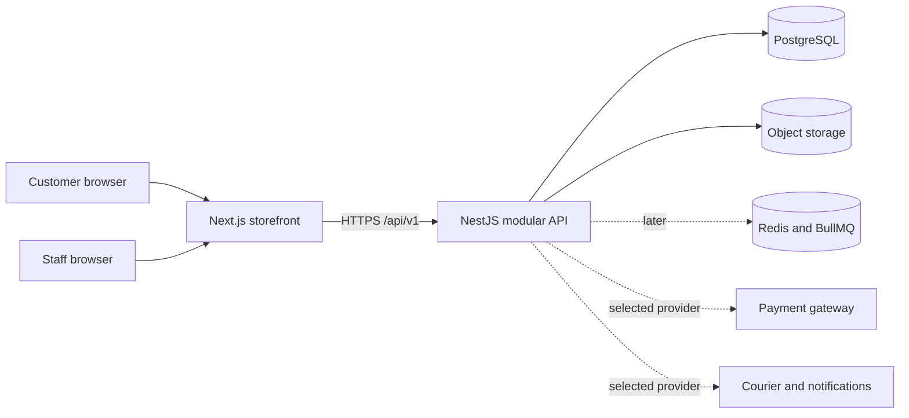
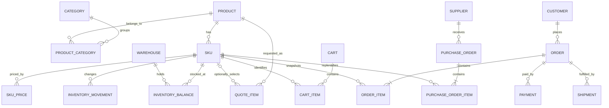

# VOLTRONIX Backend Architecture Handbook

> **Document type:** concise target blueprint
>
> **Current reality:** the repository is still a frontend prototype; this backend does not exist yet.
>
> **Goal:** build the reusable backend foundation now, then add verified products, SKUs, prices and stock when the business catalogue is ready.

### How to read this handbook

| Label | Meaning |
| --- | --- |
| **Build first** | Safe to implement before the real catalogue exists. |
| **Catalogue-ready** | Activate only when real product/SKU data is available. |
| **Launch gate** | Must be complete before accepting real orders or payments. |
| **Business decision** | Owner input is required; code must not guess. |

### The rule that keeps SKU work unblocked

- A Product is the customer-facing description and may remain `DRAFT` with zero SKUs.
- A SKU is the exact sellable and stock-controlled item; real SKU records can be added later.
- A `QUOTE_ONLY` product may be published without a SKU when the enquiry stores a product/text snapshot.
- A `DIRECT_SALE` or `BOTH` product cannot be published until it has an active SKU and a valid BDT price.
- Cart, inventory, order and payment lines always require a SKU.
- The schema, modules, admin screens and tests may be built now with tiny test fixtures; fake fixtures must never become production catalogue data.

### Ecommerce backend parts — one line each

| Part | Responsibility |
| --- | --- |
| Identity | Knows who the customer or staff user is. |
| Auth | Logs users in, manages secure sessions and account recovery. |
| RBAC | Decides which staff action is allowed. |
| Catalogue | Stores categories, brands, products, variants, specifications and media. |
| Pricing | Owns verified prices, currency and price history. |
| Inventory | Owns stock balances, reservations and movement history. |
| Cart | Holds intended SKU quantities before checkout. |
| Checkout | Revalidates price, stock, address and delivery before order creation. |
| Orders | Stores the permanent commercial record and order state. |
| Payments | Tracks payment attempts, provider events, refunds and reconciliation. |
| Quotes | Handles quote-only, bulk and custom sourcing requests. |
| Customers | Stores customer profiles, addresses and order/quote ownership. |
| Suppliers | Maps supplier items, costs and lead times to internal SKUs. |
| Purchasing | Records purchase orders and received stock. |
| Fulfilment | Tracks packing, shipment, delivery and returns. |
| Media | Stores product-file metadata; object storage holds the binary files. |
| Notifications | Sends transactional email/WhatsApp/SMS after committed events. |
| Audit | Records sensitive staff changes without storing secrets. |
| Reporting | Produces operational summaries from trusted database records. |
| Reliability | Adds idempotency, outbox jobs, health checks, logs and backups. |

---

## 1. Architecture Overview

### Target

- Keep the existing Next.js application as the storefront and dashboard frontend.
- Add one separate NestJS REST API as a modular monolith.
- Use one PostgreSQL database as the transactional source of truth.
- Keep product files in S3-compatible object storage, not inside the API container.
- Add Redis/BullMQ only when background jobs or multiple API instances justify it.
- Do not begin with microservices, GraphQL, Elasticsearch, Kafka or Kubernetes.



### Source-of-truth boundaries

| Data | Owner |
| --- | --- |
| Page rendering, interaction, SEO markup | Next.js |
| Users, permissions, products, prices, stock, quotes, orders | NestJS + PostgreSQL |
| Product image/video binary | Object storage |
| Temporary cache and queued job state | Redis, later only |
| Payment result | Local payment record confirmed by verified provider event |
| Current prototype data | Temporary frontend fixture only |

### Request path

1. Next.js calls a typed service interface.
2. The HTTP adapter calls `/api/v1`.
3. Nest validates input, authenticates the caller and checks permission.
4. A feature service applies business rules inside a database transaction where required.
5. The API returns a stable DTO; Prisma/database rows never leak directly to the frontend.

### Non-negotiable boundaries

- Browser totals, roles, stock claims and payment claims are never trusted.
- Public catalogue endpoints expose only published records.
- Admin writes are authenticated, permission-checked and audited.
- Financial, inventory, payment and audit history is archived/retained, not hard-deleted.
- The backend is deployable separately from the frontend.

---

## 2. Backend Tech Stack

Use the latest compatible stable versions at implementation time, then pin them in `pnpm-lock.yaml`. Do not mix examples from different major versions.

### Build-first stack

| Layer | Choice | Packages |
| --- | --- | --- |
| Runtime | Node.js 24 LTS, strict TypeScript, pnpm | `typescript`, `@types/node` |
| API framework | NestJS modular REST API, default Express adapter | `@nestjs/common`, `@nestjs/core`, `@nestjs/platform-express`, `reflect-metadata`, `rxjs` |
| Configuration | Typed and validated environment variables | `@nestjs/config` |
| Validation | DTO validation and transformation | `class-validator`, `class-transformer` |
| Database | PostgreSQL | Managed PostgreSQL service |
| ORM | Prisma 8 PostgreSQL runtime and CLI | `@prisma/orm-postgres`; dev: `prisma` |
| Passwords/session | Argon2id plus database-backed opaque sessions | `argon2`, `cookie-parser`; Node `crypto` |
| API security | Headers and rate limits | `helmet`, `@nestjs/throttler` |
| API contract | OpenAPI generated from controllers/DTOs | `@nestjs/swagger`; frontend dev: `openapi-typescript` |
| Files | S3-compatible signed uploads | `@aws-sdk/client-s3`, `@aws-sdk/s3-request-presigner` |
| Health | Liveness/readiness endpoints | `@nestjs/terminus` |
| Logging | Nest structured JSON logger first | Built into NestJS |
| Tests | Unit/integration/HTTP tests | `@nestjs/testing`, `vitest`, `supertest` |
| Tooling | Build, format and lint | `@nestjs/cli`, `tsx`, `prettier`, one selected linter |

### Add only when needed

| Need | Add |
| --- | --- |
| Imports, image processing, notifications or retries become asynchronous | `@nestjs/bullmq`, `bullmq`, managed Redis |
| Central error monitoring is required | `@sentry/node` |
| Distributed traces are justified | OpenTelemetry packages |
| Bulk CSV catalogue import begins | `csv-parse` plus a staging/validation workflow |
| Payment provider is selected | That provider's maintained server SDK only |
| Mobile/external clients require tokens | `@nestjs/jwt`; keep staff browser tokens out of localStorage |

### Deliberately excluded now

- No GraphQL: REST matches the current service contracts and is simpler to secure/cache.
- No microservices: the domain and workload do not yet justify network boundaries.
- No Redis as truth: PostgreSQL owns stock, prices, orders and payments.
- No search cluster: begin with indexed PostgreSQL search/trigram; measure first.
- No generic `utils` dumping ground and no duplicate validation libraries.

---

## 3. NestJS Structure

```text
backend/
  src/
    main.ts
    app.module.ts
    config/
      env.schema.ts
      configuration.ts
    common/
      auth/
      decorators/
      errors/
      filters/
      guards/
      interceptors/
      money/
      pagination/
      request-context/
    database/
      database.module.ts
      prisma.service.ts
      transaction.service.ts
    modules/
      auth/
      users/
      catalogue/
      inventory/
      customers/
      carts/
      checkout/
      quotes/
      orders/
      payments/
      suppliers/
      purchasing/
      fulfilment/
      notifications/
      reports/
      audit/
      health/
    jobs/
      outbox/
      workers/
  prisma/
    contract.prisma
    migrations/
    seed/
  test/
    integration/
    e2e/
  Dockerfile
  package.json
  tsconfig.json
```

### Module responsibilities

| Module | Owns |
| --- | --- |
| `auth` | Login, logout, session, recovery and MFA policy. |
| `users` | Staff users, two role bundles and granular permissions. |
| `catalogue` | Categories, brands, products, SKUs, attributes, prices, media and imports. |
| `inventory` | Warehouses, balances, reservations and movements. |
| `customers` | Customer profile, ownership and addresses. |
| `carts` | Guest/account carts and SKU quantities. |
| `checkout` | Server-owned validation and final payable preview. |
| `quotes` | Enquiries, revisions, messages, expiry and quote-to-order conversion. |
| `orders` | Order creation, immutable snapshots and state transitions. |
| `payments` | Payment attempts, webhooks, reconciliation and refunds. |
| `suppliers` | Supplier identity and supplier-to-SKU mapping. |
| `purchasing` | Purchase orders and goods receiving. |
| `fulfilment` | Packing, shipments, delivery and return states. |
| `notifications` | Templates and post-commit delivery requests. |
| `reports` | Read-only operational summaries/exports. |
| `audit` | Immutable staff mutation events. |
| `health` | Liveness and dependency readiness. |

### Inside a feature

```text
catalogue/
  catalogue.module.ts
  products.controller.ts
  products.service.ts
  dto/
  repositories/        # add only when queries become non-trivial
```

### Coding rules

- Controllers handle HTTP only; services own business rules.
- DTOs define the external API; database types stay inside the module.
- Services call their own repository/database boundary, not another module's tables.
- Transactions wrap one business operation, never remote network calls.
- Cross-module work uses exported application services or committed outbox events.
- Common contains proven cross-cutting code only; domain logic stays in its module.
- Every list endpoint uses bounded pagination and deterministic sorting.
- Every error follows one envelope: `code`, `message`, `fieldErrors?`, `requestId`.

---

## 4. Product, SKU and Pricing

### Core model

| Record | Meaning | Can exist now? |
| --- | --- | --- |
| Product | Customer-facing title, slug, description, category, specs and SEO content. | Yes; keep as `DRAFT` with zero SKUs. |
| SKU | Exact variant that can be priced, stocked, purchased and ordered. | Add only when the real item is known. |
| Price | Time-bounded BDT amount owned by the server and attached to a SKU. | Add with verified commercial data. |
| Quote item | Requested product/SKU or free-text sourcing need plus immutable snapshot. | Yes; SKU may be absent. |

### Required states

- Product status: `DRAFT | ACTIVE | ARCHIVED`.
- Product sales mode: `QUOTE_ONLY | DIRECT_SALE | BOTH`.
- SKU status: `DRAFT | ACTIVE | ARCHIVED`.
- Price kind: `SALE | COMPARE_AT`.
- Stock mode: `TRACKED | NOT_TRACKED | PREORDER`; exact business use is a **business decision**.

### Publication rules

| Intended result | Server rule |
| --- | --- |
| Save unfinished product | Allowed as `DRAFT`; SKU and price may be absent. |
| Publish quote-only product | Product content/category required; SKU optional; UI shows “Request price”. |
| Publish fixed-price product | Product mode allows direct sale and at least one active SKU has a current BDT sale price. |
| Enable Add to Cart | Parent product allows direct sale; selected SKU is active, priced and currently sellable. |
| Create direct order | Every line must have a valid SKU; server reloads price and stock. |
| Archive used product/SKU | Hide from new sales but preserve order, quote, stock and audit history. |
| Hard-delete draft | Only when never referenced; otherwise archive. |

### Identifier policy

- Product and SKU database IDs are generated UUID/ULID values and never shown as business codes.
- A SKU row is created only when its unique human-readable `code` is ready; do not create placeholder SKU codes.
- Product slugs are unique and stable; slug changes create a redirect record.
- Barcode, manufacturer part number and supplier code are optional independent fields.
- Never derive identity from array position, display name or image filename.

### Price policy

- Store money as integer minor units plus `currency = BDT`; never use floating point.
- API money shape: `{ amountMinor: string, currency: "BDT" }` so large integer precision is not lost.
- At most one current `SALE` price applies to one SKU at one time.
- The database keeps price history using `validFrom`, `validTo` and `status`.
- Supplier cost belongs to supplier purchasing data, never the public sale-price field.
- Checkout and order creation use the server price; the browser-submitted total is ignored.
- Order items store immutable title, SKU code, unit price, discount and quantity snapshots.
- If a price changes between cart and checkout, return `409 PRICE_CHANGED` and require confirmation.
- No valid price means “Request price”; it must never silently become BDT 0.

### Build before the real catalogue

1. Create the Product, SKU, Price, Category, Brand, Media and attribute schema.
2. Implement draft CRUD, validation, archive and publication guards.
3. Build CSV staging/validation without importing fake production data.
4. Use two or three clearly marked test-only products/SKUs in automated tests.
5. Later import verified Product → SKU → Price → Stock records in that order.

---

## 5. Database Design

### Database choices

- PostgreSQL is the only transactional database.
- Prisma migrations are the schema history; production schema is never edited manually.
- Use `JSONB` for irregular technical specifications at first.
- Normalize a specification only when it becomes a filter, constraint or report field.
- Use UTC timestamps in storage; format Asia/Dhaka time only at presentation boundaries.
- Use database constraints in addition to application validation.

### Relationship map



### Tables

| Area | Tables | Essential purpose |
| --- | --- | --- |
| Identity | `users`, `auth_sessions`, `password_reset_tokens`, `mfa_credentials`, `recovery_codes` | Login principal, hashed session token, expiry/revocation, recovery and MFA. |
| Staff access | `roles`, `permissions`, `user_roles`, `role_permissions` | Two role bundles backed by granular permissions. |
| Customers | `customers`, `addresses` | Guest or registered customer profile and reusable addresses. |
| Catalogue tree | `categories`, `brands`, `product_categories` | Navigation hierarchy, brand and product placement. |
| Products | `products`, `product_options`, `product_option_values` | Shared merchandising content, specs and variant axes. |
| Sellable units | `skus`, `sku_option_values`, `sku_prices` | Exact commercial item, selected options and price history. |
| Media | `media_assets`, `product_media`, `sku_media` | Object key, metadata, alt text and ordered product/SKU usage. |
| SEO | `slug_redirects` | Old-to-current permanent slug mapping. |
| Stock | `warehouses`, `inventory_balances`, `inventory_movements`, `inventory_reservations` | Balance, immutable ledger and temporary allocation. |
| Carts | `carts`, `cart_items` | Guest/account cart and required SKU quantities. |
| Quotes | `quotes`, `quote_items`, `quote_revisions`, `quote_revision_items`, `quote_messages`, `quote_status_history` | Request lines, product/optional SKU snapshots, priced revisions and negotiation trail. |
| Orders | `orders`, `order_items`, `order_addresses`, `order_status_history` | Permanent order, line/address snapshots and state history. |
| Payments | `payments`, `payment_attempts`, `payment_events`, `refunds` | Provider lifecycle, verified callbacks and refunds. |
| Suppliers | `suppliers`, `supplier_skus` | Supplier identity, item mapping, cost and lead time. |
| Purchasing | `purchase_orders`, `purchase_order_items`, `goods_receipts`, `goods_receipt_items` | Replenishment and received quantity. |
| Fulfilment | `delivery_zones`, `delivery_rates`, `shipments`, `shipment_items`, `returns`, `return_items`, `return_events` | Delivery pricing, courier/tracking, shipped quantities and returns. |
| Notifications | `notification_deliveries` | Channel, template, recipient reference, provider status and retry history. |
| Reliability | `idempotency_keys`, `webhook_events`, `outbox_events` | Deduplication and reliable post-transaction jobs. |
| Governance | `business_settings`, `audit_logs` | Versioned non-secret business rules and sensitive mutation history. |

### Critical columns and constraints

| Table | Required design |
| --- | --- |
| `users` | Unique normalized email; status; password hash; failed-login/lock metadata; timestamps. |
| `products` | Unique slug; status; sales mode; content; `specifications JSONB`; published timestamp. |
| `product_categories` | Unique product/category pair; at most one `is_primary = true` row per product. |
| `skus` | Unique non-null code; product FK; status; stock mode; optional barcode/MPN. |
| `sku_prices` | SKU FK; amount minor; currency; kind; validity window; no conflicting current sale price. |
| `inventory_balances` | Unique `(warehouse_id, sku_id)`; non-negative on-hand/reserved; version/timestamp. |
| `inventory_movements` | Immutable signed quantity, reason, reference type/id and actor. |
| `cart_items` | Unique `(cart_id, sku_id)`; positive bounded quantity. |
| `quote_items` | At least one of product, SKU or description; immutable display snapshot. |
| `order_items` | Required SKU reference plus immutable code/title/money/tax/discount snapshots. |
| `customers` | Nullable unique `user_id` supports both guest customers and registered accounts. |
| `quotes` / `orders` | Immutable contact/address snapshots protect history from later profile edits. |
| `payment_events` | Unique provider + provider event ID; raw payload protected by retention policy. |
| `idempotency_keys` | Unique caller/scope/key; request hash, response reference and expiry. |
| `audit_logs` | Append-only; no password, token or full payment payload. |

### Indexes

- Index every foreign key.
- Unique indexes: normalized email, product slug, SKU code, order number and provider references.
- Composite indexes follow real queries: product `(status, publishedAt)`, price `(skuId, status, validFrom)`, order `(status, createdAt)`.
- Catalogue search begins with PostgreSQL full-text/trigram indexes on published name, slug, brand and SKU code.
- Add `JSONB` indexes only for specifications proven to be queried.
- Use cursor pagination for large orders/audit feeds; page-number pagination may remain for the public catalogue initially.

### Transactions and retention

- One transaction: order + order items + reservation + status history + outbox events.
- One transaction: goods receipt + stock movements + balance update.
- One transaction: verified payment state transition + payment event + outbox event.
- Use row-level locks or optimistic version checks for stock-sensitive writes.
- Keep transactions short; call payment/courier services outside them.
- Archive catalogue master data; never delete order, payment, stock movement or audit history.

### Migration and backup rule

1. Generate a reviewed migration locally.
2. Test it against a temporary PostgreSQL database.
3. Back up production before a risky migration.
4. CI/CD runs the production migration once, before the new API becomes healthy.
5. Use managed backups and point-in-time recovery; perform a restore drill before launch.

---

## 6. Auth, Roles and Security

### Authentication choice

- Start with database-backed opaque sessions for the first-party web app.
- Put only the random session token in a `Secure`, `HttpOnly`, `SameSite=Lax` cookie; store only its hash in `auth_sessions`.
- Use one parent domain with `www` and `api` subdomains, an exact CORS allowlist and credentials enabled only there.
- Rotate the session after login, password change and privilege change; support server-side revocation.
- A privileged session starts `PASSWORD_ONLY`; Super Admin/security guards require recent `MFA_VERIFIED` assurance before allowing access.
- Use Argon2id for passwords and short-lived, hashed, single-use recovery tokens.
- Require MFA for Super Admin before production; Operations Manager MFA is strongly recommended.
- Add scoped JWT access only if a future mobile or external API client actually requires it.
- Customer ownership checks are separate from staff roles; customers are not a third admin role.

### Staff roles

| Capability | Super Admin | Operations Manager |
| --- | :---: | :---: |
| Catalogue, SKU and price management | Yes | Yes |
| Inventory, quotes, orders and fulfilment | Yes | Yes |
| Customers, suppliers and purchasing | Yes | Yes |
| Operational reports | Yes | Yes |
| Limited refund/stock override inside policy | Yes | Yes |
| Override above configured risk threshold | Yes | No |
| Create/disable staff users | Yes | No |
| Assign roles/permissions | Yes | No |
| Security, secrets and integrations | Yes | No |
| Global audit/security export | Yes | No |
| Purge protected commerce history | No | No |

### Permission implementation

- Permissions such as `product.write`, `price.write`, `inventory.adjust`, `order.manage`, `quote.approve`, `refund.approve_limited`, `user.manage` and `security.manage` are database records.
- Roles are bundles of permissions; do not scatter `if (role === ...)` throughout services.
- Register one global authentication guard, mark truly public routes explicitly, then apply a permission guard.
- Default is deny. The NestJS API is authoritative; hidden frontend buttons are only user experience.
- Resource ownership is checked separately for customer order, address and quote endpoints.
- Refund/override thresholds and any second-approval rule are **business decisions**.

### Security baseline

- Global validation: transform known values, whitelist DTO fields, reject unknown fields and bound all sizes.
- HTTPS only, Helmet headers, exact CORS, generic production errors and no stack traces in responses.
- CSRF protection on cookie-authorized state-changing requests; SameSite alone is not the whole control.
- Rate-limit login, recovery, MFA, public quotes, checkout, order, payment and upload endpoints.
- Server recalculates price, discount, delivery, tax and stock; never accept browser authority.
- Require `Idempotency-Key` for order creation, payment initiation, refunds and sensitive stock commands.
- Verify payment webhook signature, timestamp and unique provider event ID before any state change.
- Validate upload size, declared type and file content; issue short-lived signed URLs scoped to one object key.
- Keep secrets in the deployment secret manager; use separate least-privileged credentials per environment.
- Redact passwords, tokens, cookies, payment data and unnecessary customer PII from logs.
- Audit role changes, price/stock overrides, refunds, exports, order transitions and integration changes.
- Patch dependencies, scan source/dependencies and review access regularly.
- Define retention, privacy, backup RPO/RTO and account recovery ownership before launch.

### Secure bootstrap order

1. Environment validation, HTTPS/proxy trust and structured request IDs.
2. Validation/error envelope, Helmet, CORS and rate limits.
3. Users, password hashing, session rotation/revocation and recovery.
4. Permissions, two role bundles, global guards and ownership checks.
5. Audit interceptor/service for protected mutations.
6. MFA and step-up checks for high-risk actions.
7. Payment/upload controls only when those integrations are selected.

---

## 7. Catalogue, Inventory and Quotes

### What can be completed before SKU finalization

| Build first | Wait for real catalogue |
| --- | --- |
| Category/brand management | Production SKU codes and barcodes |
| Draft product CRUD and archive rules | Verified variants and option combinations |
| Product media upload/ordering | Final product images and alt text |
| Attribute definitions and JSON specifications | Filterable attribute values |
| Sales-mode and publication validation | Verified BDT prices |
| CSV staging, validation and error report | Approved production import |
| Quote request/review workflow | Supplier-to-SKU mapping |
| Inventory/order/payment modules using test fixtures | Real balances, live checkout and payment |

### Catalogue rules

- One central category tree serves navigation, catalogue filters, admin and SEO.
- A product may belong to several categories; one category is marked primary for breadcrumb/canonical use.
- Categories, brands and attributes use stable IDs; labels may change safely.
- Only `ACTIVE` products pass the public query boundary.
- Filters come from managed attribute definitions, not scattered frontend lists.
- CSV import follows `upload → stage → validate → review → apply`; invalid rows never partially publish.
- Imported media is copied to owned object storage; external hotlinks are not production data.

### Inventory rules

- Inventory starts only after real SKUs exist.
- `available = onHand - reserved`; every value is server-owned.
- Every receive, adjustment, transfer, shipment, return, reserve and release has an immutable reference.
- An admin cannot directly edit a balance; they create a reasoned adjustment.
- Order reservation locks/checks the relevant balance rows inside one short transaction.
- Reservation has an expiry; cancelled/expired checkout releases it.
- Consistent lock order and retryable transaction handling prevent deadlocks and overselling.
- Start with one warehouse if that matches the business; the schema may support more without exposing complexity.
- Backorder, preorder, reservation TTL and negative-stock policy are **business decisions**.

### Quote rules

- Quote status: `DRAFT → SUBMITTED → REVIEWING → QUOTED → ACCEPTED | EXPIRED | CANCELLED → CONVERTED`.
- A quote item may reference Product, optional SKU, or free text; it always stores an immutable title/description snapshot.
- Staff revisions store price, quantity, validity, delivery note and revision history.
- Accepted quote is not a payment. Conversion creates a normal order with immutable agreed-price snapshots.
- Quote conversion is idempotent and cannot create two orders.
- WhatsApp may remain a contact entry point, but important requests must be captured as a quote record; a chat link is not the system of record.
- Automated WhatsApp messaging waits for a selected compliant provider and approved templates.

### Supplier and purchasing rules

- `supplier_skus` maps a supplier code/cost/lead time to an internal SKU; one SKU may have multiple suppliers.
- Purchase order states are explicit: `DRAFT → SUBMITTED → PARTIALLY_RECEIVED | RECEIVED | CANCELLED`.
- Goods receipt, not purchase-order creation, increases on-hand stock.
- Supplier cost and margin are staff-only data.
- Purchase approval threshold and receiving permissions are **business decisions**.

---

## 8. Cart, Orders and Payments

### Supported selling paths

| Product mode | Customer action | Backend result |
| --- | --- | --- |
| `QUOTE_ONLY` | Request price / WhatsApp / quote form | Quote record; no fake cart price. |
| `DIRECT_SALE` | Select SKU and Add to Cart | Priced cart, checkout preview and order. |
| `BOTH` | Buy a standard SKU or request a custom/bulk quote | Either direct order path or separate quote path. |

### Cart

- Keep the current local cart only while the site is a frontend demo.
- The production guest cart uses a random opaque cart cookie; authenticated customers can own a saved cart.
- Cart items always reference active SKUs and positive bounded quantities.
- The cart may show an estimate, but the server recalculates price and availability at preview/order time.
- Login may merge a guest cart once; duplicate SKU lines are combined safely.
- Quote-only items never enter a zero-price cart.

### Checkout

`POST /checkout/preview` returns an authoritative estimate:

1. Load active SKUs and current prices.
2. Recheck quantity limits and available stock.
3. Validate customer/contact/address.
4. Calculate discounts, delivery, tax/VAT policy and total.
5. Return calculated lines/totals plus any `PRICE_CHANGED`, `OUT_OF_STOCK` or validation errors.

Tax/VAT, delivery fee, free-delivery threshold and geographic coverage are **business decisions**.

### Order creation

- `POST /orders` requires cart, contact/address, policy acknowledgement and `Idempotency-Key`.
- Order creation repeats the complete price/stock validation inside its transaction; preview is never trusted as a token.
- The server creates order, line/address snapshots, stock reservations, status history and outbox events in one transaction.
- Human order number is unique and readable; database ID remains internal.
- Order status: `PENDING → CONFIRMED → PROCESSING → SHIPPED → DELIVERED`.
- Side exits: `CANCELLED`, `RETURN_REQUESTED`, `RETURNED`.
- Only named transition commands are allowed; generic arbitrary status edits are not.

### Payment

- Payment state is separate: `NOT_REQUIRED | PENDING | AUTHORIZED | PAID | FAILED | CANCELLED | PARTIALLY_REFUNDED | REFUNDED`.
- COD and online payment can coexist; enabled methods are a **business decision**.
- Online flow: create local payment attempt → call provider → receive verified webhook → idempotently update payment/order → reconcile.
- Browser redirect/success page is never proof of payment.
- Store provider references and necessary metadata only; never store card credentials.
- Duplicate, replayed or out-of-order webhooks cannot double-pay or regress state.
- Refund requires permission, reason, idempotency and audit entry.
- Keep checkout visibly mock until the provider, merchant account, policy and webhook verification are complete.

### Fulfilment

- Shipment is created only for a confirmed order.
- Shipment tracks courier, service, tracking code, shipped items and timestamps.
- Courier webhook updates are mapped to allowed local transitions and retained as events.
- Delivery, partial shipment, returns and failed-delivery rules are **business decisions**.

---

## 9. Complete API Map

### API conventions

- Base path: `/api/v1`.
- JSON only except signed object-storage upload.
- OpenAPI is generated from the same DTOs used for validation.
- Dates are ISO 8601 UTC; money uses `amountMinor` string + `BDT`.
- Public catalogue uses bounded page/pageSize pagination; large admin feeds use cursors.
- Error envelope: `code`, `message`, optional `fieldErrors`, `requestId`.
- `Idempotency-Key` is required for order, payment, refund and other duplicate-sensitive commands.
- Public means anonymous; Owner means authenticated customer/resource owner; Ops means either staff role; Super means Super Admin only.

### System and auth

| Method and path | Access | Purpose |
| --- | --- | --- |
| `GET /health/live` | Public | Process is alive. |
| `GET /health/ready` | Platform | Database/required dependencies are ready. |
| `POST /auth/login` | Public | Verify credentials, rotate and set session. |
| `POST /auth/logout` | Authenticated | Revoke current session and clear cookie. |
| `POST /auth/logout-all` | Authenticated | Revoke every user session. |
| `GET /auth/session` | Authenticated | Return current principal and permissions. |
| `POST /auth/recovery/request` | Public | Send generic recovery response. |
| `POST /auth/recovery/complete` | Public | Consume single-use token and rotate sessions. |
| `POST /auth/mfa/challenge` | Authenticated | Begin privileged MFA challenge. |
| `POST /auth/mfa/verify` | Authenticated | Complete MFA/step-up verification. |
| `POST /auth/register` | Public, later | Create customer login only if accounts are enabled. |

### Public catalogue

| Method and path | Access | Purpose |
| --- | --- | --- |
| `GET /categories` | Public | Published category tree/hubs. |
| `GET /categories/:slug` | Public | Category content and filter definition. |
| `GET /brands` | Public | Published brands used by catalogue. |
| `GET /products` | Public | Search/filter/sort/paginate published products. |
| `GET /products/:slug` | Public | Product, media, specs, active SKUs and display price. |
| `GET /products/:slug/skus` | Public | Variant combinations and current sellability. |
| `GET /skus/:id/availability` | Public | Coarse availability, never internal balance. |

### Customer profile and addresses

| Method and path | Access | Purpose |
| --- | --- | --- |
| `GET /me` | Owner | Profile. |
| `PATCH /me` | Owner | Update allowed profile fields. |
| `GET /me/addresses` | Owner | Address list. |
| `POST /me/addresses` | Owner | Add address. |
| `PATCH /me/addresses/:id` | Owner | Update owned address. |
| `DELETE /me/addresses/:id` | Owner | Remove unused owned address. |

### Cart and checkout

| Method and path | Access | Purpose |
| --- | --- | --- |
| `POST /carts` | Public | Create guest/account cart. |
| `GET /carts/current` | Cart owner | Read current cart. |
| `POST /carts/current/items` | Cart owner | Add an active direct-sale SKU. |
| `PATCH /carts/current/items/:itemId` | Cart owner | Change bounded quantity. |
| `DELETE /carts/current/items/:itemId` | Cart owner | Remove item. |
| `POST /carts/current/merge` | Owner | Merge guest cart after login. |
| `POST /checkout/preview` | Cart owner | Recalculate and validate checkout. |
| `POST /orders` | Cart owner | Idempotently create order from preview. |

### Quotes

| Method and path | Access | Purpose |
| --- | --- | --- |
| `POST /quotes` | Public | Submit product/SKU/custom sourcing request. |
| `GET /me/quotes` | Owner | Customer quote list. |
| `GET /me/quotes/:id` | Owner | Quote details/revisions. |
| `POST /me/quotes/:id/messages` | Owner | Add customer message. |
| `POST /me/quotes/:id/accept` | Owner | Accept current valid revision. |
| `POST /me/quotes/:id/cancel` | Owner | Cancel eligible request. |

### Customer orders and payments

| Method and path | Access | Purpose |
| --- | --- | --- |
| `GET /me/orders` | Owner | Customer order list. |
| `GET /me/orders/:id` | Owner | Owned order details. |
| `POST /me/orders/:id/cancel` | Owner | Request allowed cancellation. |
| `POST /me/orders/:id/returns` | Owner | Request return for eligible delivered items. |
| `GET /me/returns/:id` | Owner | Read owned return status. |
| `POST /orders/:id/payments` | Owner | Idempotently start online payment. |
| `GET /payments/:id` | Owner | Read safe payment status. |
| `POST /webhooks/payments/:provider` | Verified provider | Process signed raw-body event. |
| `POST /webhooks/couriers/:provider` | Verified provider | Process signed delivery event. |

### Admin dashboard and access

| Method and path | Access | Purpose |
| --- | --- | --- |
| `GET /admin/dashboard/summary` | Ops | Operational summary. |
| `GET /admin/users` | Super | Staff list. |
| `POST /admin/users` | Super | Create staff user. |
| `GET /admin/users/:id` | Super | Staff detail. |
| `PATCH /admin/users/:id` | Super | Status/profile update. |
| `POST /admin/users/:id/roles` | Super + MFA | Assign role bundle. |
| `POST /admin/users/:id/revoke-sessions` | Super + MFA | Revoke sessions. |
| `GET /admin/roles` | Super | Role/permission matrix. |
| `PATCH /admin/roles/:id/permissions` | Super + MFA | Change role bundle. |
| `GET /admin/settings` | Super | Security/integration settings metadata. |
| `PATCH /admin/settings` | Super + MFA | Change allowed settings. |

### Admin catalogue

| Method and path | Access | Purpose |
| --- | --- | --- |
| `GET /admin/categories` | Ops | Full category tree. |
| `POST /admin/categories` | Ops | Create category. |
| `PATCH /admin/categories/:id` | Ops | Edit/reorder category. |
| `DELETE /admin/categories/:id` | Ops | Delete only unused draft category. |
| `GET /admin/brands` | Ops | Brand list. |
| `POST /admin/brands` | Ops | Create brand. |
| `PATCH /admin/brands/:id` | Ops | Edit brand. |
| `DELETE /admin/brands/:id` | Ops | Delete only unused brand. |
| `GET /admin/products` | Ops | Search all product states. |
| `POST /admin/products` | Ops | Create draft product. |
| `GET /admin/products/:id` | Ops | Complete editable product. |
| `PATCH /admin/products/:id` | Ops | Edit draft/allowed fields. |
| `DELETE /admin/products/:id` | Ops | Delete never-referenced draft only. |
| `POST /admin/products/:id/publish` | Ops | Validate and publish. |
| `POST /admin/products/:id/archive` | Ops | Stop future sale safely. |
| `POST /admin/products/:id/skus` | Ops | Create verified SKU. |
| `GET /admin/skus/:id` | Ops | Read complete SKU, options and commercial state. |
| `PATCH /admin/skus/:id` | Ops | Edit allowed SKU fields. |
| `POST /admin/skus/:id/archive` | Ops | Archive SKU. |
| `GET /admin/skus/:id/prices` | Ops | Price history. |
| `POST /admin/skus/:id/prices` | Ops | Add scheduled/current price. |
| `PATCH /admin/prices/:id` | Ops | Correct eligible price record. |
| `POST /admin/prices/:id/end` | Ops | End current/scheduled price. |
| `POST /admin/media/presign` | Ops | Issue scoped upload URL. |
| `POST /admin/media/complete` | Ops | Verify and register upload. |
| `DELETE /admin/media/:id` | Ops | Remove unreferenced media record/object. |
| `GET /admin/catalogue/attributes` | Ops | Managed filter/specification definitions. |
| `POST /admin/catalogue/attributes` | Ops | Create attribute definition. |
| `PATCH /admin/catalogue/attributes/:id` | Ops | Edit safe definition fields. |
| `POST /admin/catalogue-imports` | Ops | Create staged CSV import. |
| `GET /admin/catalogue-imports/:id` | Ops | Validation/errors/status. |
| `POST /admin/catalogue-imports/:id/apply` | Ops | Apply reviewed valid rows. |

### Admin inventory and operations

| Method and path | Access | Purpose |
| --- | --- | --- |
| `GET /admin/warehouses` | Ops | Warehouse list. |
| `POST /admin/warehouses` | Super | Create warehouse. |
| `PATCH /admin/warehouses/:id` | Super | Change warehouse settings. |
| `GET /admin/inventory/balances` | Ops | Filtered SKU balances. |
| `GET /admin/inventory/movements` | Ops | Immutable stock ledger. |
| `POST /admin/inventory/adjustments` | Ops | Reasoned, idempotent adjustment. |
| `POST /admin/inventory/transfers` | Ops | Move stock between warehouses. |
| `GET /admin/quotes` | Ops | Quote queue. |
| `GET /admin/quotes/:id` | Ops | Quote details/history. |
| `POST /admin/quotes/:id/assign` | Ops | Assign owner. |
| `POST /admin/quotes/:id/revisions` | Ops | Create priced revision. |
| `POST /admin/quotes/:id/messages` | Ops | Add staff message to the quote trail. |
| `POST /admin/quotes/:id/send` | Ops | Mark/send approved revision. |
| `POST /admin/quotes/:id/convert` | Ops | Idempotently convert accepted quote. |
| `POST /admin/quotes/:id/cancel` | Ops | Cancel with reason. |
| `GET /admin/customers` | Ops | Customer search. |
| `GET /admin/customers/:id` | Ops | Customer operational history. |
| `PATCH /admin/customers/:id` | Ops | Update allowed customer fields. |
| `GET /admin/orders` | Ops | Order queue. |
| `GET /admin/orders/:id` | Ops | Order/payment/shipment history. |
| `POST /admin/orders/:id/confirm` | Ops | Confirm eligible order. |
| `POST /admin/orders/:id/process` | Ops | Begin fulfilment. |
| `POST /admin/orders/:id/cancel` | Ops | Cancel and release stock. |
| `POST /admin/orders/:id/shipments` | Ops | Create shipment. |
| `POST /admin/orders/:id/refunds` | Permission + MFA | Idempotent refund request. |
| `GET /admin/payments` | Ops | Payment/reconciliation queue. |
| `GET /admin/payments/:id` | Ops | Attempts/events/refunds. |
| `POST /admin/payments/:id/reconcile` | Restricted | Record verified reconciliation. |

### Admin suppliers, purchasing, fulfilment and governance

| Method and path | Access | Purpose |
| --- | --- | --- |
| `GET /admin/suppliers` | Ops | Supplier list. |
| `POST /admin/suppliers` | Ops | Create supplier. |
| `GET /admin/suppliers/:id` | Ops | Supplier and SKU mappings. |
| `PATCH /admin/suppliers/:id` | Ops | Edit supplier. |
| `POST /admin/suppliers/:id/skus` | Ops | Map supplier item/cost/lead time to internal SKU. |
| `PATCH /admin/supplier-skus/:id` | Ops | Update or archive supplier-SKU mapping. |
| `GET /admin/purchase-orders` | Ops | Purchase-order list. |
| `POST /admin/purchase-orders` | Ops | Create draft purchase order. |
| `GET /admin/purchase-orders/:id` | Ops | PO items and receipts. |
| `PATCH /admin/purchase-orders/:id` | Ops | Edit draft. |
| `POST /admin/purchase-orders/:id/submit` | Restricted | Submit/approve by policy. |
| `POST /admin/purchase-orders/:id/receive` | Ops | Create goods receipt and stock. |
| `POST /admin/purchase-orders/:id/cancel` | Restricted | Cancel eligible PO. |
| `GET /admin/shipments` | Ops | Shipment queue. |
| `GET /admin/shipments/:id` | Ops | Tracking/events/items. |
| `POST /admin/shipments/:id/dispatch` | Ops | Mark handoff to courier. |
| `POST /admin/shipments/:id/deliver` | Ops | Confirm delivery with evidence. |
| `POST /admin/shipments/:id/return` | Ops | Record return transition. |
| `GET /admin/returns` | Ops | Return queue. |
| `GET /admin/returns/:id` | Ops | Return items, reason and history. |
| `POST /admin/returns/:id/approve` | Restricted | Approve eligible return. |
| `POST /admin/returns/:id/receive` | Ops | Receive items and apply inspected stock result. |
| `POST /admin/returns/:id/reject` | Restricted | Reject with reason. |
| `GET /admin/reports/summary` | Ops | Bounded operational summary. |
| `POST /admin/reports/exports` | Restricted | Queue audited export. |
| `GET /admin/reports/exports/:id` | Request owner | Read export status/signed download. |
| `GET /admin/audit-logs` | Super | Filtered immutable audit feed. |

### API implementation rule

This map is the planned v1 boundary, not an instruction to build every controller at once. Implement by roadmap phase; unbuilt routes return nothing because they do not exist, never mock success in production.

---

## 10. SEO Plan

### Ownership

- Next.js renders crawlable pages, canonical tags, metadata and structured data.
- NestJS supplies stable published content, slugs, timestamps, prices and availability.
- SEO never reads draft products or invents price/stock.

### Do now — no backend required

| Priority | Action |
| --- | --- |
| 1 | Set the real production origin, `metadataBase`, title template and default social image. |
| 2 | Give home, category, gadget and important static pages unique title/description/canonical metadata. |
| 3 | Keep prototype/fake product pages out of the index until their content is verified. |
| 4 | Generate robots and sitemap from only intentional indexable routes. |
| 5 | Mark internal search, filtered query combinations, cart, checkout and dashboard `noindex`. |
| 6 | Preserve one canonical URL per category/product and use real links, headings and breadcrumbs. |
| 7 | Improve Core Web Vitals: sized images, efficient fonts, minimal client JavaScript and stable layout. |
| 8 | Add factual Organization/WebSite/Breadcrumb structured data only. |
| 9 | Add accessible alt text, clear contact/business information, delivery/returns/privacy/terms pages. |
| 10 | After the domain is live, connect Search Console/Bing tools and monitor coverage/errors. |

### Add with the real catalogue/backend

- Product fields: `seoTitle`, `seoDescription`, `primaryCategoryId`, `indexable`, `publishedAt`, `updatedAt`.
- Stable product/category slugs plus `slug_redirects` for permanent 301 redirects.
- Server-rendered category/product pages from published API data.
- Product sitemap split when size requires it; use real `lastModified`.
- Product/Breadcrumb JSON-LD from the same record displayed on the page.
- Include Product Offer price/availability only for verified fixed-price SKUs.
- Quote-only products use truthful product details without a fabricated Offer.
- Canonical/noindex policy for sort, filters and pagination prevents duplicate index bloat.
- Deleted never-returning pages use 410; replaced slugs use 301; missing content uses a real 404.
- Search Console, structured-data validation, crawl logs and performance monitoring become release checks.

### SEO release gate

A product becomes indexable only when title, useful description, category, canonical slug, owned image/alt text and business-approved sales mode are valid. Fixed-price Offer markup additionally requires verified SKU, BDT price and availability.

---

## 11. Testing and Scalability

Testing is low priority for cosmetic prototype work, but commerce integrity tests are not optional before launch.

### Minimum test plan

| When | Required coverage |
| --- | --- |
| Build first | Environment validation, error envelope, money conversion, pagination and permission guard. |
| Auth stage | Login/logout, session rotation/revocation, recovery expiry/single use, disabled user, MFA and rate limits. |
| RBAC stage | Automated role × endpoint matrix; Operations Manager receives 403 for staff/security administration. |
| Catalogue stage | Draft/publish/archive rules, fixed-price versus quote-only validation, slug uniqueness and import rollback. |
| Database stage | Constraints, migrations against temporary PostgreSQL and transaction rollback. |
| Order launch gate | Server price recalculation, price-change conflict, reservation/release and concurrent oversell prevention. |
| Payment launch gate | Idempotent order/payment/refund, valid/invalid signatures, duplicate/replayed/out-of-order webhooks. |
| Operations launch gate | Audit creation for price/stock/role/refund changes and successful backup restore drill. |
| Deployment | Live/ready health, graceful shutdown, public catalogue smoke and protected dashboard smoke. |

### Test layers

- Unit: pure state transitions, money, permissions and validation rules.
- Integration: service + real temporary PostgreSQL; do not mock transaction/constraint behaviour.
- HTTP/E2E: small critical route set with Super Admin, Operations Manager, customer and anonymous callers.
- Frontend contract: generated OpenAPI types plus existing route/build checks.
- Provider sandbox: payment/courier webhook fixtures after provider selection.

### Scalability problems and solutions

| Problem | First solution | Later trigger-based solution |
| --- | --- | --- |
| Growing catalogue | Correct indexes, bounded queries, PostgreSQL text/trigram search | Dedicated search only after measured PostgreSQL limits |
| Slow filters | Normalize/index only real filter fields | Precomputed facets/materialized views |
| More anonymous traffic | CDN and short public-cache TTL | More stateless API replicas |
| Database connection pressure | Bounded pool and short transactions | Pooler, then larger/replica database |
| Overselling | Row lock/version check + reservation transaction | Partition workload only after measured contention |
| Slow notifications/imports | Transactional outbox | BullMQ workers + managed Redis |
| Image load/cost | Object storage + CDN + generated sizes | Image pipeline worker |
| Large exports/reports | Bounded read queries | Queued export, materialized views, read replica |
| Duplicate requests | Idempotency table and unique constraints | Shared cache may accelerate, never replace truth |
| Multiple API instances | Stateless API; DB-backed session initially | Shared Redis session/rate-limit storage if measured |
| Operational debugging | Request ID + structured JSON logs + health | Central errors, metrics and traces |

### Scaling rules

- Measure query latency, error rate, queue age, database load and stock conflicts before adding infrastructure.
- Fix query shape and indexes before caching incorrect/slow queries.
- Redis is disposable acceleration, never price/stock/order/payment authority.
- Use an outbox before introducing distributed event delivery.
- Microservices begin only when a measured load or team-ownership boundary justifies them.
- Keep API instances stateless and media outside their filesystem.

---

## 12. Deployment and Roadmap

### Simple initial deployment stack

| Responsibility | Initial choice | Notes |
| --- | --- | --- |
| Source control | GitHub | Protected main branch and reviewed changes. |
| CI/CD | GitHub Actions | Verify, migrate and deploy with environment approvals. |
| Frontend | Vercel | Existing Next.js application. |
| Backend | Render Docker web service | Long-running NestJS API with health checks. |
| Database | Render managed PostgreSQL | Select a plan with required backups/PITR and region. |
| Media | Cloudflare R2 | S3-compatible private uploads and CDN/public delivery policy. |
| DNS/WAF | Cloudflare | TLS, DNS and basic edge protection. |
| Errors | Sentry | Add in staging before commerce launch. |
| Queue/cache | Render Key Value or managed Redis, later | Add only with BullMQ/multi-instance need. |
| Secrets | Platform environment secret stores | Separate values for every environment. |
| Payment/courier/messages | Not selected | **Business decision**; no integration package before selection. |

Vendor/region/cost must be rechecked when deployment starts. The architecture stays portable through Docker, PostgreSQL and S3-compatible storage.

### Environments

| Environment | Purpose | Data rule |
| --- | --- | --- |
| Local | Development | Synthetic fixtures only. |
| Staging | Integration, provider sandbox, migration rehearsal | Sanitized/synthetic data; separate services. |
| Production | Real business | Least privilege, backups, alerts and audited access. |

Never share databases, buckets, signing secrets, provider keys or session secrets across environments.

### CI/CD path

1. Pull request: install locked dependencies, lint, type-check, unit/integration tests and build.
2. Main branch: build immutable frontend/API artifacts and deploy staging.
3. Staging: run migration rehearsal, seed no production fixtures, then smoke tests.
4. Approved production release: backup check → one migration job → deploy API → readiness check → deploy frontend.
5. Failure: stop rollout; use forward-fix/compatible rollback plan. Never blindly reverse a destructive database migration.

### Roadmap

#### Phase 0 — decisions and contracts

- Confirm guest checkout/customer accounts, warehouse count, stock/backorder policy, tax/delivery rules and quote expiry.
- Confirm the two-role permission matrix, MFA/recovery owner and approval thresholds.
- Freeze API error, money, pagination, Product/SKU and state-machine contracts.

#### Phase 1 — backend foundation (**build first**)

- Add `backend/` as a package in the existing pnpm workspace without moving/rebuilding the current frontend.
- Configure Node/TypeScript/pnpm, environment validation, OpenAPI, logs, errors and health.
- Add PostgreSQL/Prisma 8, reviewed migrations and local/staging database workflow.
- Add Dockerfile and basic CI.

#### Phase 2 — identity and security (**build first**)

- Implement staff users, opaque sessions, recovery, MFA foundation, permissions and two role bundles.
- Add global guards, ownership rules, validation, rate limits, CSRF/CORS/Helmet and audit logs.
- Connect dashboard access to the API; frontend hiding remains secondary to backend permission checks.

#### Phase 3 — catalogue shell and quotes (**build first**)

- Implement categories, brands, draft products, media, attributes, archive and publication validation.
- Implement staged CSV validation and error reporting.
- Implement product/custom quote intake, staff queue, revisions, messages and expiry.
- Keep real production SKU/price/stock tables empty.

#### Phase 4 — verified catalogue (**catalogue-ready**)

- Finalize real product data and assign stable SKU codes.
- Import Product → SKU → Price → Media/attributes and review every rejected row.
- Add fixed-price, quote-only and both sales modes.
- Cut public frontend reads from fixtures to API through the existing service boundary.
- Publish only reviewed records; enable catalogue SEO/sitemaps.

#### Phase 5 — inventory and commerce (**catalogue-ready**)

- Load opening stock through documented receipt/adjustment records.
- Enable server carts, checkout preview, reservation and order state machine.
- Add suppliers, purchase orders, goods receipt and fulfilment.
- Complete order concurrency/idempotency/audit tests.

#### Phase 6 — payment and launch (**launch gate**)

- Select provider/merchant account and COD policy.
- Implement payment attempts, raw signed webhooks, refunds and reconciliation.
- Connect courier and transactional notifications only after provider decisions.
- Complete restore drill, security review, provider sandbox, monitoring, legal pages and production smoke tests.
- Remove every mock checkout claim before enabling order/payment CTAs.

#### Phase 7 — measured improvement

- Improve search/facets, caching, queues, reporting and replicas only from observed bottlenecks.
- Add customer accounts, loyalty, reviews or marketplace features only as separate approved scopes.

### What “ready before SKU” honestly means

| Can be finished before real SKU data | Cannot be production-complete before SKU data |
| --- | --- |
| Architecture, Nest modules and API contracts | Cart lines and real checkout |
| Database schema and migrations | Inventory balance/reservation |
| Auth, two-role RBAC and audit | Direct order line identity |
| Draft catalogue/admin/media/import shell | Verified public price/availability |
| Quote workflow with product/free text | Payment for a real order |
| CI, deployment, logging, health and backups | Supplier item mapping and opening stock |
| Tests using isolated test fixtures | End-to-end production commerce verification |

Do not block the foundation on catalogue finalization. Also do not call SKU-dependent commerce “finished” until verified SKU, price and stock data passes the launch gates.

### Official implementation references

- [NestJS validation](https://docs.nestjs.com/techniques/validation)
- [NestJS authentication](https://docs.nestjs.com/security/authentication)
- [NestJS authorization](https://docs.nestjs.com/security/authorization)
- [NestJS rate limiting](https://docs.nestjs.com/security/rate-limiting)
- [NestJS OpenAPI](https://docs.nestjs.com/openapi/introduction)
- [NestJS health checks](https://docs.nestjs.com/recipes/terminus)
- [NestJS queues](https://docs.nestjs.com/techniques/queues)
- [Node.js release schedule](https://nodejs.org/en/about/previous-releases)
- [Prisma 8 with NestJS](https://www.prisma.io/docs/guides/frameworks/nestjs)
- [PostgreSQL explicit locking](https://www.postgresql.org/docs/current/explicit-locking.html)
- [OWASP session management](https://cheatsheetseries.owasp.org/cheatsheets/Session_Management_Cheat_Sheet.html)
- [OWASP password storage](https://cheatsheetseries.owasp.org/cheatsheets/Password_Storage_Cheat_Sheet.html)
- [OWASP REST security](https://cheatsheetseries.owasp.org/cheatsheets/REST_Security_Cheat_Sheet.html)
- [Vercel Next.js deployment](https://vercel.com/docs/frameworks/full-stack/nextjs)
- [Render services and PostgreSQL](https://render.com/docs)
- [Cloudflare R2 S3 API](https://developers.cloudflare.com/r2/get-started/s3/)
