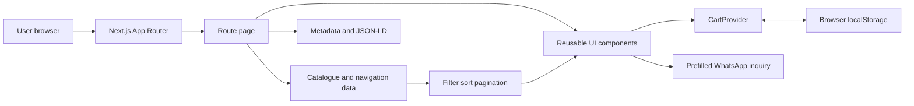
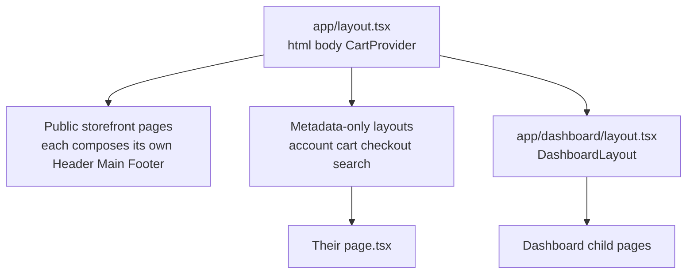
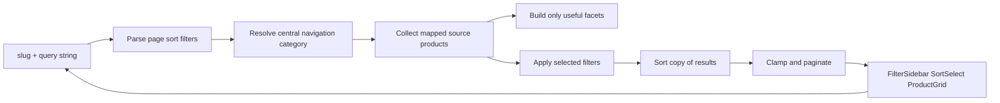
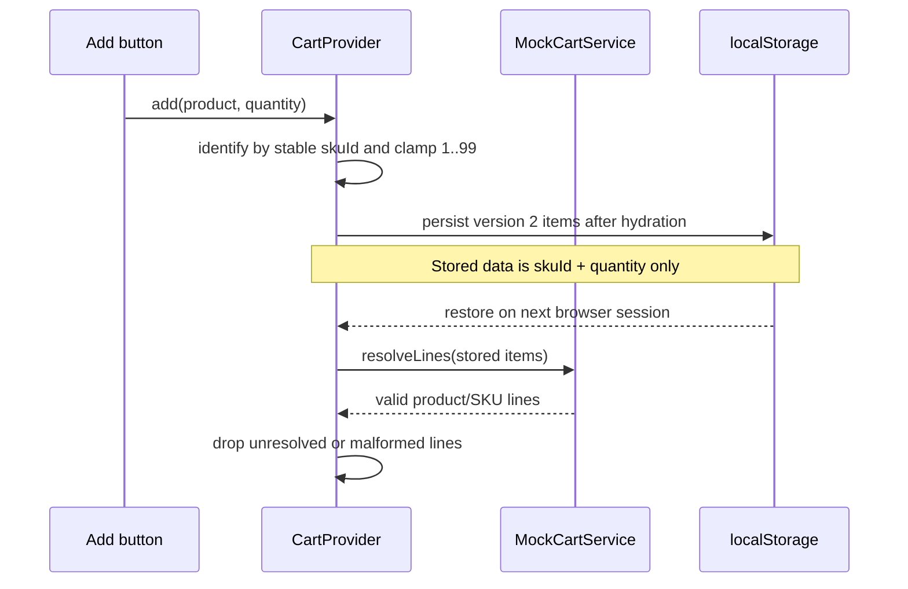

# VOLTRONIX Frontend Implementation Guide

এই document-টি current codebase দেখে লেখা। উদ্দেশ্য হলো beginner হিসেবে তুমি যেন file খুলে বুঝতে পারো—কোন route কোথা থেকে আসে, কোন component কী করে, data কোথা থেকে আসে, interaction কীভাবে চলে, আর কোন decision কেন নেওয়া হয়েছে।

> Current truth: এটি একটি **frontend-only marketplace prototype**। Catalogue, cart, filters, dashboard preview এবং WhatsApp quotation flow আছে; real backend, database, login, payment, order creation বা live inventory নেই।

## 1. Project-টি এক লাইনে কীভাবে কাজ করে

Next.js route একটি page render করে → page central catalogue data নেয় → reusable component দিয়ে UI বানায় → interactive অংশ client-side state ব্যবহার করে → cart browser-এর `localStorage`-এ থাকে → final inquiry WhatsApp draft হিসেবে খোলে।



এখানে application code মূলত **TypeScript**:

- `.ts` = UI ছাড়া TypeScript logic/type/data।
- `.tsx` = JSX লেখা TypeScript component/page।
- `.css` = global বা component-scoped style।
- `.mjs` = Next/PostCSS configuration। এটি app-এর ordinary JavaScript source নয়।
- `tsconfig.json`-এ `allowJs: false` এবং `strict: true`; তাই handwritten app code JavaScript নয়। Browser-এ অবশ্য build হওয়ার পর JavaScript bundle-ই চলে।

## 2. সবচেয়ে দরকারি mental model

Codebase-কে পাঁচটি layer হিসেবে ভাবো:

1. **Route layer — `app/`**: URL কোন page দেখাবে।
2. **UI layer — `components/`**: reusable screen parts।
3. **Catalogue/domain layer — `lib/catalog*`, `lib/data.ts`**: product shape, data, category mapping, filters।
4. **State/integration layer — Cart, services, WhatsApp**: browser state ও future backend boundary।
5. **Asset/style layer — `public/`, `app/globals.css`**: images, fonts, global visual rules।

একই request-এ সব layer পরিবর্তন না করাই এই project-এর গুরুত্বপূর্ণ rule। উদাহরণ: নতুন category দিলে central navigation mapping ও product source বদলাবে; header, homepage এবং footer-এ আলাদা hardcoded list বসাতে হবে না।

## 3. Folder structure

```text
Electronix marketplace/
├─ app/                         URL routes, layouts, SEO/system routes
│  ├─ category/[slug]/         Dynamic category route
│  ├─ product/[id]/            Dynamic product route
│  ├─ dashboard/               Separate dashboard route family
│  ├─ layout.tsx               Root HTML + CartProvider
│  ├─ page.tsx                 Homepage
│  └─ globals.css              Global design system and utilities
├─ components/
│  ├─ catalog/                 Filter/category-listing UI
│  ├─ dashboard/               Dashboard shell and reusable primitives
│  ├─ home/                    Homepage and 3D hero
│  ├─ product/                 Product-detail-only UI
│  ├─ seo/                     Structured-data helper
│  └─ ui/                      Low-level reusable UI
├─ lib/
│  ├─ catalog/                 Current Product type, navigation and display rules
│  ├─ contracts/               Future-facing Product/SKU/service types
│  ├─ adapters/                Current product → future contract bridge
│  ├─ services/                Interfaces and mock implementations
│  └─ dashboard/               Read-only dashboard derivations
├─ public/                     Static browser assets and product illustrations
├─ package.json                Commands and packages
├─ tsconfig.json               Strict TypeScript configuration
├─ next.config.mjs             Next image/build option
└─ postcss.config.mjs          Tailwind/PostCSS pipeline
```

Rule of thumb:

- URL/page খুঁজতে `app/`।
- Visible reusable block খুঁজতে `components/`।
- Product/category/filter behaviour খুঁজতে `lib/`।
- Image খুঁজতে `public/`।

## 4. Routing এবং layout

Next.js App Router-এ folder path-ই URL হয়। `page.tsx` route তৈরি করে, `layout.tsx` তার নিচের route-গুলোকে wrap করে। `[slug]` বা `[id]` হলো dynamic URL segment।



Root layout-এ `SiteHeader`/`SiteFooter` রাখা হয়নি। কারণ storefront, checkout/cart এবং dashboard-এর shell এক নয়। Root শুধু global CSS, root metadata, JSON-LD এবং `CartProvider` দেয়। তাই child page নিজের প্রয়োজন অনুযায়ী shell compose করতে পারে।

### Public এবং system routes

| URL | Source file | কী করে |
|---|---|---|
| `/` | `app/page.tsx` | Homepage: hero, trust strip, category browser, product showcases এবং CTA। |
| `/category/[slug]` | `app/category/[slug]/page.tsx` | Central navigation slug থেকে category/hub resolve করে; filter, sort এবং pagination চালায়। |
| `/product/[id]` | `app/product/[id]/page.tsx` | Slug বা ID দিয়ে product detail, gallery, facts, quote/cart action ও related items দেখায়। |
| `/search` | `app/search/page.tsx` | Search result + একই filter/sort/pagination pipeline। Empty query এবং `q=all` সব visible product দেখায়; `q=best` P1 product দেখায়। |
| `/cart` | `app/cart/page.tsx` | Browser cart/quote list, quantity, priced subtotal এবং WhatsApp quote action। |
| `/checkout` | `app/checkout/page.tsx` | Real checkout নয়; customer details নিয়ে WhatsApp quote-review draft তৈরি করে। |
| `/account` | `app/account/page.tsx` | Auth না থাকার honest placeholder। |
| `/price-challenge` | `app/price-challenge/page.tsx` | Competitor price details নিয়ে WhatsApp price-challenge draft তৈরি করে। |
| `/solutions` | `app/solutions/page.tsx` | Project requirements/BOQ inquiry WhatsApp-এ পাঠানোর form। |
| `/wholesale` | `app/wholesale/page.tsx` | Bulk/wholesale request-এর static guide ও WhatsApp entry। |
| 404 | `app/not-found.tsx` | Missing page-এর fallback এবং search link। |
| Route error | `app/error.tsx` | Client error boundary; error log করে retry/reset দেয়। |
| Loading | `app/loading.tsx` | Route transition/loading skeleton। |

`app/account/layout.tsx`, `app/cart/layout.tsx`, `app/checkout/layout.tsx` এবং `app/search/layout.tsx` মূলত SEO robots policy দেয়। Account/cart/checkout index হয় না; search page-ও search engine result হিসেবে index হয় না।

### Dashboard routes

সব dashboard URL `app/dashboard/layout.tsx`-এর `DashboardLayout` shell পায় এবং `noindex` থাকে।

| URL | File | Current behaviour |
|---|---|---|
| `/dashboard` | `app/dashboard/page.tsx` | Mock catalogue completeness metrics এবং category readiness। |
| `/dashboard/products` | `app/dashboard/products/page.tsx` | Read-only catalogue table, search, readiness filter, pagination। |
| `/dashboard/reports` | `app/dashboard/reports/page.tsx` | Deterministic catalogue data-quality report; sales report নয়। |
| `/dashboard/settings` | `app/dashboard/settings/page.tsx` | Future integration boundaries; settings save হয় না। |
| `/dashboard/inventory` | `app/dashboard/inventory/page.tsx` | Inventory service নেই—সেটা পরিষ্কারভাবে জানায়। |
| `/dashboard/orders` | `app/dashboard/orders/page.tsx` | Order records নেই—placeholder boundary। |
| `/dashboard/purchases` | `app/dashboard/purchases/page.tsx` | Purchase workflow নেই—placeholder boundary। |
| `/dashboard/quotes` | `app/dashboard/quotes/page.tsx` | WhatsApp inquiry dashboard record নয়—এটা জানায়। |
| `/dashboard/customers` | `app/dashboard/customers/page.tsx` | Customer persistence/auth না থাকায় unavailable state। |
| `/dashboard/suppliers` | `app/dashboard/suppliers/page.tsx` | Supplier data/backend না থাকায় unavailable state। |
| Dashboard error/loading | `app/dashboard/error.tsx`, `app/dashboard/loading.tsx` | Dashboard-specific fallback UI। |

Dashboard এখন admin application নয়; এটি future operations UI-এর safe shell। কোনো edit/delete button দেখিয়ে false capability তৈরি করা হয়নি।

### SEO/system route files

| File | কাজ |
|---|---|
| `app/robots.ts` | Search engine-কে private/utility routes crawl না করতে বলে। |
| `app/sitemap.ts` | Real `NEXT_PUBLIC_SITE_URL` থাকলেই public category/product URLs তৈরি করে। |
| `app/opengraph-image.tsx` | Social share-এর 1200×630 image code দিয়ে generate করে। |

## 5. Server Component বনাম Client Component

Next.js App Router-এ component defaultভাবে Server Component। File-এর শুরুতে `'use client'` থাকলে সেটি Client Component।

### Server Component কখন ব্যবহার হয়েছে

- Data array পড়া, filtering, sorting, pagination।
- Metadata/SEO generate করা।
- Static layout এবং product cards render করা।
- Browser event/state দরকার নেই এমন UI।

লাভ: কম client JavaScript, সহজ SEO, প্রথম render-এ data ready।

### Client Component কখন ব্যবহার হয়েছে

- `useState`, `useEffect`, `useContext`।
- click/hover/keyboard interaction।
- `localStorage`, `window`, WebGL।
- Framer Motion animation।
- `usePathname`, `useRouter`।

এখানে client code পুরো page-এ ছড়িয়ে না দিয়ে ছোট **client islands** রাখা হয়েছে। যেমন homepage route server component, কিন্তু `Hero`, `CategoryBrowser`, `SiteHeader` client component।

Hydration বোঝার জন্য cart ভালো example: server-এর কাছে browser `localStorage` নেই। তাই প্রথম render empty state দিয়ে হয়; mount-এর পরে stored cart restore হয় এবং `isHydrated` true হয়। এতে server/client HTML mismatch এড়ানো যায়।

## 6. Main page logic: raw flow

### 6.1 Homepage

`app/page.tsx` orchestration file। এটি নিজে complex UI আঁকে না; sections compose করে।

1. Central product arrays থেকে gadget essentials, popular এবং trending groups তৈরি করে।
2. `Set` ব্যবহার করে showcase-এর product duplicate এড়ায়।
3. `SiteHeader` → `Hero` → `TrustStrip` → `CategoryBrowser` → তিনটি `Showcase` → CTA panels → `SiteFooter` render করে।
4. Homepage showcase intentionally ছোট; catalogue browsing category/search page-এ যায়।

Gadget showcase আটটি item নেয়। প্রথমে প্রতিটি gadget category থেকে অন্তত একটি item রাখার চেষ্টা করে; তারপর selected extras যোগ করে; dedupe করে `slice(0, 8)`। ফলে শুধু প্রথম আটটি raw product নেওয়ার তুলনায় category coverage ভালো হয়।

### 6.2 Category listing

`app/category/[slug]/page.tsx` হলো সবচেয়ে গুরুত্বপূর্ণ catalogue route।



Important details:

- Unknown slug হলে `notFound()`।
- Category name এবং description central mapping থেকে আসে।
- Filter state React state-এ নয়; URL query string-এ থাকে। তাই refresh/share/back button কাজ করে।
- Current data-তে verified price না থাকলে price sort option disable/hide হয়।
- Previous/Next link existing filters/sort preserve করে।
- `generateStaticParams()` known slugs Next-কে আগে থেকে জানায়।
- `generateMetadata()` category-specific title, description ও canonical তৈরি করে।

### 6.3 Search

`app/search/page.tsx` category page-এর একই filtering utilities reuse করে। পার্থক্য শুধু initial product pool `searchProducts(q)` থেকে আসে।

- blank বা `/search` → সব visible products।
- `q=all` → সব visible products।
- `q=best` → priority `P1` products।
- ordinary query → name, SKU, source category, subcategory এবং tags-এর combined text-এ substring match।
- pagination/filter URLs-এ `q` preserve করার জন্য `extras` object ব্যবহার হয়।

এটি full-text search engine নয়; typo tolerance, stemming বা relevance score নেই। Current prototype-এর জন্য deterministic substring search।

### 6.4 Product details

`app/product/[id]/page.tsx`:

1. URL value দিয়ে slug অথবা ID match করে।
2. Missing হলে 404।
3. Raw source category-কে public navigation category-তে map করে breadcrumb বানায়।
4. `ProductGallery`, summary, pricing/availability, `ProductPurchaseActions` এবং `ProductSpecifications` compose করে।
5. Same source category থেকে সর্বোচ্চ চারটি related product নেয়।
6. Client-side recently viewed list দেখায়।
7. Product এবং breadcrumb JSON-LD দেয়; unverified price থাকলে fake Offer schema বানায় না।

### 6.5 Cart এবং mock checkout

Cart-এর দুইটি truth আলাদা রাখা হয়েছে:

- **Cart identity/state**: `CartProvider`।
- **Cart screen presentation**: `app/cart/page.tsx`।

Priced line-এর total = `sellingPrice × quantity`। Price `null` হলে zero-price product দেখানো হয় না; `Quote required` state দেখায়। Subtotal শুধু priced lines যোগ করে এবং quote-required count আলাদা রাখে।

Checkout form real order submit করে না। Customer name, phone, location ও notes নিয়ে structured WhatsApp quote-review message খোলে। তাই UI payment/order success claim করে না।

### 6.6 Price challenge এবং solution forms

`app/price-challenge/page.tsx` ও `app/solutions/page.tsx` controlled client forms। Form data browser memory-তে থাকে; submit-এর সময় `lib/whatsapp.ts` message তৈরি করে নতুন WhatsApp tab খোলে। File upload/storage নেই; প্রয়োজন হলে user WhatsApp chat-এ attachment দেয়।

## 7. Component directory

এখানে প্রতিটি component file-এর দায়িত্ব সংক্ষেপে দেওয়া হলো। Parent page composition বোঝার পরে component file পড়লে সবচেয়ে দ্রুত শেখা যাবে।

### 7.1 Shared storefront components

| File | কী render করে | ভিতরের logic / কেন আছে |
|---|---|---|
| `components/site-header.tsx` | Top strip, logo, search, cart badge, Electrical/Gadgets navigation | Search submit-এ router navigation; mobile menu ও active submenu state; Escape/outside click close; pathname দিয়ে active department; categories central mapping থেকে। |
| `components/site-footer.tsx` | Company/help/category links ও WhatsApp contact | Footer category links একই central mapping reuse করে; duplicate catalogue config তৈরি করে না। |
| `components/brand-logo.tsx` | VOLTRONIX logo ও hover spark | Pointer position, movement direction এবং speed হিসাব করে CSS custom properties দেয়; deterministic SVG arc frames/CSS animation; reduced motion respected। |
| `components/cart-provider.tsx` | Visible UI নয়; global cart Context | SKU-keyed lines, add/update/remove/clear, count/subtotal, v1→v2 storage migration, localStorage restore/persist এবং invalid data cleanup। |
| `components/add-to-cart-button.tsx` | Product card/detail primary action | `useCart().add`; price null হলে quote-list wording; 1.35s Added state; icon/text animation; repeated click-এ feedback key নতুন animation চালায়; accessible live announcement। |
| `components/product-card.tsx` | Compact catalogue card এবং `ProductGrid` | Image/name links product route-এ; brand/category/price state; primary button card-এর বাইরে navigation নষ্ট না করে add করে; grid responsive 2/3/4 columns। |
| `components/showcase.tsx` | Reusable titled product section | Heading ID, optional View All link, `ProductGrid`; empty array হলে honest empty state। |
| `components/product-purchase-actions.tsx` | Detail page quantity + cart + WhatsApp block | Quantity 1–99 clamp; selected quantity দুই action-এই যায়; price না থাকলে label quote-focused। |
| `components/product-whatsapp-button.tsx` | Product-specific WhatsApp button | Browser-এর current product URL ও quantity নিয়ে clean question template তৈরি করে নতুন tab খোলে। |
| `components/recently-viewed-products.tsx` | Previously viewed cards | localStorage-এ versioned list; current product বাদ; সর্বোচ্চ 6 store/4 display; malformed data safely ignore। |
| `components/ui/electric-button.tsx` | Premium animated CTA primitive | Button/link দুই mode; Framer Motion hover/tap; fixed five spark positions ও scan shine; random/date-based render নেই; reduced motion safe। |
| `components/seo/json-ld.tsx` | Hidden structured-data script | Object-কে safe serialized JSON-LD হিসেবে page head/body-তে দেয়। |

### 7.2 Product detail components

| File | দায়িত্ব |
|---|---|
| `components/product/product-gallery.tsx` | Primary এবং gallery URL dedupe করে; selected thumbnail state রাখে; illustrative/dummy visual হলে সতর্ক label; next-image action দেয়। |
| `components/product/product-specifications.tsx` | `getProductFacts()` output semantic `<dl>` rows-এ দেখায়; product-specific formatting UI থেকে আলাদা রাখে। |

### 7.3 Catalogue components

| File | দায়িত্ব এবং logic |
|---|---|
| `components/catalog/category-selector.tsx` | Current department-এর hub + child category links দেখায়; central navigation group থেকে data নেয়। |
| `components/catalog/category-card-grid.tsx` | Generic category link cards; optional product counts; category hub page presentation সহজ করে। |
| `components/catalog/filter-sidebar.tsx` | Desktop sticky filter ও mobile `<details>`; GET form submit; selected query/sort preserve; useful facets only; প্রথম 6 option visible, বাকিগুলো expandable। |
| `components/catalog/active-filters.tsx` | Selected filter values removable chips হিসেবে দেখায়; remove URL বানিয়ে অন্য state preserve করে। |
| `components/catalog/sort-select.tsx` | GET-based sort form; current q/filters hidden input দিয়ে preserve; valid price data না থাকলে price sorts বাদ। |

Filter UI intentionally server-friendly HTML form। Apply করলে নতুন URL request হয়; client-side filter store নেই। এতে browser history, copyable URL এবং pagination consistency সহজ থাকে।

### 7.4 Homepage components

| File | দায়িত্ব এবং logic |
|---|---|
| `components/home/hero.tsx` | Left copy এবং right circuit experience-এর responsive shell; দুই subcomponent-এর boundary। |
| `components/home/hero-copy.tsx` | Headline, trust copy, CTAs; Framer spring দিয়ে pointer-follow soft glow; touch/reduced-motion-এ unnecessary movement বন্ধ। |
| `components/home/hero-copy.module.css` | Hero-only reveal/glow styling; scope leak হয় না; reduced-motion override আছে। |
| `components/home/circuit-animator.tsx` | Heavy WebGL experience dynamic import করে এবং `ssr: false` রাখে; load হওয়ার সময় stable placeholder। |
| `components/home/trust-strip.tsx` | WhatsApp help, quote-first pricing, delivery coordination এবং project sourcing—চারটি static trust item। |
| `components/home/category-browser.tsx` | Electrical/Gadgets accessible tabs; arrow/Home/End keyboard navigation; active group-এর central categories render; icon map শুধু presentation। |

### 7.5 3D circuit hero internals

এই folder feature-isolated। সাধারণ storefront change করতে এখানে ঢোকার প্রয়োজন নেই।

| File | দায়িত্ব এবং logic |
|---|---|
| `components/home/lumen-circuit/experience.tsx` | Experience controller। `off → arming → on → disarming` state; transition চলাকালে double toggle ঠেকায়; Canvas, lights/effects, status ও accessible switch control compose করে; WebGL না থাকলে fallback। |
| `components/home/lumen-circuit/scene.tsx` | প্রতি frame-এ one mutable timeline update; wire curves memoize; battery/resistor/bulb/switch/current parts compose; reduced motion হলে camera fixed। React state প্রতি frame বদলানো হয়নি, তাই avoidable rerender নেই। |
| `components/home/lumen-circuit/circuit-parts.tsx` | Battery charge, resistor heat, bulb emission, switch lever এবং moving current particles-এর meshes/animation। Timeline power values material/light-এ damp করে realistic transition দেয়। |
| `components/home/lumen-circuit/geometry.ts` | Deterministic wire paths, rounded curve segments এবং bulb filament geometry। Visual structure math-কে React markup থেকে আলাদা রাখে। |
| `components/home/lumen-circuit/hooks.ts` | Browser reduced-motion listener ও WebGL capability detection; renderer test resource dispose করে। |
| `components/home/lumen-circuit/stone-texture.ts` | Seeded procedural graphite color/roughness/normal `DataTexture`; network image লাগে না; generated textures dispose করার API দেয়। |
| `components/home/lumen-circuit/types.ts` | Circuit state ও shared timeline ref-এর TypeScript types। |
| `components/home/lumen-circuit/lumen-circuit.module.css` | Canvas panel, fallback, status, control এবং overlay styles; feature-scoped এবং reduced-motion rules। |

Performance decision: Canvas server-এ render হয় না; `useFrame`-এর animation data React state-এ নয়; geometry/curves memoized; WebGL unsupported হলে CSS fallback।

### 7.6 Dashboard components

| File | দায়িত্ব এবং logic |
|---|---|
| `components/dashboard/dashboard-layout.tsx` | Dashboard page shell; sidebar + topbar + main; mobile sidebar open/close state। |
| `components/dashboard/dashboard-sidebar.tsx` | Central dashboard navigation groups; pathname দিয়ে active link; close callback mobile flow-এ ব্যবহার। |
| `components/dashboard/dashboard-topbar.tsx` | Current dashboard page label, menu trigger এবং storefront exit link। |
| `components/dashboard/dashboard-pagination.tsx` | Link-based pagination; previous/next, compact page numbers এবং ellipsis; caller URL builder দেয়। |
| `components/dashboard/data-table.tsx` | Generic typed table; page columns, cell renderer এবং row ID inject করে; empty message support। |
| `components/dashboard/filter-bar.tsx` | Dashboard GET search/select form এবং reset link। URL-এ filter state রাখে। |
| `components/dashboard/metric-card.tsx` | Reusable catalogue metric card; neutral/attention/ready tone mapping। |
| `components/dashboard/status-badge.tsx` | Small semantic status label; tone অনুযায়ী style। |
| `components/dashboard/page-header.tsx` | Common eyebrow/title/description/action layout। |
| `components/dashboard/empty-state.tsx` | Generic icon, title, detail ও optional actionসহ empty state। |
| `components/dashboard/operation-unavailable.tsx` | `PageHeader` + `EmptyState` compose করে unavailable operation pages consistent রাখে। |
| `components/dashboard/loading-state.tsx` | Reusable dashboard skeleton blocks। |

## 8. Catalogue data architecture

এখানেই project-এর business-like frontend logic সবচেয়ে বেশি।

### 8.1 Current product shape

`lib/catalog/types.ts`-এর `Product` এখন storefront-এর মূল data shape। গুরুত্বপূর্ণ field groups:

- Identity: `id`, `sku`, `name`, `slug`।
- Classification: `category`, `subcategory`, `tags`।
- Merchandising: `priority`, `trending`, `shortDescription`।
- Technical data: `attributes`, `specifications`, `applications`।
- Media: `images.primary`, `images.gallery`।
- Commercial truth: nullable `sellingPrice`, nullable stock/quantity।
- Supplier: nullable supplier fields।

Nullable field deliberate। Unknown price-কে `0` এবং unknown stock-কে `in stock` বানানো হয়নি। UI-ও সেই unknown state honestভাবে দেখায়।

### 8.2 `lib/data.ts`: current catalogue source

এই file দুই ধরনের catalogue merge করে:

1. `source` tuple list থেকে generated legacy electrical products।
2. `gadgetProducts` থেকে manually structured gadget starter products।

Legacy generation flow:

- Stable array order থেকে item number।
- Item number থেকে `item-001`, `VLT-0001` এবং unique slug।
- Regex দিয়ে name থেকে voltage, amp, cable size, pole ইত্যাদি basic attributes infer।
- Keyword rules দিয়ে stock mode/priority classify।
- Price, brand, supplier এবং verified availability invent না করে `null`।
- Source category অনুযায়ী deterministic illustrative image।

Launch policy-তে legacy source-এর **প্রতি category থেকে alternate item** রাখা হয় (`position % 2 === 0`)। তাই product count প্রায় অর্ধেক হলেও কোনো source category পুরো vanish করে না। Gadget starter products সব রাখা হয়।

Important maintenance warning: legacy IDs/SKUs array position থেকে আসে। Existing source list-এর মাঝখানে item insert করলে পরের generated IDs বদলাতে পারে। এখন append করা safer; real business launch-এর আগে backend-controlled stable SKU দরকার।

Exported helpers:

- `products`: visible launch catalogue।
- `getProduct()`: slug বা ID lookup।
- `getProductBySku()`: SKU lookup।
- `productsByNavigationCategory()`: public category mapping অনুযায়ী product pool।
- `searchProducts()`: blank/all/best/substring search।
- `relatedProducts()`, `priorityProducts`, `trendingProducts`।

### 8.3 Gadget seed data

`lib/catalog/gadget-seed-data.ts` ছয়টি source group এবং 30টি starter listing রাখে। `createGadgetProduct()` common defaults centralize করে:

- unbranded;
- price/stock unverified;
- `P3`, order-on-request;
- category-level illustrative image;
- supplier verification notice;
- structured attributes/tags/applications।

ফলে প্রতিটি gadget object-এ একই defensive wording বারবার লিখতে হয় না। Navigation label এবং raw source category আলাদা রাখা হয়েছে, যাতে future taxonomy বদলালেও product record-এর canonical source grouping থাকে।

### 8.4 Central navigation mapping

`lib/catalog/navigation.ts` হলো catalogue navigation-এর **single source of truth**।

- `leafNavigationCategories`: customer-facing category name, slug, mapped raw source categories, description।
- `electricalCategories` / `gadgetCategories`: section-derived leaf lists।
- `electricalHub` / `gadgetHub`: সব child source category aggregate করে all-department routes।
- `navigationCategories`: route resolver-এর complete list।
- `catalogueNavigationGroups`: header ও homepage tabs-এর Electrical/Gadgets groups।
- Lookup helpers: slug → category, source category → public category, slug → group।

এই কারণেই header, category selector, homepage browser এবং footer একই taxonomy follow করতে পারে। নতুন public category ideally এখানেই map হবে; component-এ নতুন hardcoded list নয়।

### 8.5 Images এবং display formatting

| File | কাজ |
|---|---|
| `lib/catalog/product-images.ts` | Electrical source category-কে public category illustration-এ map করে; match না হলে local dummy SVG। External hotlink নেই। |
| `lib/catalog/product-display.ts` | Attributes/specifications readable label ও unit-এ format; duplicate fact বাদ; placeholder descriptionকে clearer summary; availability wording। |
| `lib/currency.ts` | `Intl.NumberFormat('en-BD')` দিয়ে consistent `৳` BDT output। |

Current product images mostly category-level illustrative assets, exact SKU photography নয়। UI এই limitation label করে।

## 9. Filter, sort এবং pagination engine

### `lib/facet-config.ts`

প্রতিটি possible filter-এর definition:

- query key;
- customer label;
- value type;
- optional unit;
- কোন category slug-এ relevant;
- optional max option count।

এটি UI নয়; filter policy। Product attributes-এ value থাকলেই actual option তৈরি হতে পারে।

### `lib/catalog-filter.ts`

Main functions:

- `parseCatalogSearchParams()` unknown query keys ignore করে, page/sort validate করে, repeated checkbox values dedupe করে।
- `buildAvailableFacets()` current product pool থেকে counts বানায়; দুইটির কম distinct option হলে filter লুকায়।
- `applyProductFilters()` সব active facet-এর জন্য AND, একই facet-এর selected values-এর মধ্যে OR match করে।
- `sortProducts()` source array mutate না করে copy sort করে; null price সবসময় priced items-এর পরে।
- `paginateProducts()` invalid page/pageSize clamp করে এবং slice দেয়।
- `serializeFilterParams()` / `catalogUrl()` stable query URL বানায়।

Current limit: numeric facets exact-value checkbox; price/range slider নয়। এই simplicity data trustworthy না হওয়া পর্যন্ত safer।

## 10. Cart, contracts এবং service boundary

Project-এ product-এর দুইটি layer আছে। Beginner হিসেবে এই distinction জানা জরুরি।

### Layer A: current legacy storefront model

`lib/catalog/types.ts` + `lib/data.ts`। অধিকাংশ current page/component সরাসরি এটি ব্যবহার করে।

### Layer B: future-facing contracts

`lib/contracts/` product এবং SKU আলাদা করে। Future backend-এ এক product-এর multiple SKU/variant থাকতে পারে। Current flat product-এর প্রতিটি item আপাতত এক default SKU হিসেবে adapt হয়।

| File | Contract |
|---|---|
| `lib/contracts/common.ts` | `Money`, stock snapshot, page request/result। |
| `lib/contracts/catalog.ts` | Future `Product`, `SKU`, variant এবং image types। |
| `lib/contracts/cart.ts` | Persistable `skuId + quantity`, resolved cart line এবং summary। |
| `lib/contracts/checkout.ts` | Preview-only checkout; `orderSubmissionAvailable: false` hard guarantee। |
| `lib/contracts/dashboard.ts` | Catalogue readiness summary/row contracts। |

`lib/adapters/legacy-product-adapter.ts` দুই layer-এর bridge:

- Current price → `Money | null`।
- Current availability → verified/unknown stock snapshot।
- Current primary image → contract image array।
- One current product → one default SKU।
- SKU থেকে legacy product resolve করে existing UI চালু রাখে।

### Service interfaces এবং mocks

| File | দায়িত্ব |
|---|---|
| `lib/services/catalog-service.ts` | Product list/lookup/SKU lookup-এর interface। |
| `lib/services/cart-service.ts` | Stored SKU inputs resolve ও summary interface। |
| `lib/services/checkout-service.ts` | Checkout preview-only interface। |
| `lib/services/dashboard-service.ts` | Dashboard overview/readiness interface। |
| `lib/services/index.ts` | Current app-এ mock implementations export করার single entry। |
| `lib/services/mock/catalog-service.ts` | Current arrays adapter দিয়ে contract products-এ convert ও paginate করে। |
| `lib/services/mock/cart-service.ts` | Quantity normalize/dedupe, SKU resolve, line subtotal এবং quote count। |
| `lib/services/mock/checkout-service.ts` | Cart lines/summary দিয়ে non-order preview বানায়। |
| `lib/services/mock/dashboard-service.ts` | Current products থেকে readiness counts বানায়; revenue/order invent করে না। |

Current transition incomplete but intentional: `CartProvider` service boundary ব্যবহার করছে, কিন্তু অনেক storefront page এখনও `lib/data.ts` সরাসরি পড়ে। Backend এলে একবারে সব rewrite না করে page-by-page service adoption করা যাবে।

### Cart persistence flow



Version 1 cart-এ product ID ছিল; version 2 SKU ID ব্যবহার করে। Migration reader পুরনো saved cart-ও resolve করার চেষ্টা করে।

## 11. WhatsApp integration

`lib/whatsapp.ts` সব WhatsApp message-এর single formatter। Number raw international format-এ `8801775297759`; display version আলাদা।

Functions:

- General product/project help।
- Product-specific availability, price fixed কিনা, delivery time/charge।
- Price Challenge।
- Project solutions/BOQ।
- Wholesale/bulk quote।
- Cart quote এবং checkout quote review।

`buildWhatsAppUrl()` message URL-encode করে `wa.me` link বানায়। Product query-তে name, SKU, category, quantity এবং current page link থাকে। Cart query-তে প্রতিটি line-এর quantity ও priced total থাকে; শেষে পরিষ্কারভাবে বলে এটি quotation request, confirmed order নয়।

No API call হয় না। Browser শুধু WhatsApp URL খোলে; message user নিজে review/send করে।

## 12. Dashboard data logic

`lib/dashboard/catalog-data.ts` current catalogue থেকে presentation rows/metrics derive করে। এটি independent database নয়।

- Image আছে কি না এবং image illustrative না assigned তা classify।
- Price, availability, brand, specification completeness।
- Search/readiness filter parse এবং 120-character query limit।
- 12-row pagination এবং URL builder।
- Category-wise pending counts।

`lib/dashboard/navigation.ts` sidebar groups, labels, paths, icons এবং future permission name রাখে। Permission strings এখন documentation/structure; actual auth/RBAC enforcement নেই।

## 13. Styling, responsiveness এবং accessibility

### Styling

- `app/globals.css` design tokens, font faces, reset/base style, container utilities, buttons, focus helpers এবং brand-logo animation রাখে।
- Tailwind classes component markup-এ layout/spacing/color/state দেয়।
- Hero/3D-এর complex style CSS Module-এ scope করা, যাতে global collision না হয়।
- Brand identity প্রধানত dark navy, blue, white এবং limited VOLTRONIX yellow accent।

### Responsive strategy

- Shared `container-shell` content width/side spacing control করে।
- Product grid mobile-এ 2, বড় screen-এ 3/4 columns।
- Filter mobile-এ collapsible, desktop-এ sticky sidebar।
- Header desktop search/nav ও mobile menu/search আলাদা presentation দেয় কিন্তু same state/data ব্যবহার করে।
- Dashboard sidebar mobile-এ overlay-style toggle, desktop-এ persistent।
- Hero small screen-এ stack হয়; WebGL panel layout-safe থাকে।

### Accessibility already present

- Semantic links/buttons/forms/fieldset/legend।
- Search এবং icon button labels।
- Keyboard tabs in CategoryBrowser।
- Escape ও focus restoration in header menu।
- `aria-expanded`, `aria-controls`, `aria-current`, live announcements।
- Quantity control labelled group।
- Reduced-motion handling in animation/3D/CSS।
- WebGL fallback।
- Decorative icons mostly `aria-hidden`।

## 14. SEO implementation

SEO তিন স্তরে করা:

1. **Root metadata** — `app/layout.tsx`: title template, description, Open Graph, Twitter।
2. **Route metadata** — category/product pages: route-specific title, description, canonical।
3. **Structured data** — Organization, WebSite, Product এবং Breadcrumb JSON-LD।

`lib/seo.ts`:

- `NEXT_PUBLIC_SITE_URL` validate করে।
- Real URL না থাকলে false production canonical/sitemap/schema publish করে না।
- Relative path থেকে absolute URL বানায়।
- Product description 160 characters-এর মধ্যে রাখে।
- `<` escape করে safe JSON-LD serialization।

Important launch task: production deployment-এ correct `NEXT_PUBLIC_SITE_URL` set না করলে canonical/sitemap/full schema intentionally incomplete থাকবে। Real product price/stock ছাড়া Product Offer schema যোগ করা উচিত নয়।

## 15. Tools এবং packages কেন ব্যবহার হয়েছে

| Package/tool | Project-এ কাজ |
|---|---|
| Next.js 16 | File-based App Router, Server Components, metadata, sitemap/robots, optimized build। |
| React 19 | Components, Context, hooks, client interactions। |
| TypeScript 5.8 | Strict type checking; product/service/component contracts। |
| Tailwind CSS 3 | Fast utility-first responsive styling। |
| PostCSS + Autoprefixer | Tailwind compile ও browser CSS prefixes। |
| Framer Motion | CTA/button feedback এবং subtle hero motion। |
| Lucide React | Consistent accessible icon components। |
| Three.js | Low-level 3D scene/material/geometry। |
| React Three Fiber | Three.js sceneকে React component tree হিসেবে লেখা। |
| Drei | Useful Three/R3F helpers। |
| React Three Postprocessing | Bloom/vignette-এর মতো controlled visual effects। |
| pnpm | Dependency install এবং `dev`, `build`, `typecheck` scripts চালানো। |

`components.json` shadcn-compatible aliases/config রাখে, কিন্তু current UI prebuilt shadcn component collection-এর ওপর heavily dependent নয়। `@/*` alias project root থেকে clean import দেয়, যেমন `@/lib/data`।

## 16. Configuration files

| File | যে সিদ্ধান্তটি ধরে |
|---|---|
| `package.json` | Runtime/dev packages এবং commands: `pnpm dev`, `pnpm build`, `pnpm start`, `pnpm typecheck`। |
| `tsconfig.json` | Strict TS, no emit, no JS, React JSX, bundler resolution, `@/*` path alias। |
| `next.config.mjs` | Next Image `unoptimized: true`; current static/local assets সহজে serve হয়, তবে production image optimization CDN নেই। |
| `postcss.config.mjs` | Tailwind এবং Autoprefixer pipeline। |
| `components.json` | UI tooling conventions, TSX/RSC preference এবং aliases। |

## 17. Public assets

`public/`-এর path browser URL-এ root থেকে পাওয়া যায়। যেমন:

```text
public/products/generated/power-backup.webp
→ /products/generated/power-backup.webp
```

- `public/products/generated/*.webp`: electrical category illustrations।
- `public/products/generated/gadgets/*.png`: ছয় gadget category illustration।
- `public/products/dummy-product.svg`: deterministic fallback।
- Root icon/placeholder files: favicon/app/general placeholder assets।

External image hotlink ব্যবহার করা হয়নি। তাই third-party URL বন্ধ হলে product image ভাঙবে না।

## 18. Raw implementation decisions: কেন এভাবে করা হয়েছে

| Decision | কারণ | Trade-off |
|---|---|---|
| Root layout-এ শুধু provider, global header নয় | Dashboard/checkout আলাদা shell রাখতে পারে | Public page-এ header/footer explicitভাবে compose করতে হয়। |
| URL-driven filters | Shareable, refresh-safe, browser history-friendly | Apply করলে navigation হয়; instant client filtering নয়। |
| Central navigation mapping | Header/home/category/footer একই taxonomy | Mapping file বুঝে change করতে হয়। |
| Unknown commercial data = `null` | Fake price/stock claim হয় না | Catalogue-তে quote-required item বেশি। |
| SKU-keyed cart | Future variants/SKU backend-এর সাথে compatible | Current model-এ one product = one SKU adapter দরকার। |
| Category illustrations | Initial visual consistency, no broken/hotlinked image | Exact product photo নয়; clear label জরুরি। |
| Half legacy catalogue by alternating items | Noise কমে, category coverage থাকে | Direct business assortment decision নয়। |
| Client-only dynamic 3D import | SSR/WebGL mismatch এড়ায় | Hero bundle/graphics cost এখনও আছে। |
| Mock service interfaces | Future API swap-এর seam তৈরি | Current code-এ legacy and contract model দুইটি বুঝতে হয়। |
| Honest dashboard placeholders | Fake operational data/actions নেই | Dashboard এখনও usable admin tool নয়। |

## 19. তুমি feature change করলে কোথা থেকে শুরু করবে

### একটি homepage section-এর text/layout বদলাতে

1. `app/page.tsx` দেখে কোন component render হচ্ছে চিহ্নিত করো।
2. Section-specific file `components/home/` বা `components/showcase.tsx` edit করো।
3. Catalogue logic না বদলালে `lib/data.ts` touch কোরো না।

### নতুন public category যোগ করতে

1. Product-এর canonical source category ঠিক করো।
2. `lib/catalog/navigation.ts`-এ leaf mapping যোগ করো।
3. Relevant filter চাইলে `lib/facet-config.ts`-এ slug map করো।
4. Product data-তে সেই source category/attributes দাও।
5. Optional illustration `public/products/` এবং image mapping-এ যোগ করো।
6. Header/home/category routes central mapping থেকে automatically পায় কিনা verify করো।

### নতুন product যোগ করতে

- Gadget হলে `lib/catalog/gadget-seed-data.ts`-এর structured seed pattern follow করো।
- Legacy source হলে existing IDs নষ্ট না করতে list-এর শেষে append করো।
- Unknown price/brand/stock invent কোরো না।
- Attribute key existing facet config-এর সাথে match করো।
- Exact product image না হলে illustrative status honest রাখো।

### নতুন filter যোগ করতে

1. Product `attributes`-এ stable key/value বসাও।
2. `lib/facet-config.ts`-এ definition এবং category slugs দাও।
3. দরকার হলে `product-display.ts`-এ readable label/unit দাও।
4. Category URL-এ repeated query key দিয়ে filter verify করো।

### নতুন route যোগ করতে

1. `app/<route>/page.tsx`।
2. Interactive হলে যত ছোট possible child-এ `'use client'` দাও।
3. Public storefront হলে required shell compose করো।
4. Metadata/canonical/indexing policy ঠিক করো।
5. Navigation-এ দরকার হলে central config থেকে link দাও।

### Cart behavior বুঝতে বা বদলাতে

এই order-এ পড়ো:

1. `components/add-to-cart-button.tsx`
2. `components/cart-provider.tsx`
3. `lib/adapters/legacy-product-adapter.ts`
4. `lib/services/mock/cart-service.ts`
5. `app/cart/page.tsx`
6. `lib/whatsapp.ts`

### Future backend connect করতে

Existing page থেকে arbitrary `fetch()` ছড়াবে না। `lib/services/*` interface implement করা HTTP service বসাও; `lib/services/index.ts`-এ mock export বদলাও; তারপর legacy direct-import pages ধীরে service boundary-তে migrate করো।

## 20. Beginner reading path

একসাথে সব file পড়ো না। এই order follow করো:

1. `app/layout.tsx` — whole app wrapper।
2. `app/page.tsx` — composition শেখো।
3. `lib/catalog/types.ts` — Product বুঝো।
4. `lib/data.ts`-এর generation/export অংশ — data কোথা থেকে আসে।
5. `lib/catalog/navigation.ts` — public taxonomy।
6. `components/product-card.tsx` — one product UI।
7. `app/category/[slug]/page.tsx` + `lib/catalog-filter.ts` — URL-driven listing flow।
8. `components/cart-provider.tsx` + `app/cart/page.tsx` — state/persistence।
9. `app/product/[id]/page.tsx` — dynamic route + SEO + composition।
10. `components/site-header.tsx` — client navigation state/accessibility।
11. `lib/contracts/`, adapter, services — backend-ready seam।
12. Dashboard।
13. Three.js hero সবশেষে।

প্রতিটি file পড়ার সময় চারটি প্রশ্ন করো:

1. Input/props কী?
2. Local state আছে কি?
3. Data কোথা থেকে আসছে?
4. Output UI বা returned value কোথায় ব্যবহার হচ্ছে?

## 21. Current limitations এবং technical debt

- Product data real source/database নয়; legacy IDs/SKUs order-derived।
- Most prices, brands, suppliers, specifications এবং stock unverified।
- Category illustrations exact product photos নয়।
- Search simple substring matching।
- Numeric/price range filter নেই; exact option filters।
- Cart device/browser-local; account sync নেই।
- WhatsApp inquiry send হওয়ার result app জানে না।
- Checkout real order/payment নয়।
- Dashboard auth/RBAC/edit CRUD নেই।
- Service abstraction আছে, কিন্তু storefront পুরোপুরি service-driven নয়।
- `next/image` optimization disabled; production media strategy পরে দরকার।
- Automated test suite এখনও main implementation layer নয়; build/typecheck primary safety net।

এই limitation-গুলো bug লুকানোর চেষ্টা নয়; UI-তে যতটা সম্ভব clear state হিসেবে রাখা হয়েছে।

## 22. Final map

```text
Route জানতে           → app/
Page composition      → app/**/page.tsx
Reusable UI           → components/
Product shape         → lib/catalog/types.ts
Visible catalogue     → lib/data.ts
Category structure    → lib/catalog/navigation.ts
Filter definitions    → lib/facet-config.ts
Filter engine         → lib/catalog-filter.ts
Cart state            → components/cart-provider.tsx
Future data boundary  → lib/contracts/ + lib/services/
WhatsApp wording      → lib/whatsapp.ts
SEO helpers           → lib/seo.ts
Static images         → public/
Global visuals        → app/globals.css
3D hero only          → components/home/lumen-circuit/
```

সবচেয়ে গুরুত্বপূর্ণ architectural idea: **page route orchestration করে, component UI/interaction encapsulate করে, আর `lib` reusable data/business rules ধরে।** এই boundary বজায় রাখলে project বড় হলেও manualভাবে trace, edit এবং পরে backend connect করা সহজ থাকবে।
