# Project: VOLTRONIX

**Document Type:** Next-Stage Architecture & Production Blueprint  
**Baseline:** `ARCHITECTURE_CASE_STUDY.md`  
**Purpose:** Current frontend → production ecommerce  
**Source of Truth:** Verified baseline + targeted repository inspection

## Planning language

- **CURRENT:** verified in the present repository.
- **NEXT:** the immediate dependency-safe work.
- **LATER:** required after earlier checkpoints pass.
- **NOT NEEDED YET:** deliberately deferred until evidence justifies it.
- **BUSINESS DECISION REQUIRED:** code should not choose this policy.

This document defines a future implementation sequence. It does not claim that a backend, database, real order, payment or protected dashboard exists today. `ARCHITECTURE_CASE_STUDY.md` remains the detailed description of the current frontend.

# 1. Current → target architecture

## CURRENT — one-page boundary summary

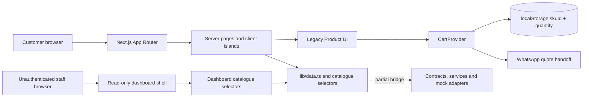

The current product is a strong frontend quote prototype: public discovery routes, URL-driven filtering/pagination, product detail, SKU-keyed browser cart, WhatsApp enquiry flows, SEO foundations, Three.js isolation and a dashboard shell are present. Business truth is not. Product accuracy, prices, stock, customers, orders, payment, purchasing, fulfillment and audit history have no durable server owner.

The main migration asset is the partial seam under `lib/contracts/`, `lib/services/` and `lib/adapters/`. The main migration risk is that homepage, category, search, product, sitemap and dashboard pages still import `lib/data.ts` or catalogue projections directly. `CartProvider` persists the correct identity pair—`skuId + quantity`—but still exposes legacy products and locally derives totals.

## TARGET

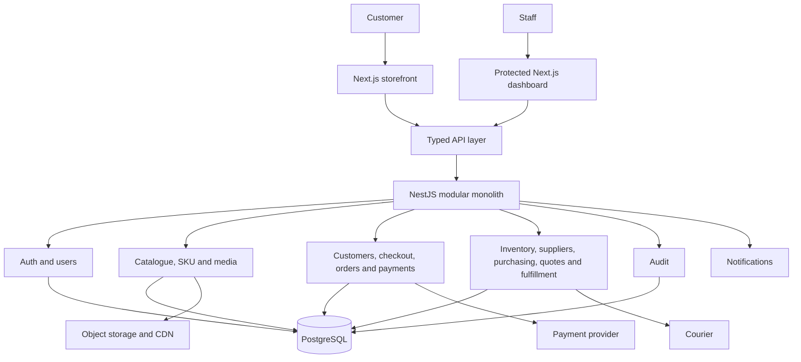

### The gap

| Concern | CURRENT | TARGET | Required bridge |
|---|---|---|---|
| Data access | direct module imports plus partial mock services | typed HTTP adapter | consolidate application/service layer first |
| Product model | flat legacy product; one adapted SKU | Product owns shared content; SKU owns sellable combination | freeze contracts and migrate consumers gradually |
| Cart | browser intent and local estimate | server-resolved cart/checkout preview | keep local identity, replace legacy display resolution |
| Checkout | WhatsApp draft only | validated preview then idempotent order creation | add CheckoutService and OrderService contracts |
| Price/stock | null/unverified frontend values | server-authoritative SKU price and availability | catalogue + inventory transactions |
| Dashboard | public read-only shell | staff-authenticated operational UI | Auth/RBAC before mutations |
| Media | local illustrative assets | verified object-storage assets via CDN | import validation and media metadata |
| Reliability | no transaction/webhook concerns yet | idempotency, ledgers, reconciliation and recovery | tests, observability and operational runbooks |

The safe strategy is incremental replacement, not a frontend rewrite: keep route structure, UI components, URL semantics and SKU cart identity; replace the data owner behind stable interfaces one vertical slice at a time.

# 2. Master development phases

## Dependency map

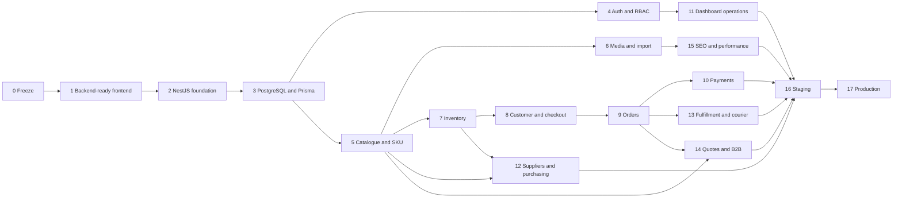

Phases are dependency gates, not permission to build everything simultaneously. A phase may overlap another only when its prerequisites and exit criteria remain independently verifiable.

## Phase 0 — Frontend Freeze · **NEXT**

| Field | Plan |
|---|---|
| Goal / why now | Establish a trusted UI, route, taxonomy and contract baseline before two systems depend on them. |
| Dependencies / architecture | Current frontend only; tag a reviewed baseline and keep App Router/routes/UI intact. |
| Frontend work | Resolve only launch-path regressions; document route smoke matrix, responsive acceptance, public slugs and known limitations. |
| Backend / database | None. Record future assumptions only. |
| Security / tests | `pnpm typecheck`, `pnpm build`, manual route/cart/filter/accessibility smoke; record absence of automated tests. |
| Definition of Done | Checkpoint A passes: accepted core journeys, clean build/typecheck, frozen slugs/contracts and a recoverable Git baseline. |
| Do NOT build yet | NestJS, Prisma, auth, database, real checkout, payment or dashboard mutations. |

## Phase 1 — Backend-Ready Frontend · **NEXT**

| Field | Plan |
|---|---|
| Goal / why now | Make data transport replaceable without redesigning pages. Direct `lib/data.ts` coupling is the immediate integration risk. |
| Dependencies / architecture | Phase 0; `UI → application service → mock/HTTP adapter`; preserve server-first rendering. |
| Frontend work | Freeze domain DTOs, consolidate service consumption route by route, normalize loading/error/empty states, make cart consume contract Product/SKU lines. |
| Backend / database | Define OpenAPI-oriented request/response/error contracts only; no server implementation. |
| Security / tests | Unit tests for filters, money, adapters, cart normalization and URL serialization; contract fixtures reject unsafe/malformed states. |
| Definition of Done | Routes no longer know `lib/data.ts` shape; one adapter switch can move catalogue reads from mock to HTTP; legacy adapter is isolated. |
| Do NOT build yet | Global state rewrite, TanStack Query without HTTP needs, dashboard CRUD or speculative endpoint wrappers. |

## Phase 2 — NestJS Foundation · **LATER**

| Field | Plan |
|---|---|
| Goal / why now | Create one production-shaped API host after the frontend contract is stable. |
| Dependencies / architecture | Phase 1; modular monolith with versioned REST boundary, validated config, structured errors and request IDs. |
| Frontend work | Add environment-selected HTTP adapter and retain mock adapter; no visual changes. |
| Backend work | Bootstrap modules, config validation, global validation pipe, exception filter, logging, `/health/live`, `/health/ready`, OpenAPI and test harness. |
| Database | No business tables yet; connectivity may be proven with a disposable health dependency after Phase 3. |
| Security / tests | Secure headers, strict CORS plan, payload limits; unit/bootstrap/health/error-envelope tests. |
| Definition of Done | API builds/tests, health and error formats are stable, logs carry request IDs, and a sample typed read works from staging frontend. |
| Do NOT build yet | Business CRUD, microservices, queues everywhere, payment or auth shortcuts. |

## Phase 3 — PostgreSQL + Prisma · **LATER**

| Field | Plan |
|---|---|
| Goal / why now | Establish durable relational truth and migration discipline before real domain records. |
| Dependencies / architecture | Phase 2 plus approved conceptual model; managed PostgreSQL and Prisma repository boundary. |
| Frontend work | None beyond stable contracts. |
| Backend work | Prisma client lifecycle, transaction helper, repository boundaries, seed strategy and migration command policy. |
| Database work | Initial identity/audit foundations, constraints/index conventions, migration history, backup and restore rehearsal. |
| Security / tests | Least-privilege DB users, TLS, secrets outside Git; migration tests on empty and production-shaped data. |
| Definition of Done | Forward migration and tested restore succeed in non-production; schema version and readiness checks are observable. |
| Do NOT build yet | Destructive production migrations, direct Prisma calls from controllers, generic repository framework or data warehouse. |

## Phase 4 — Auth + RBAC · **LATER**

| Field | Plan |
|---|---|
| Goal / why now | Protect staff data and commands before the dashboard becomes operational. |
| Dependencies / architecture | Phases 2–3; secure staff session, granular permissions, guards and audit events. |
| Frontend work | Login/logout/session-expired UI, server-side dashboard session check, permission-aware presentation and forbidden states. |
| Backend work | Users, roles, permissions, sessions, password hashing, guards, login/logout/refresh/reset policy and audit integration. |
| Database work | User, Role, Permission, joins and hashed/rotatable Session records. |
| Security / tests | Argon2id, HttpOnly Secure cookies, CSRF strategy, rate limits, revocation; full allow/deny matrix tests. |
| Definition of Done | Anonymous/expired/forbidden access fails safely; both initial roles pass endpoint-level authorization tests; actions are attributable. |
| Do NOT build yet | Customer social login, SSO, UI-only authorization or secrets in `NEXT_PUBLIC_*`. |

## Phase 5 — Catalogue + Product/SKU · **LATER**

| Field | Plan |
|---|---|
| Goal / why now | Create verified product identity before stock, orders or purchasing reference it. |
| Dependencies / architecture | Phases 3–4; Product shared content, SKU sellable variant, stable category/brand relations. |
| Frontend work | HTTP catalogue reads, true SKU selection, accurate price/availability states and controlled admin catalogue forms. |
| Backend work | Category, brand, product and SKU read/write services; slug history; publish workflow; permission and audit enforcement. |
| Database work | Category, Brand, Product, SKU, AttributeDefinition/Value, price and status constraints/indexes. |
| Security / tests | Validate slugs/SKUs/attributes, sanitize content, authorize publishing; uniqueness, lookup, filter and state-transition tests. |
| Definition of Done | A verified SKU can be created, selected, read publicly and edited with audit history; public URLs remain stable. |
| Do NOT build yet | Inventory claims, vendor marketplace, promotion engine or generalized product information management platform. |

## Phase 6 — Media + Product Import · **LATER**

| Field | Plan |
|---|---|
| Goal / why now | Replace illustrative assets and manual mock rows with a repeatable verified onboarding pipeline. |
| Dependencies / architecture | Phase 5; staged import job and object-storage metadata separated from catalogue publishing. |
| Frontend work | Admin dry-run/error report, upload progress, media assignment and exact/illustrative status; storefront uses CDN URLs through `next/image`. |
| Backend work | Signed uploads, file validation, import parser/validator, idempotent import job, media ownership and publish checks. |
| Database work | MediaAsset, ProductMedia/SkuMedia, ImportJob, ImportRowError and source/reference fields. |
| Security / tests | MIME/signature/size limits, private upload path, malware policy, permissions; duplicate SKU/slug, bad file and partial import tests. |
| Definition of Done | First reviewed catalogue imports by dry run, rejects unsafe/invalid rows, maps exact media and publishes only approved records. |
| Do NOT build yet | AI auto-publishing, arbitrary remote-image hotlinking or a full digital asset management system. |

## Phase 7 — Inventory · **LATER**

| Field | Plan |
|---|---|
| Goal / why now | Make SKU availability a transactional source of truth before accepting orders. |
| Dependencies / architecture | Verified SKUs from Phase 5; one logical warehouse initially; immutable movements plus transactionally maintained balances/reservations. |
| Frontend work | Availability states, inventory dashboard read/adjust UI, mandatory reason and conflict feedback. |
| Backend work | Receive, reserve, release, sell, return, damage, adjust and transfer commands with row locking and idempotency. |
| Database work | Warehouse, InventoryBalance, InventoryMovement and InventoryReservation with non-negative invariants and reference keys. |
| Security / tests | `inventory.adjust` permission, large-adjustment policy and audit; final-unit concurrency, expiry, cancellation and retry tests. |
| Definition of Done | Concurrent requests cannot oversell; every balance change has a reason/reference; reconciliation detects drift. |
| Do NOT build yet | Multiple active warehouses, forecasting, barcode hardware integration or automated replenishment. |

## Phase 8 — Customer + Checkout · **LATER**

| Field | Plan |
|---|---|
| Goal / why now | Convert browser cart intent into a server-validated commercial preview without yet trusting the browser. |
| Dependencies / architecture | Catalogue, pricing and inventory reads; guest-first customer/contact model; server checkout calculation. |
| Frontend work | Replace WhatsApp-only checkout with API preview while retaining WhatsApp help; validation, stale-line and delivery error states. |
| Backend work | Customer/address validation, cart resolution, price/stock/shipping/tax preview and expiring preview token/version. |
| Database work | Customer and Address; optional CheckoutSession/Preview record only if required for consistency/audit. |
| Security / tests | Data minimization, field/rate limits, privacy policy; invalid contact, stale SKU/price/stock and replay/expiry tests. |
| Definition of Done | Given only SKU IDs, quantities and delivery intent, the server returns a reproducible authoritative preview or explicit correction. |
| Do NOT build yet | Mandatory customer accounts, saved cards, loyalty, advanced tax engine or client-authoritative totals. |

## Phase 9 — Orders · **LATER**

| Field | Plan |
|---|---|
| Goal / why now | Persist accepted intent and reserve stock exactly once. |
| Dependencies / architecture | Phase 8 preview contract and Phase 7 reservation transaction; Order aggregate with separate status histories. |
| Frontend work | Submit with idempotency key, confirmation/retry-safe UI, order reference and honest pending states. |
| Backend work | Validate preview, snapshot SKU/name/price/tax/shipping, create order/items, reserve stock and write outbox/audit in one transaction. |
| Database work | Order, OrderItem, OrderStatusHistory, IdempotencyRecord and OutboxEvent; unique public order number. |
| Security / tests | Customer/staff ownership checks; duplicate submit, last-unit race, rollback, cancellation/release and invalid transition tests. |
| Definition of Done | Identical retries return one order; failure leaves neither orphan order nor leaked reservation; cancellation releases safely. |
| Do NOT build yet | Marketplace split orders, complex promotions, subscription orders or payment-dependent fulfillment shortcuts. |

## Phase 10 — Payments · **LATER**

| Field | Plan |
|---|---|
| Goal / why now | Add provider-neutral money handling only after order identity and stock safety exist. |
| Dependencies / architecture | Stable order/payment state contracts; PaymentAttempt + immutable provider events + reconciliation. |
| Frontend work | Choose COD/online where allowed, redirect/return presentation and pending/failure recovery; never assert payment from redirect. |
| Backend work | Provider adapter, initiate payment, signature verification, idempotent webhook inbox, refund commands and reconciliation jobs. |
| Database work | Payment, PaymentAttempt, PaymentEvent, Refund and reconciliation references/unique provider IDs. |
| Security / tests | Secrets server-only, signed callbacks, amount/currency/order verification; duplicate/out-of-order/forged webhook and partial-refund tests. |
| Definition of Done | Provider ledger, internal payment state and order state reconcile; retries cannot double charge/refund; COD policy is explicit. |
| Do NOT build yet | Multiple gateways, stored card data, custom wallet or treating a success page as proof. |

## Phase 11 — Dashboard Operations · **LATER**

| Field | Plan |
|---|---|
| Goal / why now | Turn the existing shell into a protected operational tool using completed backend capabilities. |
| Dependencies / architecture | RBAC plus catalogue, inventory, order and payment APIs; server-rendered reads with focused client action forms. |
| Frontend work | Replace `OperationUnavailable` one module at a time; reuse current table/filter/pagination/loading/empty/error primitives. |
| Backend work | Task-oriented read models and commands, not generic unrestricted CRUD; optimistic-concurrency/version checks. |
| Database work | Use domain tables/read models; no dashboard-owned duplicate truth. |
| Security / tests | Endpoint permissions, reason/confirmation for sensitive actions and audit views; unauthorized, conflict and partial-failure tests. |
| Definition of Done | Staff can complete normal catalogue/inventory/order/payment exceptions with clear ownership and audit evidence. |
| Do NOT build yet | Custom BI platform, configurable workflow engine or exposing raw database editing. |

## Phase 12 — Suppliers + Purchasing · **LATER**

| Field | Plan |
|---|---|
| Goal / why now | Make replenishment traceable from supplier intent to physical receipt. |
| Dependencies / architecture | SKU catalogue, inventory receipt command and RBAC; PurchaseOrder aggregate with partial receipts. |
| Frontend work | Supplier records, PO create/approve/send/receive views, outstanding quantities and discrepancy states. |
| Backend work | Supplier and PO services, approval transition, goods receipt transaction and PO close rules. |
| Database work | Supplier, SupplierSku, PurchaseOrder, PurchaseOrderItem, GoodsReceipt and ReceiptItem. |
| Security / tests | Purchase permissions and approval separation policy; over-receipt, partial receipt, duplicate receipt and cancellation tests. |
| Definition of Done | Every accepted receipt increases stock exactly once and traces to supplier, PO, receiver and discrepancy resolution. |
| Do NOT build yet | Supplier portal, automated forecasting, EDI or full accounts payable ledger. |

## Phase 13 — Fulfillment + Courier · **LATER**

| Field | Plan |
|---|---|
| Goal / why now | Move confirmed orders through pick, pack, ship and delivery with recoverable courier integration. |
| Dependencies / architecture | Safe orders, payment/COD policy and inventory sale transition; provider adapter plus shipment history. |
| Frontend work | Operational queue, pick/pack checks, label/tracking presentation and exception actions; customer tracking view if required. |
| Backend work | Fulfillment state machine, shipment/parcel creation, courier webhook polling, cancellation/return hooks and outbox retries. |
| Database work | Fulfillment, Shipment, Parcel, ShipmentEvent and courier reference uniqueness. |
| Security / tests | Address/PII access control and masked logs; duplicate shipment, courier timeout, out-of-order event and return tests. |
| Definition of Done | One order cannot ship twice; tracking events are idempotent; manual fallback and reconciliation work during courier outage. |
| Do NOT build yet | Multi-courier optimizer, route planning or warehouse automation. |

## Phase 14 — Quotes / B2B · **LATER**

| Field | Plan |
|---|---|
| Goal / why now | Turn current WhatsApp/project/wholesale intent into versioned commercial records that can become orders. |
| Dependencies / architecture | Customer, catalogue/SKU and order foundations; Quote aggregate with immutable revisions. |
| Frontend work | Preserve WhatsApp contact, add quote request/status/acceptance UX and staff quote editor using dashboard primitives. |
| Backend work | Project enquiry, price challenge and wholesale intake; quote revision, expiry, approval, acceptance and conversion service. |
| Database work | Quote, QuoteRevision, QuoteItem and QuoteStatusHistory linked to customer and eventual order. |
| Security / tests | Quote ownership, special-price permission and expiring acceptance token; stale revision, expiry and double-conversion tests. |
| Definition of Done | An accepted exact quote version creates at most one order with server-controlled price snapshots and audit trail. |
| Do NOT build yet | Complex B2B credit limits, negotiated price-list engine or sales CRM replacement. |

## Phase 15 — SEO + Performance Hardening · **LATER**

| Field | Plan |
|---|---|
| Goal / why now | Optimize truthful production content and measured runtime behavior after real catalogue/media exist. |
| Dependencies / architecture | Stable production slugs/domain, real media and API caching/invalidation policy. |
| Frontend work | Canonicals/schema/sitemap/redirect history, optimized images/fonts, client-boundary review and measured Three.js loading. |
| Backend work | Cache headers/revalidation events, sitemap-scale data, redirect lookup and indexed catalogue queries. |
| Database work | Slug history plus indexes proven by real query plans; search index only if PostgreSQL evidence is insufficient. |
| Security / tests | Prevent private/draft indexing and schema injection; crawl, structured-data, Web Vitals, bundle and load tests. |
| Definition of Done | Indexing policy is correct and core journeys meet agreed mobile budgets on production-shaped data. |
| Do NOT build yet | AI recommendations, speculative edge stack or external search engine without measured need. |

## Phase 16 — Staging · **LATER**

| Field | Plan |
|---|---|
| Goal / why now | Prove the full system and its recovery procedures without customer risk. |
| Dependencies / architecture | All launch-critical vertical slices, isolated staging DB/storage/provider credentials and CI/CD. |
| Frontend work | Production-mode E2E, accessibility/responsive checks, error paths and release smoke suite. |
| Backend work | Production-shaped deploy, migrations, workers/webhooks, health checks, logs/alerts and runbooks. |
| Database work | Sanitized realistic data, backup/restore rehearsal and migration timing/lock verification. |
| Security / tests | Threat/permission review; final-unit, duplicate checkout/webhook, outage, rollback and reconciliation drills. |
| Definition of Done | Checkpoint I passes with signed business/engineering acceptance, tested rollback and no unresolved P0/P1 launch issue. |
| Do NOT build yet | Production data copies, shared secrets or unreviewed emergency bypasses. |

## Phase 17 — Production · **LATER**

| Field | Plan |
|---|---|
| Goal / why now | Launch only when commerce truth, operations and recovery are demonstrably owned. |
| Dependencies / architecture | Checkpoints A–I, legal/support approval, production domain/secrets/providers and accountable operators. |
| Frontend work | Final domain/analytics/search validation, smoke journey and graceful support/quote fallback. |
| Backend work | Controlled migration/deploy, health/readiness, alerts, reconciliation jobs and on-call/runbook activation. |
| Database work | Verified backup, point-in-time recovery policy, least-privilege production access and migration gate. |
| Security / tests | Production permission/secret/header checks and safe smoke order/refund/reconciliation. |
| Definition of Done | Checkpoint J passes; one real order completes and reconciles; monitoring, support, rollback and restore owners are active. |
| Do NOT build yet | Scale architecture for traffic that does not exist; first operate the modular monolith reliably. |

# 3. Backend-ready frontend

**Priority: NEXT.** This is the only architecture migration that should begin before NestJS exists. It removes transport coupling while preserving the current routes and UI.

## Target frontend boundary

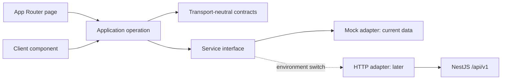

Recommended responsibility—not a required folder rewrite:

| Boundary | Responsibility | Must not contain |
|---|---|---|
| Route/page | await params, metadata, compose screen, choose not-found/error behavior | raw data-array filtering or ad hoc HTTP |
| Application operation | `getCategoryListing`, `getProductDetail`, `getCheckoutPreview` orchestration | JSX, browser storage, NestJS/Prisma types |
| Contract | serialized request/response meaning | React components or database entities |
| Service interface | operations needed by frontend | mock-file assumptions or `fetch` details |
| Mock adapter | translate `lib/data.ts` and legacy Product into contracts | production claims |
| HTTP adapter | encode request, timeout, parse response/error | business price/stock calculation |
| UI component | render contract data and own local interaction | direct database/API policy |

The current `lib/services/` can remain the port location. Add application operations around it rather than making every page aware of adapter selection. Keep mock implementations under `lib/services/mock/` during migration; later place HTTP implementations beside them under an explicit adapter namespace. Do not rename folders merely for theoretical purity.

## Current coupling and removal order

| Existing consumer | CURRENT coupling | Migration action | Order | Why |
|---|---|---|---:|---|
| `app/product/[id]/page.tsx` | `getProduct`, `products`, `relatedProducts` from `lib/data.ts` | product-detail application operation returns product, resolved default/selected SKU, public category and related summaries | 1 | smallest high-value read contract; proves 404/metadata handling |
| `app/category/[slug]/page.tsx` | category/products from `lib/data.ts`; local filter pipeline | catalogue listing operation accepts canonical `CatalogQuery`; mock adapter may reuse pure filters | 2 | proves category, facets, sort and pagination contract |
| `app/search/page.tsx` | `searchProducts` direct | use same catalogue listing operation with `query` | 3 | avoids a second search contract and preserves empty/all/best semantics during transition |
| `app/page.tsx` | `products`, priority and trending selectors | merchandising/home operation returns bounded named collections | 4 | prevents homepage from downloading/filtering whole catalogue |
| `app/sitemap.ts` | `products` direct | SEO catalogue iterator/page API returning published slugs and modification dates | 5 | production sitemap must follow published backend truth |
| `components/cart-provider.tsx` | legacy Product lines; `cartService` only during restore | persist/own `{skuId, quantity}` only; resolve display lines through the application/service contract; remove legacy Product from Context | 6 | identity is already correct; change after read contracts stabilize |
| `app/checkout/page.tsx` | local legacy subtotal/form; no `checkoutService` | consume authoritative preview contract; keep WhatsApp fallback until real order phase | 7 | prevents UI totals becoming order truth |
| dashboard pages | direct `lib/dashboard/catalog-data.ts` projections | first consume unified `DashboardService`; later resource-specific API read models/commands | 8 | operations must wait for auth/RBAC |

After migration, direct `lib/data.ts` imports may remain **only inside the mock/legacy adapter boundary** and any temporary test fixtures. Route pages, components, sitemap and dashboard pages should not import it.

## Service decisions

| Service | CURRENT | NEXT contract | LATER HTTP/backend owner |
|---|---|---|---|
| `CatalogService` | list by query/category plus product/SKU lookup; no adaptive filters/sort contract | accept full `CatalogQuery`; return listing facets and product summaries; explicit get-by-slug and batch SKU resolution | Catalogue/SKU modules |
| `CartService` | resolves local items and computes mock summary | normalize local intent and batch-resolve display lines; no authoritative checkout total claim | may remain frontend application service; catalogue batch-read supplies display |
| `CheckoutService` | preview returns `orderSubmissionAvailable: false` | server-ready preview request/response with version/expiry, line corrections and authoritative totals | Checkout application service across catalogue/inventory/order modules |
| `OrderService` | absent | define `createOrder`, `getOrder`, allowed customer cancellation only when Phase 9 begins | Orders module |
| `DashboardService` | mock overview/readiness, unused by actual dashboard pages | consolidate current read-only views first; keep overview/query read models narrow | per-domain NestJS queries; avoid one dashboard god service |
| `AuthService` | absent | define session view, login/logout and permission result at Phase 4 | Auth/Users modules |

## Contract retention and change

| Existing contract | Decision | Required change before HTTP |
|---|---|---|
| `CurrencyCode = 'BDT'` | **KEEP** initially | expand only after a real multi-currency requirement |
| `Money` | **CHANGE representation** | use integer `amountMinor` plus currency, or an agreed decimal-string policy; never JSON floating calculations without a rule |
| `StockState` / `StockSnapshot` | **EVOLVE** | return `InventoryAvailability` with SKU, warehouse scope, `availableQuantity` nullable, verification/freshness and sellability |
| `PageRequest` / `PaginatedResult<T>` | **KEEP semantics** | enforce server limits; add stable sort and optional `hasNext/hasPrevious`; do not switch to cursor pagination now |
| `Product`, `SKU`, `Variant`, `ProductImage` | **KEEP separation, CHANGE fields** | normalized category/brand/media; SKU owns code/barcode/options/price/cost reference/stock identity/active state |
| `CartItemInput` | **KEEP core exactly** | validate unique SKU IDs and quantity range; batch size limit |
| `CartLine`, `CartSummary` | **CHANGE** | server resolution status, original/requested quantity, corrections, authoritative Money totals only in preview |
| `CheckoutPreview` | **REPLACE demo flag** | preview ID/version, expiry, totals, delivery options, warnings and `canCreateOrder` |
| dashboard contracts | **REWORK gradually** | align page size and readiness definitions; create task/read-model DTOs rather than mirroring tables |

**BUSINESS DECISION REQUIRED:** monetary precision/rounding, tax inclusion, delivery calculation, price validity window, guest versus account checkout, reservation expiry and which quote-only products may coexist with direct-order products.

## CartProvider migration

1. Preserve storage versioning and the persisted `{ skuId, quantity }` format.
2. Change Context lines from `{ legacyProduct, qty, skuId }` to resolved contract lines plus a per-line state: `resolving | valid | changed | unavailable | missing`.
3. Queue/merge user additions while stored lines resolve so an early click cannot be overwritten.
4. Treat header cart count as local intent; label totals as estimates until a server checkout preview arrives.
5. On API failure, retain SKU intent and show retry/offline state; do not delete the cart silently.
6. Add optional cross-tab synchronization only after deterministic merge behavior is tested.
7. Never persist trusted price, stock, discount or payment state.

## Loading, error and empty contract

| State | Required behavior |
|---|---|
| Loading | route-level skeleton for navigation; action-level pending state that prevents duplicate submit but preserves context |
| Empty | valid zero-result UI with filters/query preserved; not a 404 |
| Not found | unknown unpublished category/product returns framework `notFound()`/404 |
| Validation | field/filter/SKU corrections with stable machine codes and human message |
| Unauthorized | login/session-expired path; preserve safe return destination |
| Forbidden | 403 explanation; no implication that hiding the control is enforcement |
| Conflict | 409 for stale version/invalid transition/stock conflict; refresh authoritative state |
| Unavailable | 503/timeout with retry and WhatsApp/contact fallback where appropriate |
| Unexpected | request ID shown to user/support; structured server log, no sensitive detail |

## Before NestJS integration is allowed

- Product/SKU/category/query/pagination/Money/error contracts are versioned and reviewed.
- Product, category and search pages read through one application/service path using mock data.
- Contract fixtures cover null price, unknown stock, multiple SKUs, unpublished product and empty facets.
- Cart context no longer requires the legacy Product shape.
- Dashboard uses one readiness definition and one pagination rule.
- HTTP timeout/error/loading behavior is specified and testable with a fake adapter.
- URL behavior and public slugs remain unchanged.
- The frontend still builds and passes route/cart/filter smoke checks with the mock adapter.

# 4. API and domain contracts

## Contract principles

1. Public REST base: `/api/v1`; breaking changes require a new version or backward-compatible rollout.
2. The API exposes DTOs, never Prisma models directly.
3. Request DTOs contain identity and intent; responses contain authoritative calculated state.
4. Internal IDs are immutable opaque UUID/ULID-style values. Slugs and public order numbers are separate human-facing identifiers.
5. Dates are ISO 8601 UTC strings such as `2026-09-09T08:30:00.000Z`; clients format local time.
6. Enums are stable machine values. Unknown future response values must fail visibly or map to a safe unknown state, never to success.
7. Nullable means deliberately absent/unknown. Missing means omitted by that response projection. Do not use `0`, empty string or `false` as unknown.
8. Money uses server-calculated integer minor units and a currency. Database calculations use exact decimal/integer rules, never binary floating point.
9. Page pagination remains because the existing UI exposes pages. Server sets maximum page size and returns totals with a stable tie-break sort.
10. Filter keys and sort values are allow-listed by the catalogue domain. Unknown keys return validation errors or are ignored only under an explicitly documented compatibility policy.

## Proposed contract shapes

| Contract | Required meaning |
|---|---|
| `Product` | immutable ID, stable slug, shared name/description/SEO, brand/category references, shared media, status and SKU summaries |
| `SKU` | immutable ID, unique code, optional barcode, product ID, sellable option combination, active state, media override, current price view and stock identity |
| `Category` | ID, stable slug, name, optional parent, department, path/breadcrumb, active/published state and SEO |
| `CatalogQuery` | `query`, category slug, allow-listed filter map, sort enum, page and bounded page size |
| `Pagination<T>` | items, page, page size, total items/pages and stable applied query/sort metadata |
| `CartLine` | requested SKU/quantity, resolved product/SKU summary, line state and display estimate; never proof of stock reservation |
| `CheckoutPreview` | versioned/expiring authoritative line prices, stock corrections, delivery/tax/discount/total and whether order creation is currently valid |
| `CreateOrderRequest` | preview ID/version, accepted customer/delivery input, payment method intent and idempotency key/header; no trusted total |
| `Order` | internal ID, public number, customer snapshot/reference, immutable item snapshots, separate order/payment/fulfillment statuses, totals and timestamps |
| `InventoryAvailability` | SKU, warehouse scope, sellability, available quantity or null, verification and `checkedAt`; no unrestricted internal ledger details |
| `ApiError` | HTTP status plus machine `code`, safe message, field/details, request ID and optional retry hint |

## Commerce ownership

| Product owns | SKU owns |
|---|---|
| name and marketing identity | one sellable option combination |
| brand and primary category | unique SKU code and optional barcode |
| shared description/specification narrative | normalized variant attribute values |
| SEO title/description and public slug | selling price and cost visibility rules |
| shared media and category relationships | supplier reference(s) and purchasing identity |
| publish lifecycle | inventory identity and active/sellable state |

Example target:

```text
Finolex Cable (Product)
├── 2.5mm² / 3 Core / Red / 100m → SKU FIN-25-3-R-100
└── 4mm² / 3 Core / Red / 100m   → SKU FIN-40-3-R-100
```

The present adapter maps each flat legacy Product to one Product with one default SKU and no variants. Migration should first reproduce that one-to-one mapping in the API. Only reviewed source rows should later be grouped into true parent products; never infer that similarly named legacy rows are variants without catalogue-owner approval.

## Representative JSON 1 — product with SKUs

```json
{
  "id": "prd_01J...",
  "slug": "finolex-cable",
  "name": "Finolex Cable",
  "brand": { "id": "brd_01J...", "name": "Finolex", "slug": "finolex" },
  "category": { "id": "cat_01J...", "name": "Electrical & Wiring", "slug": "electrical-wiring" },
  "status": "ACTIVE",
  "media": [{ "url": "https://cdn.example/products/finolex/main.webp", "alt": "Finolex cable coil", "role": "PRIMARY" }],
  "skus": [
    {
      "id": "sku_01J...",
      "code": "FIN-25-3-R-100",
      "barcode": null,
      "options": { "cable_size_mm2": "2.5", "cores": "3", "colour": "Red", "length_m": "100" },
      "price": { "amountMinor": 1250000, "currency": "BDT" },
      "availability": { "state": "IN_STOCK", "availableQuantity": 8, "checkedAt": "2026-09-09T08:30:00.000Z" },
      "active": true
    }
  ]
}
```

The URL is stable by product slug; cart/order identity is the SKU ID. CDN/domain values above are illustrative target examples, not current configuration.

## Representative JSON 2 — catalogue query and page

```json
{
  "query": {
    "categorySlug": "electrical-wiring",
    "filters": { "cable_size_mm2": ["2.5"], "cores": ["3"] },
    "sort": "PRICE_ASC",
    "page": 2,
    "pageSize": 12
  },
  "result": {
    "items": [],
    "page": 2,
    "pageSize": 12,
    "totalItems": 0,
    "totalPages": 0,
    "facets": []
  }
}
```

The frontend public URL may keep its existing query format. The HTTP adapter translates it into this typed query. Empty results are valid; the route must not become 404.

## Representative JSON 3 — preview then order intent

```json
{
  "preview": {
    "id": "chk_01J...",
    "version": 3,
    "expiresAt": "2026-09-09T08:45:00.000Z",
    "lines": [{ "skuId": "sku_01J...", "quantity": 2, "unitPrice": { "amountMinor": 1250000, "currency": "BDT" } }],
    "subtotal": { "amountMinor": 2500000, "currency": "BDT" },
    "delivery": { "amountMinor": 8000, "currency": "BDT" },
    "total": { "amountMinor": 2508000, "currency": "BDT" },
    "canCreateOrder": true
  },
  "createOrderRequest": {
    "checkoutPreviewId": "chk_01J...",
    "checkoutPreviewVersion": 3,
    "customer": { "name": "Customer Name", "phone": "+8801XXXXXXXXX" },
    "deliveryAddressId": "adr_01J...",
    "paymentMethod": "COD"
  }
}
```

Send the idempotency key in an `Idempotency-Key` header. The request deliberately omits totals. Whether anonymous inline addresses or saved address IDs are accepted is **BUSINESS DECISION REQUIRED**.

## Representative JSON 4 — error envelope

```json
{
  "status": 409,
  "code": "CHECKOUT_PREVIEW_STALE",
  "message": "Price or availability changed. Review the updated checkout.",
  "details": [{ "field": "lines[0].quantity", "code": "AVAILABLE_QUANTITY_CHANGED" }],
  "requestId": "req_01J...",
  "retryable": false
}
```

### Validation layers

| Layer | Validates |
|---|---|
| HTTP DTO/pipe | types, required fields, lengths, formats, enum membership and request size |
| Application service | entity existence, ownership, permissions and use-case preconditions |
| Domain | legal state transitions, price/stock/order invariants and idempotency meaning |
| PostgreSQL | unique keys, foreign keys, check constraints and transaction atomicity |
| Frontend | early usability feedback only; never replaces server validation |

Return 400/422 for malformed input according to one documented convention, 401 for no valid identity, 403 for denied permission, 404 for unavailable public identity, 409 for state/version/idempotency conflict, 429 for limits and 503 for temporary dependency unavailability. Do not expose stack traces, Prisma errors, secrets or internal table names.

# 5. NestJS and database architecture

## Modular monolith layout · **LATER**

```text
repo/
├── app/, components/, lib/       existing Next.js frontend stays in place
└── backend/
    ├── src/
    │   ├── config/
    │   ├── common/
    │   ├── auth/
    │   ├── users/
    │   ├── categories/
    │   ├── brands/
    │   ├── products/
    │   ├── skus/
    │   ├── media/
    │   ├── inventory/
    │   ├── customers/
    │   ├── orders/
    │   ├── payments/
    │   ├── suppliers/
    │   ├── purchases/
    │   ├── quotes/
    │   ├── fulfillment/
    │   └── audit/
    ├── prisma/
    └── test/
```

The frontend should not be moved into a new directory just to look like a monorepo. Add `backend/` alongside it, define root scripts/workspace behavior deliberately, and deploy the two applications separately.

### Module rules

- A **controller** translates HTTP into an authenticated, validated command/query and translates the result into a DTO.
- An **application/domain service** owns use-case sequence, invariants and transaction boundaries.
- A **DTO** is the versioned public API shape, not a Prisma-generated type.
- A **repository/data boundary** expresses domain-specific persistence needs. Do not build a universal generic CRUD repository.
- Cross-module writes happen through an explicit application service or domain event/outbox, not by importing another module’s Prisma table everywhere.
- External payment, courier, notification and storage code sits behind provider interfaces.

| Module | Controller/API | Service and repository responsibility | Permissions | Important side effects |
|---|---|---|---|---|
| Auth | login, logout, refresh/session, reset | credential/session lifecycle; user/session repositories | public login; self logout; admin reset policy | security audit, revoke sessions |
| Users | staff profile and staff administration | users, role bundles and permission assignment | `user.manage`, self read | revoke sessions after disable/critical role change |
| Categories | public tree; protected category commands | hierarchy, slug/history and publish rules | public read; `product.write` for change | revalidate nav/sitemap; audit slug changes |
| Brands | public brand read; protected commands | normalized identity and slug | public read; `product.write` | revalidate catalogue; audit merge/archive |
| Products | public detail/list projections; protected product commands | shared content, category/brand/media relations and publish lifecycle | public published read; `product.read/write` | search/revalidation events; audit publish |
| SKUs | SKU resolution and protected SKU commands | unique code/barcode, option combination, active state and price view | public active read; `product.read/write` | revalidate product/cart; audit price/status |
| Media | signed upload/finalize/read | object metadata, ownership, ordering and lifecycle | `product.write` | storage upload/delete jobs; revalidation |
| Inventory | availability queries and stock commands | balances, reservations, movement ledger, locks and reconciliation | `inventory.read/adjust` | low-stock/reconciliation events; audit adjustments |
| Customers | customer/contact/address APIs | identity merge, contact/address and consent rules | self/assigned read; operational permission | notifications and privacy audit |
| Orders | preview-linked create, read and valid commands | order aggregate, snapshots, idempotency and transitions | customer ownership; `order.read/update/cancel` | reservation, outbox notification, audit |
| Payments | initiate/status/webhook/refund | provider attempts/events, signature result and reconciliation | customer limited read; `refund.approve` | provider calls, order payment transition, audit |
| Suppliers | supplier and supplier-SKU APIs | identity, contacts, terms and purchasing references | `purchase.read/write` | audit sensitive terms/change |
| Purchases | PO/receipt APIs | approval, partial receiving, discrepancies and close rules | `purchase.read/write` plus approval policy | inventory receipt movement, notifications, audit |
| Quotes | enquiry, revisions, accept/convert | versioned quote aggregate, expiry, special price and conversion | customer ownership; `quote.manage` | notification, order creation, audit |
| Fulfillment | pick/pack/ship/tracking commands | fulfillment state, shipments and courier adapter | `order.read/update` or dedicated permission | inventory sale, courier calls, customer notification |
| Audit | protected search/export | append-only actor/action/entity/change records | `audit.read` | archival/retention only; no business write-back |

### What belongs in `common/`

`common/` may contain request-ID middleware, safe error envelope, base validation helpers, authentication decorators/guards infrastructure, pagination primitives, Money serialization, clock/ID abstractions, transaction/outbox infrastructure and generic observability adapters.

It must **not** become a dumping ground for Product/SKU rules, stock calculations, order states, payment logic, supplier DTOs, broad “utils”, shared mutable constants or a service that writes multiple domains. If only one domain understands a rule, keep it in that module.

## Conceptual PostgreSQL model

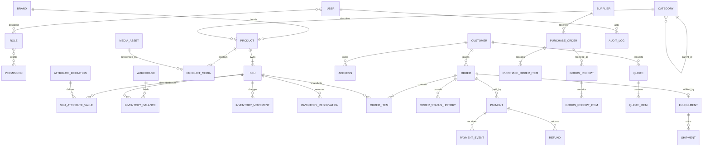

This is conceptual, not a Prisma schema. Names, nullability, deletion rules and state values must be finalized through ADRs and business policy before migration files exist.

## Table design checklist

| Table/group | Responsibility and relationships | Keys / uniqueness | Indexes | Audit requirement |
|---|---|---|---|---|
| `User` | staff identity; joins roles/sessions | PK ID; unique normalized email/phone as chosen | status, normalized login identifier | create/disable/credential and role changes |
| `Role`, `Permission`, joins | named role bundles over granular permissions | unique role code; unique permission code; unique join pairs | role/permission lookup | every assignment/removal with actor |
| `Session` | hashed server session/refresh lifecycle | unique token hash/family; user FK | user+revoked/expiry, expiry cleanup | login, rotation, revoke and suspicious reuse |
| `Category` | hierarchy, department and public slug | PK; unique slug; parent FK; prevent self/cycle in service | parent+sort/status, slug | create/move/archive/slug change |
| `Brand` | normalized brand identity | unique normalized name and slug | name search, active status | merge/archive/rename |
| `Product` | shared content, SEO, brand/category and lifecycle | PK; unique current slug; brand/category FKs; version column | category+status, brand+status, publishedAt | content, category, status and publish changes |
| `ProductSlugHistory` | permanent old-slug redirect lookup | unique old slug; product FK | old slug | append on slug change; never silently reuse |
| `SKU` | sellable option combination | PK; unique normalized code; unique non-null barcode; product FK; version | product+active, code/barcode | price, code, options and active-state changes |
| `AttributeDefinition`, `SkuAttributeValue` | allow-listed typed facet values per SKU/category | unique attribute key; unique SKU+attribute; validated typed value | attribute+normalized value+SKU | definition changes; value changes via product audit |
| `MediaAsset`, `ProductMedia`/`SkuMedia` | object key, dimensions/type/hash and ordered association | unique storage key; unique owner+role+position | owner ordering, checksum | upload/finalize/reassign/delete request |
| `Warehouse` | stock location; start with one active row | unique code; unique slug/name policy | active status | create/disable; physical address change |
| `InventoryBalance` | transactionally maintained current on-hand/reserved per SKU/location | unique warehouse+SKU; checks `on_hand >= 0`, `reserved >= 0`, `reserved <= on_hand`; version | SKU, warehouse, low-stock query | derived from ledger; direct edits prohibited |
| `InventoryMovement` | immutable on-hand/reserved deltas and reason/reference | PK; unique idempotency/reference key per movement source | SKU+warehouse+time, reference type+ID | append-only actor/system source; compensating rows only |
| `InventoryReservation` | quantity held for order/checkout with lifecycle/expiry | PK; unique active order-line intent as defined; SKU/warehouse/order FKs | active+expiresAt, order, SKU | reserve/release/consume actor/reason |
| `Customer`, `Address` | contact, delivery and consent; orders keep snapshots | customer PK; optional unique verified contact; address FK | normalized phone/email, customer status | merge, consent and sensitive changes |
| `Order` | commercial aggregate and totals | PK; unique public order number; unique accepted idempotency scope; customer FK; version | customer+createdAt, each status+updatedAt | every command/status/total correction |
| `OrderItem` | immutable accepted SKU/name/options/price/tax snapshots | PK; order/SKU FKs; unique order+line sequence | order, SKU for operational lookup | changed only through controlled correction/versioning |
| `OrderStatusHistory` | append-only order/payment/fulfillment transition evidence | PK; order FK; transition sequence | order+createdAt, status | actor, from/to, reason, request ID |
| `Payment`, `PaymentAttempt` | expected amount/method and provider initiation | PK; order FK; unique provider transaction/reference when present | order, payment status+updatedAt | every attempt/status/manual action |
| `PaymentEvent` | immutable verified/unverified provider inbox | unique provider+event ID; payment/order correlation | processedAt/status, provider reference | raw payload protected/redacted; processing result retained |
| `Refund` | requested/approved/provider refund state and amount | PK; unique provider refund ID/idempotency key; payment FK | payment, status+updatedAt | requester, approver, reason and provider outcome |
| `Supplier`, `SupplierSku` | supplier terms/contact and SKU-specific reference/cost/lead time | supplier unique code; unique supplier+supplier SKU reference | active supplier, SKU/supplier lookup | terms, cost and identity changes |
| `PurchaseOrder`, `PurchaseOrderItem` | approved replenishment intent and ordered quantities/cost snapshots | unique PO number; supplier FK; unique line sequence | supplier+createdAt, status+expected date | create/approve/send/cancel/close |
| `GoodsReceipt`, `GoodsReceiptItem` | actual partial/full receipt and accepted/damaged quantities | unique receipt number; optional unique supplier document per supplier; PO FK | PO, receivedAt, SKU | receiver, discrepancy and generated movement IDs |
| `Quote`, `QuoteRevision`, `QuoteItem` | enquiry plus immutable priced revisions and accepted version | unique quote number; unique quote+revision; conversion order unique per accepted revision | customer+createdAt, status+expiry | special price, revision, accept/expire/convert |
| `Fulfillment`, `Shipment`, `ShipmentEvent` | warehouse fulfillment and courier history | one active fulfillment policy per order; unique courier+tracking/event IDs | status queue, tracking, order | pick/pack/ship/cancel/return events |
| `AuditLog` | cross-domain sensitive-action evidence | immutable PK/event ID; actor nullable for system; entity reference | actor+time, entity+time, action+time | append-only; restricted read; retention/export policy |
| `IdempotencyRecord`, `OutboxEvent` | retry safety and reliable post-commit work | unique actor/scope+key; unique event ID | expiry/status/nextAttemptAt | payload redaction, completion/failure history |

### Data rules

- Never hard-delete products/SKUs/categories referenced by commercial records; archive them and preserve historical snapshots.
- Use optimistic versions for staff edits and row locks for contended inventory/order transitions.
- Use PostgreSQL constraints for invariants that must survive every code path.
- Store provider payloads and PII under explicit retention/access/redaction policies.
- Generate public order/PO/quote numbers server-side with uniqueness; do not expose sequential database IDs.
- Keep one default Warehouse initially even though the model is location-aware. Multiple operational warehouses are **NOT NEEDED YET**.

# 6. Inventory, order and payment architecture

## Inventory · **LATER**

Authoritative availability per SKU and warehouse is:

```text
available = on_hand - reserved
```

`InventoryMovement` is the immutable ledger of why balances changed. `InventoryBalance` is a transactionally maintained fast projection. `InventoryReservation` represents a live claim against stock. Never derive operational truth only from frontend display state.

| Movement type | `on_hand` delta | `reserved` delta | Required reference/reason |
|---|---:|---:|---|
| `RECEIPT` | `+quantity` | `0` | goods receipt / approved opening stock |
| `RESERVATION` | `0` | `+quantity` | order/order line and expiry policy |
| `RELEASE` | `0` | `-quantity` | cancelled/expired reservation |
| `SALE` | `-quantity` | `-quantity` | shipment/fulfilled order line |
| `RETURN` | `+quantity` when sellable | `0` | inspected return; damaged returns use another disposition |
| `DAMAGE` | `-quantity` | `0` | damage/write-off approval and reason |
| `ADJUSTMENT` | signed delta | normally `0` | stock count correction; permission and reason |
| `TRANSFER` | source negative + destination positive | policy-specific | paired movement group in one transaction |

`RESERVATION` and `RELEASE` can be represented as reservation lifecycle plus corresponding ledger deltas; choose one canonical write path so the same event cannot update reserved stock twice.

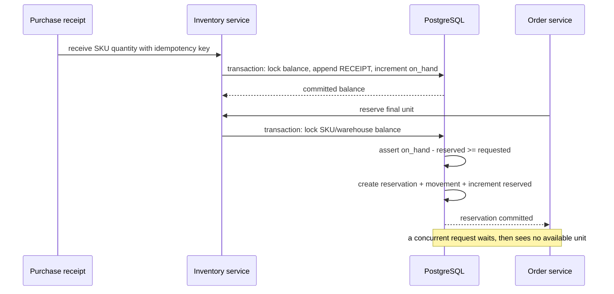

### Concurrency and authorization rules

1. Lock the balance row (`SELECT ... FOR UPDATE` through an explicit repository/transaction abstraction) in a consistent SKU order to reduce deadlocks.
2. Re-read authoritative balance inside the transaction; never rely on a value previously returned to the browser.
3. Assert requested quantity is positive, SKU is active and `available >= requested`.
4. Create reservation/movement and update balance in the same transaction.
5. Use idempotency/reference uniqueness so retry cannot reserve twice.
6. Retry only recognized transient transaction/deadlock failures with bounded attempts.
7. Reservation expiry is a scheduled idempotent release command; the exact duration is **BUSINESS DECISION REQUIRED**.
8. `inventory.adjust` is required for manual adjustments; large/negative adjustments may require Super Admin approval—**BUSINESS DECISION REQUIRED**.
9. Every manual adjustment includes counted value, delta, reason, actor and optional evidence.
10. Reconciliation compares physical count, movement sum and balance projection; corrections are compensating movements, not history edits.

## Orders · **LATER**

```mermaid
flowchart LR
    Cart[Local SKU cart] --> Preview[Authoritative checkout preview]
    Preview --> VS[Validate active SKU]
    VS --> VP[Validate current price]
    VP --> VI[Validate available stock]
    VI --> Create[Create order idempotently]
    Create --> Reserve[Reserve stock atomically]
    Reserve --> Payment[COD approval or online payment]
    Payment --> Confirm[Confirm]
    Confirm --> Fulfill[Pick and pack]
    Fulfill --> Ship[Ship]
    Ship --> Deliver[Deliver]
```

Keep three independent dimensions:

| Dimension | Example candidate states | Owner |
|---|---|---|
| Order status | `DRAFT`, `PENDING_CONFIRMATION`, `CONFIRMED`, `CANCELLED`, `COMPLETED` | Orders |
| Payment status | `UNPAID`, `PENDING`, `AUTHORIZED`, `PAID`, `PARTIALLY_REFUNDED`, `REFUNDED`, `FAILED` | Payments |
| Fulfillment status | `UNFULFILLED`, `PICKING`, `PACKED`, `SHIPPED`, `DELIVERED`, `RETURN_REQUESTED`, `RETURNED` | Fulfillment |

These are proposed names. Final states and allowed transitions are **BUSINESS DECISION REQUIRED**. Do not compress them into one status: a paid order may be unfulfilled, a delivered COD order may await remittance reconciliation, and a return may be received before its refund completes.

### Transition rules

| Command | Valid precondition | Atomic effects | Invalid result |
|---|---|---|---|
| Create order | current accepted preview; active SKUs; stock available | order/items/snapshots + reservations + idempotency record + outbox | 409 with corrected preview/conflict |
| Confirm COD | COD allowed and order pending | order confirmation + operational event | 409 invalid transition |
| Mark paid | verified provider event and exact amount/currency | payment transition + order confirmation policy + outbox | quarantine mismatch; no fulfillment |
| Cancel | policy allows current order/fulfillment/payment state | order status + release reservation + refund request if required | 409 with current state |
| Start fulfillment | confirmed and payment/COD rule satisfied | fulfillment record/transition | 409; never bypass payment policy |
| Ship | packed, not cancelled, reservation valid | SALE movement consumes stock + shipment transition | rollback entire command on failure |
| Complete | delivered and reconciliation policy satisfied | order completion/status history | 409 until required evidence exists |

Order creation requires an idempotency key scoped to the actor/session and operation. Store the request fingerprint and final response. Same key + same fingerprint returns the original response; same key + different fingerprint returns conflict. Never “fix” duplicates by searching similar orders after creation.

Cancellation must know physical and money state. Before shipment it usually releases reservation. After shipment it becomes return/recall policy rather than a simple cancel. Paid cancellation creates a refund workflow; it does not mark money returned before provider confirmation.

## Payments · **LATER**

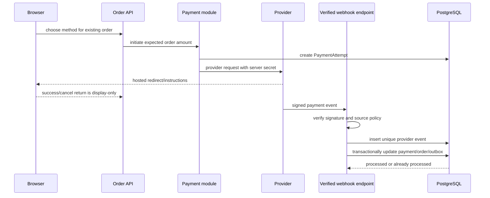

### Provider-neutral rules

- The frontend never verifies payment and never receives provider secrets.
- A browser success redirect is not authoritative; show “verifying payment” until backend state changes.
- The webhook handler verifies signature, provider account, reference, amount and currency before applying a transition.
- Store each provider event under a unique `(provider, eventId)` key. Duplicate delivery returns success without duplicate effects.
- Out-of-order events are stored, then applied only when their transition is valid; otherwise they enter reconciliation review.
- Network timeout after initiation means “unknown”, not “failed”; query/reconcile provider state before retrying a charge.
- Refunds have request, approval, provider-pending, succeeded and failed states. Partial refunds must never exceed captured minus already-refunded amount.
- Daily reconciliation compares expected internal payments/refunds with provider settlement/export and, for COD, courier remittance.

### COD versus online payment

| Concern | COD | Online |
|---|---|---|
| Confirmation | operations/risk policy confirms order | verified provider event confirms money state |
| Stock | reserve before confirmation according to expiry policy | reserve while payment is pending under bounded expiry |
| Failure | rejection/non-delivery and courier return | failed/abandoned attempt, timeout or charge/refund mismatch |
| Reconciliation | courier collection/remittance versus delivered orders | provider transactions/settlements versus Payment ledger |
| Business decisions | allowed locations/values, verification call, return charge | provider, fees, capture timing, timeout, refund policy |

**BUSINESS DECISION REQUIRED:** first payment provider, COD coverage/limits, reservation durations, capture timing, cancellation/refund rules, partial payment support, tax/rounding and who may approve refunds.

# 7. Auth, dashboard and operations

## Staff authentication first · **LATER**

Initial role bundles:

| Role | Scope |
|---|---|
| `SUPER_ADMIN` | all operational permissions plus users/roles, security settings, integrations, audit access and high-risk approvals |
| `OPERATIONS_MANAGER` | catalogue, inventory, customers, orders, quotes, suppliers, purchases, fulfillment and operational reports; no user/role/security/secret management |

Roles are convenience bundles. Endpoints check granular permissions such as:

```text
product.read      product.write
inventory.read    inventory.adjust
order.read        order.update       order.cancel
purchase.read     purchase.write
quote.manage      refund.approve
user.manage       audit.read
```

Add narrower permissions when a real use case requires them; do not encode `if role === ...` throughout domain services.

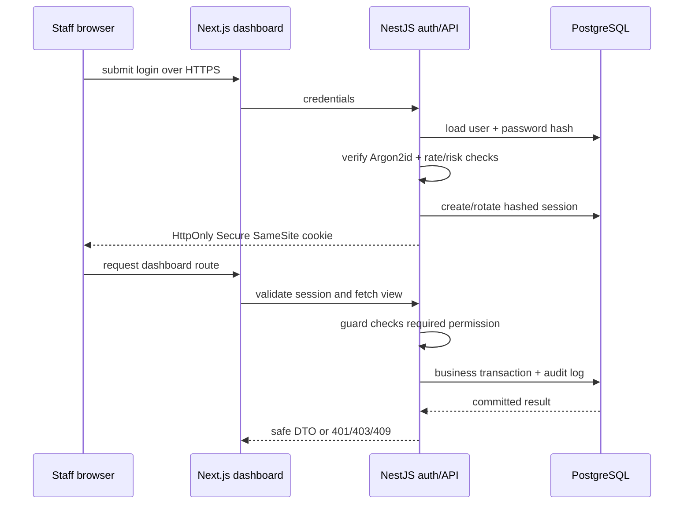

### Session and route protection

- Prefer a revocable server-side opaque session cookie for the initial staff dashboard. A short-lived JWT plus rotated refresh token is acceptable only with equivalent revocation/reuse controls. Final choice is **BUSINESS DECISION REQUIRED**.
- Cookie: `HttpOnly`, `Secure`, deliberate `SameSite`, narrow domain/path where practical, rotation after login/privilege change and server-side expiry/revocation.
- Hash session/refresh tokens at rest. Revoke all relevant sessions when a staff user is disabled or high-risk credentials change.
- Use Argon2id with current reviewed parameters for password hashing. Never encrypt or store plaintext passwords.
- Protect Next.js dashboard routes with a server-side session check for UX and data privacy. Middleware may perform an early optimistic redirect, but the NestJS endpoint remains authoritative.
- Cookie authentication requires a CSRF strategy for mutations; validate Origin/Referer where appropriate and use CSRF tokens/same-site deployment policy.
- Configure credentialed CORS only for exact approved frontend origins and required methods/headers.
- Rate-limit login/reset and sensitive commands more strictly than public catalogue reads.
- Frontend permission-aware hiding improves clarity only. A manually crafted request must still receive 401/403 from NestJS.
- Audit login, logout, failed/rate-limited attempts, session revocation, role changes and every sensitive business command without logging secrets.

## Dashboard module contract

The current `components/dashboard/*` shell, `PageHeader`, `MetricCard`, `FilterBar`, `DataTable`, `StatusBadge`, pagination and loading/empty/error patterns should be reused. Replace each current unavailable/mock page only when its complete read + command + permission + failure workflow exists.

| Page | API and data | Actions | Permission | Query controls | Required states | Audit-sensitive actions |
|---|---|---|---|---|---|---|
| Overview | `GET /dashboard/overview`; operational counts/queues derived server-side | navigate to actionable queues only | permissions filter visible metrics | time/location only when supported | partial dependency, stale timestamp, empty | none unless later quick actions added |
| Products | product/SKU/category/brand list and detail commands | create/edit/archive/publish SKU/product; assign media | `product.read/write` | query, category, status, readiness, page | no products, validation, version conflict, media pending | publish/archive, slug, SKU, price/status changes |
| Inventory | availability, balances, reservations and movement history | approved adjustment; inspect/release stuck reservation through domain command | `inventory.read/adjust` | SKU, warehouse, movement type, date, low stock, page | no balance, conflict, reconciliation drift, dependency outage | every adjustment/release/transfer |
| Orders | order queue/detail/status histories | confirm COD, cancel, progress allowed order actions | `order.read/update/cancel` | number/customer/status/payment/fulfillment/date/page | empty, stale version, stock/payment conflict | cancel, manual status intervention, customer-data access |
| Purchases | suppliers, PO/receipt/discrepancy | create/approve/send/cancel PO; partial receive; close | `purchase.read/write` plus approval rule | supplier/status/expected date/SKU/page | no PO, over-receipt, discrepancy, duplicate receipt | approval, cancellation, receiving, cost correction |
| Suppliers | supplier/contact/terms/SKU associations | create/edit/archive and associate SKU | `purchase.read/write` | query/status/category/page | no supplier, duplicate identity, referenced/archive conflict | terms, cost, identity and archive changes |
| Customers | customer/contact/address/order/quote summary | correct/merge under policy; support notes if approved | operational customer permission, least privilege | query/contact/date/status/page | not found, duplicate candidates, restricted PII | view/export/merge/contact/address changes |
| Quotes | enquiries and versioned quote detail | assign, revise, approve special price, send, expire, accept/convert | `quote.manage`; elevated special-price policy | number/customer/type/status/owner/expiry/page | stale revision, expired, missing SKU, converted | revision, price approval, acceptance/conversion |
| Reports | catalogue, inventory, orders, payments, purchasing reconciliation views | export approved scoped report | domain read permissions; `audit.read` for audit report | date/status/category/location/page; bounded export | delayed/stale data, no results, export pending/failed | sensitive export and reconciliation resolution |
| Settings | safe non-secret integration status and business configuration | update approved settings; rotate credentials through secure process | Super Admin / scoped settings permission | section/query only | invalid config, dependency check failed, secret unavailable | every setting/integration/security change |

### Dashboard interaction rules

1. Reads use server components where practical; client components own tables/forms only where interactive state requires them.
2. Filters/search/page remain in the URL for shareable operational views, excluding secrets/PII that should not appear in URLs.
3. All list APIs return bounded pagination and stable sorting; bulk exports use background jobs after dataset limits justify them.
4. Mutations use explicit verbs—`approve`, `receive`, `adjust`, `cancel`, `refund`—not unrestricted generic “update status”.
5. Send expected entity version for conflicting staff edits and return 409 with current safe state.
6. Loading preserves table/screen context; empty distinguishes “no records” from “no matches”; failures expose retry and request ID.
7. Confirmation is proportional to consequence. Destructive/high-value actions require reason and possibly second permission—not decorative modal spam.
8. Audit logs store server-derived actor and authoritative before/after/reason. Never trust an actor name submitted by the frontend.

## Auth Definition of Done

- Anonymous dashboard/API access fails and reveals no operational data.
- Expired/revoked sessions redirect or return 401 without loops; safe return path works.
- `SUPER_ADMIN` and `OPERATIONS_MANAGER` permission matrices have automated allow/deny tests.
- UI controls match permissions, but endpoint tests prove backend enforcement independently.
- CSRF, CORS, cookie, brute-force and session-rotation checks pass in staging.
- User disable/role change invalidates sessions according to policy.
- Sensitive operations produce queryable audit evidence with request ID.

# 8. Catalogue import, media and B2B

## Real product onboarding · **LATER**

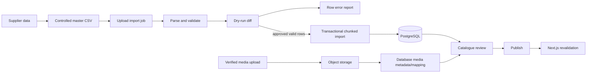

### Import validation

| Concern | Validation / behavior |
|---|---|
| SKU uniqueness | normalize code; reject duplicates within file and database unless explicit idempotent update mode matches identity |
| Slug uniqueness | generate only in preview; reject collision or require reviewed redirect/change plan |
| Category | resolve an existing active category ID/slug; no silent fallback category |
| Brand | resolve normalized existing brand or create only with permission/approved import option |
| Attributes | allow-listed key for category, correct type/unit and complete SKU option combination |
| Price/cost | exact Money policy, non-negative, valid-from/version; cost never exposed publicly |
| Supplier reference | resolve supplier and unique supplier SKU reference where supplied |
| Image references | map only uploaded/finalized asset IDs; reject remote hotlinks, missing keys and unsupported media |
| Publish state | import as draft by default; publish only rows passing mandatory content/media/price/stock policy |
| Identity | distinguish create/update by stable internal/external reference; never fuzzy-match names automatically |

Dry run returns counts and exact row-level errors/warnings: create, update, unchanged, conflict and reject. Approval binds to the input hash and dry-run version so a changed file cannot reuse approval. Import in bounded transactions; retain job, row outcome and actor. A failed row must not leave half-created Product/SKU/media relations.

**BUSINESS DECISION REQUIRED:** mandatory fields by category, whether import may create brands/categories, update versus replace semantics, publish approval, supplier reference authority and initial verified catalogue size.

## Media architecture

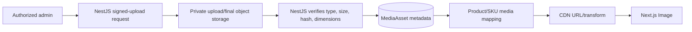

- Store stable object keys, content type, byte size, dimensions, checksum, alt text, source/rights, lifecycle and owner association.
- Validate actual file signature, allowed type, size/dimensions and malware policy; never trust filename/MIME alone.
- Upload through short-lived signed URLs; finalize only after server verification.
- Keep original plus generated delivery variants according to storage/CDN capability. Database stores metadata and stable key, not binary image data.
- Product owns shared media; SKU may override images for visually different options such as colour.
- Deleting an association is different from deleting an object. Reference-check, retention and versioning protect against accidental image loss.
- Current `/public/products/generated/` images remain clearly illustrative until an exact verified asset is approved. Migrate per product; do not bulk relabel placeholders as exact product photography.
- Switch from `images.unoptimized: true` only after verifying Vercel/CDN loader behavior, dimensions, cache headers and mobile bytes.

## Purchasing · **LATER**

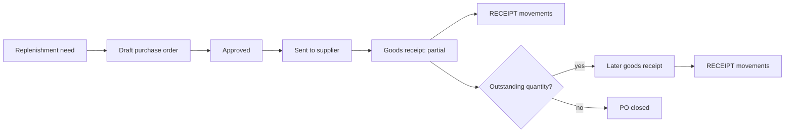

Each PO item snapshots supplier SKU, ordered quantity, unit cost/currency and expected date. A goods receipt records accepted, damaged/rejected and missing quantities. Only accepted sellable quantity creates `RECEIPT` inventory movement; damage/quarantine follows explicit disposition. The PO remains partially received until outstanding quantities are received or cancelled by authorized decision.

Duplicate receipt submission is prevented with a unique idempotency/document reference. Over-receipt is rejected or requires an explicit approval policy. PO approval, cancellation, cost correction, receipt and close are audited.

## Quote and B2B evolution · **LATER**

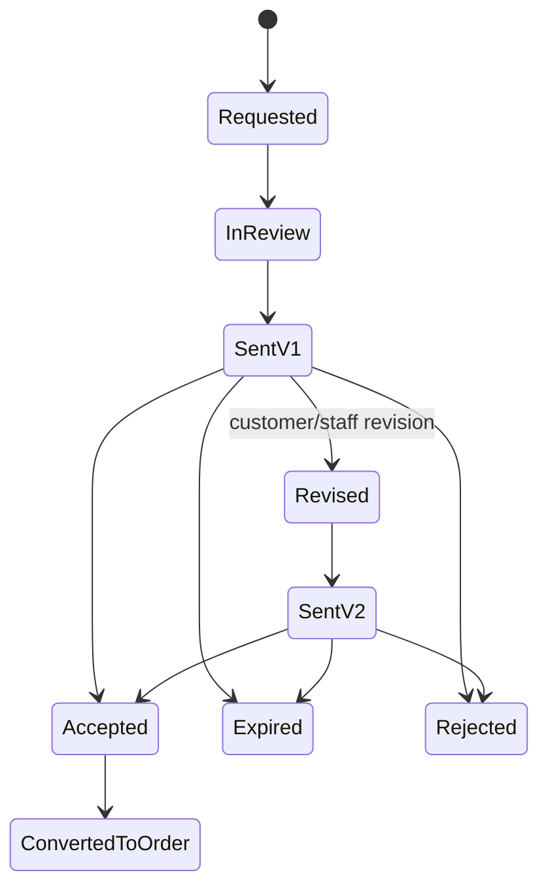

One intake model can represent project enquiry, wholesale, price challenge and staff-created quote while preserving a `type` and original message/source. Quote revisions are immutable: line SKU/description, quantity, agreed price, terms, delivery, tax and expiry belong to the exact revision. Acceptance names the revision; conversion has a unique link so it can create at most one order.

WhatsApp remains a communication channel and may include a quote reference/deep link. It must not become the only record of approval, price, expiry or conversion. Database records become business truth; staff notes distinguish customer-visible content from internal notes.

**BUSINESS DECISION REQUIRED:** who may approve special prices, minimum wholesale rules, quote validity, deposit/credit terms, non-catalogue line policy, customer acceptance method and whether price-challenge requests can become quotes automatically.

# 9. SEO and performance

## SEO production plan

| Timing | Task | Why / verification |
|---|---|---|
| **BEFORE BACKEND** | Preserve current product/category slugs and central navigation mapping | prevents integration-driven URL churn; export a slug inventory and route smoke it |
| **BEFORE BACKEND** | Keep search, cart, checkout, account and dashboard `noindex` | these are private/duplicative/utility states, not durable landing pages |
| **BEFORE BACKEND** | Define filter-indexing policy and canonical rules | current route canonicals are a foundation, not a complete facet SEO strategy |
| **BEFORE BACKEND** | Add unique factual metadata plans for solutions, wholesale and price challenge if they will be indexed | current inherited metadata is too broad; content/intent approval required |
| **AFTER REAL CATALOGUE** | Generate product/category metadata from verified fields with safe fallbacks | validate rendered HTML, not only React source |
| **AFTER REAL CATALOGUE** | Add persistent slug history and permanent redirects | never reuse an old product/category slug for another entity |
| **AFTER REAL CATALOGUE** | Emit Product JSON-LD with truthful Offer only when current server price/availability policy supports it | validate with structured-data tooling; no fake ratings/offers |
| **AFTER REAL CATALOGUE** | Preserve Breadcrumb JSON-LD and meaningful internal links across department/category/product | crawler path must match visible navigation hierarchy |
| **AFTER REAL CATALOGUE** | Use exact image alt, media dimensions and social images | alt describes content; decorative images stay empty-alt |
| **AFTER REAL CATALOGUE** | Build sitemap from published backend records, updated timestamps and bounded chunks if needed | exclude drafts/archived/private/filter/search URLs |
| **BEFORE PRODUCTION** | Set and verify `NEXT_PUBLIC_SITE_URL`, production metadata base and canonical domain | test HTTPS, www/non-www choice and no localhost leakage |
| **BEFORE PRODUCTION** | Verify `robots.txt`, sitemap discovery, canonical/pagination/filter behavior and 404/redirect status codes | crawl staging behind controlled access, then production after release |
| **BEFORE PRODUCTION** | Connect Search Console/analytics under privacy/consent policy | ownership and tracking policy are **BUSINESS DECISION REQUIRED** |
| **BEFORE PRODUCTION** | Create legal, delivery, returns/refunds, privacy and support pages with internal links | these are trust/operation requirements, not keyword filler |

### Filter and pagination policy

- Keep public category URLs stable and human-readable.
- Default recommendation: canonicalize arbitrary multi-facet/filter/sort pages to the base category and keep internal search `noindex,follow`.
- Curate a small set of indexable landing pages only where unique content, demand and inventory justify them; do not index combinatorial filter URLs.
- Page 2+ needs a deliberate policy based on actual rendering/canonical behavior and current search-engine guidance at implementation time. Do not invent `rel=prev/next` as a universal solution.
- Reject/normalize invalid filter values and page numbers consistently to avoid duplicate URL states.
- Slug changes create permanent redirect history and update internal links/sitemap; never rely on a temporary client redirect.

## Performance plan

| Timing | Measure first | Correct action | Tradeoff / stop condition |
|---|---|---|---|
| **DO NOW** | production build output, route JS and browser hydration | keep App Router pages Server Components; prevent service migration from turning route trees client-side | do not add query libraries before HTTP client-state needs exist |
| **DO NOW** | LCP/network bytes on home/gadget pages | compress current large PNGs to reviewed WebP/AVIF or exact optimized assets; keep dimensions/sizes | preserve acceptable product detail; do not process unrelated reference assets |
| **DO NOW** | font request waterfall | replace runtime Google Fonts `@import` with `next/font` or approved self-hosting during a scoped frontend-hardening task | typography may shift; require visual regression check |
| **DO NOW** | WebGL load/CPU/GPU on low-end mobile and reduced motion | retain `ssr:false`, capped DPR and fallback; consider near-viewport/idle loading only if measurement improves experience | delayed hero interaction versus bundle/GPU reduction |
| **DO NOW** | image behavior on selected deployment | decide Next image optimization/CDN loader and remove `unoptimized` only with verified caching/formats | platform cost and transformation ownership |
| **AFTER BACKEND** | API latency, cache hit and freshness requirement per route | cache published category/product reads; use tag/path revalidation after publish/price/media changes | invalidation complexity; never cache staff/private responses publicly |
| **AFTER BACKEND** | query plans for category/filter/SKU/order queues | add indexes matching real predicates and stable sort; prevent N+1 projections | indexes increase writes/storage; keep only measured useful ones |
| **AFTER BACKEND** | request waterfall traces | batch SKU cart resolution and parallelize independent reads; set timeouts/cancellation | large batches need limits; avoid per-card API calls |
| **AFTER BACKEND** | server render/API payload | return summaries for lists and full detail only for product route; paginate at 12 where UI expects it | extra DTO projections but smaller transfer |
| **AFTER REAL TRAFFIC** | search latency/relevance and facet-count cost | tune PostgreSQL full-text/trigram/materialized read models; external search only after thresholds fail | operational complexity of a second index |
| **AFTER REAL TRAFFIC** | bundle analyzer and Web Vitals by route/device | remove proven unused code/deps, split expensive client features and adjust performance budget | no arbitrary dependency purge |
| **AFTER REAL TRAFFIC** | cache churn and content update frequency | tune revalidation/TTL and CDN strategy from evidence | freshness versus origin load |

Suggested initial budgets must be measured and approved rather than copied blindly: define mobile LCP/INP/CLS goals, maximum initial JS by route, maximum hero/product image bytes and API p95 latency in Checkpoint I. Current repository evidence is insufficient to set credible production numbers.

Premature optimization is changing architecture without a measured bottleneck. Correct optimization is: reproduce → measure production-shaped behavior → identify dominant cost → make one reversible change → compare → retain only a meaningful improvement without correctness/accessibility loss.

# 10. Deployment, testing and observability

## Target repository and deployments

```text
repo/
├── app/, components/, lib/, public/   existing Next.js frontend
└── backend/                           future NestJS application
```

Do not relocate the frontend unless tooling later proves a concrete need. Root `pnpm` workspace/scripts may coordinate both packages, but each deployment builds one owned artifact.

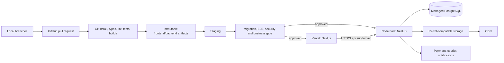

### Environment boundaries

| Variable/secret | Owner | Exposure | Rule |
|---|---|---|---|
| `NEXT_PUBLIC_API_URL` | Next.js | public browser bundle | HTTPS public API base only; environment-specific |
| `NEXT_PUBLIC_SITE_URL` | Next.js | public browser/metadata | canonical site origin; no path/trailing ambiguity |
| session/cookie public settings | frontend/backend | some public, policy-sensitive | same registrable domain strategy reviewed before auth |
| `DATABASE_URL` | NestJS/migration job | secret | server/CI secret manager only; least-privilege users |
| session/JWT/password-reset secrets | NestJS | secret | rotate/version; never Git or frontend |
| payment/courier/webhook credentials | NestJS | secret | separate sandbox/production credentials and access audit |
| object-storage keys | NestJS/worker | secret | least privilege; browser gets short-lived signed operation only |
| logging/error-reporting DSN | each runtime | public or secret by vendor | classify before prefixing `NEXT_PUBLIC_*`; scrub PII |

Never commit `.env*.local`, database/storage credentials, session/JWT keys, provider secrets, admin passwords, private exports, backups or customer data. Provide a safe `.env.example` with names and non-secret descriptions only when implementation starts.

### HTTPS, domains and CORS

- Recommended: storefront `www.<domain>`, API `api.<domain>`, dashboard under the storefront route or a deliberate admin subdomain.
- TLS redirects HTTP to HTTPS; HSTS/security headers are staged carefully.
- NestJS CORS allow-list names exact production/staging origins, required methods/headers and credential policy. Wildcard origin with credentials is invalid and unsafe.
- Cookies across subdomains require deliberate Domain, SameSite, Secure and CSRF design. Test in staging browsers rather than assuming localhost behavior.
- Provider webhooks use dedicated public HTTPS endpoints with signature verification and payload limits; CORS is irrelevant to server-to-server webhooks.

## Migration and rollback policy

1. CI builds/tests code without production secrets.
2. A controlled release job runs reviewed migrations against the target environment with backup/recovery readiness.
3. Prefer expand → deploy compatible code → backfill → verify → contract in a later release.
4. Long locks, table rewrites and destructive changes require staging timing and explicit approval.
5. Application rollback deploys the previous immutable artifact. Database rollback is not assumed safe; migrations need backward-compatible sequencing or a reviewed forward fix.
6. Health/readiness gates prevent traffic before required dependencies/schema are usable.
7. Record release version, migration version, actor, timestamps and rollback decision.

## Health checks

| Check | Meaning | Must not do |
|---|---|---|
| `/health/live` | process/event loop is alive | depend on every external provider |
| `/health/ready` | instance can serve required API work; DB/schema available | expose secrets or expensive deep queries |
| dependency monitors | payment/courier/storage health and latency | automatically declare payments failed on timeout |
| worker/outbox health | queue age, retry/failure backlog | hide poison events in logs only |

## Testing architecture

| Level | Scope | VOLTRONIX examples | Gate |
|---|---|---|---|
| Unit | pure deterministic rules | current filters/serialization, Money arithmetic, SKU option resolution, inventory deltas, state transitions, permission predicates | every PR |
| Component | focused UI behavior | filters/chips, SKU selection, cart feedback, validation and dashboard action states | every frontend PR |
| Integration | NestJS service + real test PostgreSQL | constraints, migrations, repository queries, reservation/order/refund transactions | every backend PR |
| Contract | frontend DTO/HTTP adapter ↔ OpenAPI/Nest responses | product page, catalogue query, error envelope, preview/order response compatibility | every API change |
| E2E | deployed user/staff journey | browse → product/SKU → cart → preview → order; staff receive/adjust/cancel/fulfill | staging/release |
| Operational | failure and recovery | backup restore, rollback, provider timeout, outbox replay, reconciliation | staging/release schedule |

### Mandatory concurrency/idempotency tests

1. **Final stock unit:** start with `on_hand=1, reserved=0`; run two concurrent order reservations for quantity 1. Exactly one succeeds, one receives stock conflict, balance remains valid and one reservation/movement exists.
2. **Duplicate checkout:** submit the same create-order request concurrently with the same idempotency key. Both callers receive the same order identity; one order and one reservation set exist.
3. **Idempotency misuse:** reuse the same key with a different fingerprint. Return conflict; do not mutate the existing order.
4. **Duplicate webhook:** deliver the same signed provider event concurrently/repeatedly. One PaymentEvent/effect exists; all valid retries receive safe acknowledgement.
5. **Out-of-order webhook:** deliver success/refund/failure in unsafe order. Store evidence, apply only legal transition and surface reconciliation work.
6. **Cancellation race:** cancel while fulfillment/payment event arrives. Transaction/version rules produce one valid final state and correct stock/money follow-up.

Tests should assert database rows, balances, histories, outbox/audit events and external adapter call count—not only HTTP status.

## CI/CD gates

```text
install frozen lockfile
→ formatting/lint policy
→ TypeScript builds
→ unit/component tests
→ backend integration + migration tests
→ frontend and backend production builds
→ contract compatibility
→ deploy staging artifacts
→ E2E/concurrency/security smoke
→ explicit production approval
→ deploy + migrate + smoke + observe
```

PRs that change public API or database require the associated contract/migration compatibility evidence. Do not deploy from a developer workstation as the standard production path.

## Observability

| Signal | Required content/use | Alert/reconciliation |
|---|---|---|
| Structured logs | timestamp, level, service/version, environment, request ID, safe actor/entity/event references | no passwords, tokens, full provider secrets or unnecessary PII |
| Request tracing | request ID from Next.js/API through transaction/outbox/provider correlation | surface request ID in safe error UI/support |
| Error reporting | grouped server/client exceptions with release and route | alert on sustained new failures, not every user validation error |
| Uptime/latency | storefront, API liveness/readiness and critical endpoint p95/p99 | environment-specific objectives set before launch |
| Payment reconciliation | internal attempts/events/refunds versus provider settlement | unmatched/amount mismatch/stuck state queue with owner |
| Inventory reconciliation | balance projection versus ledger and physical count | negative/impossible balance and ageing reservation alerts |
| Audit logs | sensitive actor/action/entity/reason/before-after metadata | restricted searchable access and retention policy |
| Backup monitoring | latest successful database/object backup plus restore-test evidence | alert missing/old/failing backup; periodic restore drill |
| Outbox/jobs | queue age, attempts, dead-letter/failed jobs | owned runbook for replay/compensation |

**BUSINESS DECISION REQUIRED:** hosting vendors, regions/data residency, environments, uptime/recovery objectives, log/PII retention, on-call ownership, backup frequency/retention, analytics/consent and production release approvers.

# 11. Failure handling and non-goals

## Failure table

| Failure | Prevention | Detection | Recovery |
|---|---|---|---|
| Backend unavailable | timeouts, health-gated deploy, more than one instance only when justified; frontend graceful boundary | uptime/5xx/latency alerts with request IDs | keep cart intent; show retry and WhatsApp/contact fallback; restore service and reconcile queued work |
| Database unavailable | managed HA option, bounded connection pool/timeouts, readiness check | DB connection/error/replica/space alerts | stop writes safely; no fake success; fail over/provider recovery; verify transactions/outbox after return |
| Stock race | row lock + transaction + constraints + idempotency | reservation conflicts and balance invariant monitor | reject one request with refreshed preview; compensate any detected invalid reservation |
| Duplicate checkout | scoped idempotency key and unique request fingerprint | duplicate-key metrics and one-order assertion | return original order; conflict on changed payload; never create/merge heuristically |
| Payment timeout | durable PaymentAttempt, provider idempotency/reference, unknown state | stuck attempt/reconciliation queue | query provider/reconcile before retry; do not tell customer paid/failed prematurely |
| Duplicate webhook | verify signature then unique provider/event ID and transactional inbox | duplicate event count and processing status | acknowledge stored event without repeating effects |
| Failed migration | reviewed expand/contract migration, staging copy, backup and lock timing | migration job/schema readiness failure | block deployment; roll app back if compatible or apply tested forward fix; restore only by rehearsed decision |
| Bad deployment | CI artifacts, health/readiness, staged rollout and smoke gate | error/latency/health and business KPI alerts | route traffic/deploy previous artifact; retain backward-compatible DB; open incident record |
| Image/CDN outage | durable originals, versioning, multiple delivery variants and local-safe fallback | broken-image synthetic check/CDN errors | serve placeholder/previous cached asset, restore object/CDN, reconcile metadata |
| Bad supplier import | schema validation, input hash, dry run, approval and bounded transactions | row error report, import diff/anomaly metrics | reject/rollback failed chunk, archive job, correct source and rerun idempotently |
| Courier outage | adapter timeout/retry/outbox and manual shipment fallback | provider health, stuck shipment queue | pause duplicate booking, use documented manual provider process, reconcile tracking on recovery |

Every failure needs an owner, alert threshold, customer/staff message and runbook before production. “Retry” is safe only for reads or operations protected by idempotency.

## NOT NEEDED YET

| Deferred capability | Why now | Reconsider when |
|---|---|---|
| Microservices | one team/domain and many cross-domain transactions benefit from one modular monolith | independent teams/scaling/release boundaries are repeatedly blocked and modules are already clean |
| Kafka/event streaming | PostgreSQL transaction + outbox/worker is sufficient for current reliability needs | sustained event volume, multiple independent consumers and replay requirements exceed simpler queue/outbox operation |
| Kubernetes | Vercel + managed Node/DB/storage reduce operational load | multiple services/regions and deployment/auto-scaling needs demonstrably exceed managed platform capabilities |
| GraphQL | REST DTOs match current route/query needs and are simpler to cache/secure | several clients need independently composed graphs and measured over/under-fetching cannot be solved by projections |
| Multiple payment gateways | doubles webhook/reconciliation/failure surface before one flow is reliable | provider downtime/cost/coverage creates a measured business need and first gateway is well reconciled |
| AI recommendations | no trustworthy behavior/order catalogue exists | sufficient consented interaction/order data and an experiment can prove value without harming relevance/privacy |
| Complex loyalty | core order/refund/accounting rules are not yet stable | repeat-customer economics and policy justify a liability-aware points ledger |
| Multi-vendor architecture | VOLTRONIX is not currently a vendor marketplace | legal/commission/payout/catalogue ownership model is approved and vendor scale requires it |
| Multiple warehouses | one default warehouse covers initial truth while schema remains location-aware | physical operations use more locations and allocation/transfer needs are real |
| Custom full accounting ledger | payments/purchases need reconciliation, not a home-grown accounting product | accountant-approved requirements cannot be met through exports/integration to established accounting software |
| Native apps | responsive web covers discovery and operations sooner | proven repeat use/offline/device capability has measurable ROI and API/security are mature |

Also defer custom search infrastructure, workflow engines, advanced promotions and data warehouses until PostgreSQL queries/read models and basic operational reporting are measured under real load.

# 12. Exact implementation plan

| # | Precondition | Task | Output | Verification | Do not proceed until… |
|---:|---|---|---|---|---|
| 1 | current working tree understood | Freeze frontend routes, taxonomy, responsive buying/quote path and known limitations; create reviewed Git baseline | accepted frontend baseline and route smoke matrix | category/search/product/cart/checkout/dashboard smoke; `pnpm typecheck`; `pnpm build`; Git baseline review | build/typecheck pass, stakeholders accept UX/slugs and no unresolved blocker is hidden |
| 2 | Step 1 | Freeze Product/SKU/Category/CatalogQuery/Pagination/Money/Cart/Checkout/Order/ApiError contracts and business-decision register | versioned contract specification and fixtures | review null/unknown/multiple-SKU/status/date/Money/error examples; stakeholder sign-off | price precision, SKU ownership, URL/filter semantics and checkout authority are unambiguous |
| 3 | Step 2 | Consolidate frontend application/service layer and isolate `lib/data.ts` behind mock adapter | route-facing operations with mock and future HTTP ports | product→category→search→home→sitemap→cart→dashboard unit/contract tests | no route/component imports legacy data directly and mock behavior remains equivalent |
| 4 | Step 3 | Add critical frontend unit/component/contract tests and CI quality scripts | repeatable filter/cart/adapter/URL/error regression suite | clean fresh install; typecheck, tests and production build in CI | the adapter can be swapped without relying only on manual QA |
| 5 | Steps 2–4 | Create NestJS modular-monolith foundation only | `backend/`, config validation, error envelope, request IDs, health, OpenAPI and test harness | backend unit/bootstrap tests; staging frontend reaches sample typed endpoint | foundation has no business shortcuts and deploy/health behavior is stable |
| 6 | Step 5 + approved conceptual model | Add managed PostgreSQL connection and Prisma migration/repository discipline | initial schema foundations, migrations, seed/dev strategy and backup/restore runbook | empty/realistic migration tests, constraints, readiness and restore rehearsal | migration and rollback/forward-fix process is proven outside production |
| 7 | Step 6 | Add staff Auth/RBAC/audit foundation | secure sessions, users/roles/permissions, guards and login UX | allow/deny matrix, CSRF/CORS/rate/session rotation/revocation tests | dashboard and every protected API fail closed for anonymous/forbidden users |
| 8 | Steps 6–7 | Add Category/Brand/Product/SKU APIs and protected catalogue commands | verified domain persistence, publish states and stable slug history | uniqueness, variant resolution, permissions, audit and API contract tests | one real product with multiple reviewed SKUs works end to end in staging |
| 9 | Step 8 + storage choice | Add media pipeline and validated catalogue import; onboard first verified dataset | object storage/CDN metadata, dry-run/error report/import jobs and exact media | bad/duplicate/malicious input, idempotent rerun, publish and broken-media tests | business owner approves imported SKUs, prices/content/media and error report |
| 10 | Steps 3, 8–9 | Switch storefront reads from mock to HTTP adapter; retain rollback switch | real read-only home/category/search/product/sitemap with existing URLs | contract/E2E/SEO/load tests; mock-vs-API route parity; not-found behavior | Checkpoint C passes and legacy adapter is no longer a production runtime dependency |
| 11 | Steps 8–10 | Implement one-warehouse inventory ledger, balance, reservation and reconciliation | authoritative availability and protected inventory commands | final-unit concurrency, duplicate receipt/reservation, expiry/release/adjust/audit tests | Checkpoint E passes; no code path silently overwrites stock |
| 12 | Step 11 + customer/privacy/delivery decisions | Add customer/address and authoritative checkout preview | validated customer intent, SKU/price/stock/delivery/tax preview with expiry/version | stale SKU/price/stock, invalid contact/address, timeout and privacy tests | preview is reproducible from server truth and frontend totals are non-authoritative |
| 13 | Step 12 | Add idempotent order creation/cancellation and reservation transaction | Order/Items/histories/idempotency/outbox plus confirmation UI | duplicate checkout, last-unit race, rollback, cancellation/release and state tests | Checkpoint F passes with exactly-once order identity and correct inventory effects |
| 14 | Steps 7, 10–13 | Connect dashboard catalogue, inventory, customer and order operations vertically | protected operational queues/forms/actions using current primitives | role, empty/loading/error/conflict, audit and task E2E tests | staff can recover normal order/inventory exceptions without raw DB access |
| 15 | Step 13 + provider/COD/refund decisions | Add provider-neutral COD/online payments, webhooks, refunds and reconciliation | Payment/Attempt/Event/Refund services and dashboard payment actions | signed/forged, duplicate/out-of-order/timeout, partial refund and reconciliation tests | Checkpoint G passes; redirect never acts as payment proof |
| 16 | Steps 11 and 14 | Add suppliers, purchase orders and partial goods receipt | supplier/PO/receipt workflow linked to inventory movements | approval, over/partial/duplicate receipt, cancellation, discrepancy and audit tests | one PO can be partially/finally received and reconciled without stock duplication |
| 17 | Steps 13–16 | Add fulfillment/courier adapter and return handoff | pick/pack/ship/deliver histories, shipment events and manual outage path | duplicate booking, courier timeout/out-of-order events, sale movement and return tests | operational owner completes and recovers full shipment lifecycle in staging |
| 18 | Steps 8, 12–14 | Persist project/wholesale/price-challenge requests as versioned quotes and conversion | Quote/Revisions/Items/accept/expiry/one-order conversion; WhatsApp reference retained | stale revision, special-price permission, expiry, duplicate conversion and audit tests | database quote record—not chat—is the accepted commercial truth |
| 19 | real catalogue and all launch-critical paths | Harden SEO/performance/accessibility/observability; execute full staging plan | production-domain metadata/redirects, optimized media/fonts, budgets, alerts, backups and runbooks | crawl/schema/Web Vitals/a11y/security/load/E2E/failure/restore/rollback drills | Checkpoint I passes with no unresolved P0/P1 and business/engineering sign-off |
| 20 | Step 19 + legal/support/on-call approval | Controlled production migration/deploy and small real smoke transaction | monitored production system, verified order/payment/fulfillment/reconciliation and release record | health, smoke, logs, alerts, reconciliation, backup and rollback readiness | Checkpoint J passes; only then expand traffic/catalogue/marketing |

# 13. Checkpoints and decisions

## Measurable checkpoints

| Checkpoint | Exit criteria |
|---|---|
| **A. Frontend Frozen** | core routes/quote path accepted on mobile/desktop; public slugs/taxonomy recorded; typecheck/build and smoke matrix pass; known limitations/debt recorded; reviewed Git baseline exists |
| **B. Backend-Ready Frontend** | route/components no longer import legacy data directly; stable contracts and mock/HTTP ports exist; product/category/search/home/sitemap/cart/dashboard critical tests pass; loading/error/empty behavior is defined |
| **C. Real Read-Only Catalogue** | verified categories/products/SKUs/media are imported; HTTP storefront preserves URLs/filter/page behavior; draft data is private; metadata/sitemap use published truth; rollback to prior adapter/data is tested |
| **D. Protected Admin** | secure staff sessions; two role bundles backed by granular permissions; every protected endpoint has allow/deny tests; CSRF/CORS/rate/revocation work; sensitive actions are audited |
| **E. Inventory Source of Truth** | one-warehouse balances/reservations/movements are authoritative; final-unit race passes; no direct adjustment path; receipt/release/sale/reconciliation and audit work |
| **F. Safe Order Creation** | server preview controls price/stock; idempotent create and atomic reservation pass duplicate/concurrency tests; cancellation releases stock; immutable item snapshots/histories exist |
| **G. Safe Payment** | signed idempotent webhooks, amount/currency verification, COD/online states, refund limits and provider/COD reconciliation pass failure tests; browser redirects are display-only |
| **H. Operational Workflows** | staff can run and recover catalogue, inventory, orders, payment exceptions, purchases/partial receipts, fulfillment/courier and quote conversion with permissions/audit/runbooks |
| **I. Staging Passed** | production-shaped data/infrastructure; CI/deploy/migration/health/log/alert/backups; E2E, accessibility, security, load and failure/rollback/restore drills pass; no open P0/P1 launch issue |
| **J. Production Ready** | legal/support/on-call/business owners approve; production secrets/domain/backups/monitoring are verified; controlled release and one real reconciled smoke transaction pass; rollback owners are ready |

## Architecture Decision Record (ADR) summary

| Decision | Why | Main tradeoff | Revisit when |
|---|---|---|---|
| Next.js App Router | already supports server-first routes, metadata and focused client islands | framework conventions and server/client boundary discipline | a proven framework blocker exists, not preference |
| NestJS modular monolith | clear modules/DI/guards with simple cross-domain transactions for one product/team | one deployment can grow internally complex | modules/teams need independent scale/release and boundaries are already mature |
| PostgreSQL | constraints, joins, exact transactions and locking fit catalogue/inventory/orders/payments | schema/migration/operations discipline required | a specific workload is demonstrably unsuitable, not before |
| Product/SKU separation | shared merchandising differs from sellable price/stock option identity | migration/grouping needs catalogue review | never collapse; extend only for proven bundles/configurators |
| Frontend service abstraction | swaps mock/HTTP without UI rewrite and centralizes errors | extra types/adapters can drift if unused | simplify after legacy adapter disappears, while keeping transport boundary |
| URL-driven filters | shareable, server-renderable and browser-navigation friendly | canonical/index rules and query length need control | private/non-shareable high-frequency UI state appears |
| SKU cart identity | exact sellable unit survives product variants and server resolution | display needs asynchronous resolution | never revert to product-only cart when variants exist |
| Inventory ledger + balance projection | auditable recovery plus fast current availability | more transaction/reconciliation logic than a number field | scale may change projection implementation, not fact history |
| Server-authoritative pricing | prevents stale/tampered client totals | checkout may require reconfirmation on change | never delegate final commercial truth to browser |
| Idempotent orders/payments | retries/timeouts/webhooks are unavoidable | key storage, fingerprint and expiry policy required | semantics may evolve per operation; exactly-once claims remain prohibited |
| Separate frontend/backend deployments | Vercel and Node workloads scale/release independently without moving current frontend | CORS/cookie/version coordination | a single host materially reduces complexity without coupling releases/data secrets |

Create a full ADR before implementing decisions with unresolved business policy, security implications or irreversible data/URL effects.

# 14. Final master plan

## Production architecture

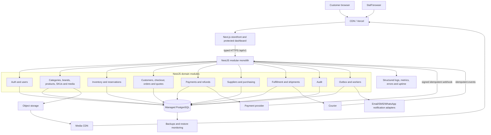

## 1. Top 10 immediate architecture tasks · **NEXT**

1. Accept and tag the frontend freeze baseline after build/typecheck and route smoke.
2. Freeze public category/product slug and redirect policy.
3. Approve Product versus SKU ownership and one-to-many variant examples.
4. Approve Money precision/rounding and null/unknown semantics.
5. Freeze `CatalogQuery`, pagination, facet/sort and `ApiError` contracts.
6. Add application operations above current service interfaces; keep mock adapter.
7. Migrate product detail, then category and search away from direct `lib/data.ts` imports.
8. Migrate homepage/sitemap and consolidate dashboard readiness/service pagination.
9. Change CartProvider domain state to contract SKU lines while preserving versioned `{skuId, quantity}` persistence.
10. Add critical unit/component/contract tests and CI typecheck/build gates before NestJS scaffolding.

## 2. Top 10 dependency rules

1. Freeze behavior and contracts before adding the backend.
2. Product/SKU truth exists before inventory references it.
3. Auth/RBAC/audit exists before dashboard mutations or real staff data.
4. Inventory reservation safety exists before real order creation.
5. Authoritative checkout preview exists before accepting order totals.
6. Idempotent order identity exists before payment initiation.
7. Payment verification/reconciliation exists before automated paid fulfillment.
8. Purchase receiving uses the same inventory movement path as every other stock change.
9. Quote acceptance references an immutable revision before conversion to one order.
10. Production follows staging failure/restore/rollback evidence, not merely a passing build.

## 3. Top 10 mistakes to avoid

1. Rewriting the frontend while changing its data source.
2. Letting route components call arbitrary endpoints or import Prisma types.
3. Treating a Product ID as a sellable SKU identity.
4. Trusting browser price, subtotal, stock, role or payment redirect.
5. Updating stock with a direct number overwrite instead of movement/reservation commands.
6. Creating orders, reservations or webhook effects without idempotency and transactions.
7. Using one status for order, payment and fulfillment.
8. Exposing dashboard data before backend permission checks.
9. Publishing unverified imported products/images or silently fixing duplicate identities.
10. Adding microservices/search/Kubernetes/AI/multi-warehouse complexity before measured need.

## 4. Top 10 decisions you must personally understand

1. Why Product and SKU are separate and how existing flat rows will be grouped.
2. Which categories, slugs and attributes are commercially authoritative.
3. How BDT precision, tax, discount, delivery and rounding work.
4. When price/stock previews expire and when customers must reconfirm.
5. How reservation, release, sale, return, damage and adjustment affect inventory.
6. Legal order/payment/fulfillment/refund transitions and who may trigger them.
7. Exact Super Admin versus Operations Manager permission/approval boundaries.
8. COD, online payment, refund and courier reconciliation ownership.
9. Import, media rights, quote/special-price and supplier purchasing policies.
10. Production security, privacy/legal, monitoring, backup/restore and incident accountability.

## 5. What Codex can safely implement

- Scoped service/application adapters and typed DTOs after contracts are approved.
- Mock-to-HTTP route migrations while preserving public behavior.
- Unit, integration, contract and E2E test scaffolding/cases.
- NestJS module/controller/service/repository scaffolding from approved boundaries.
- Prisma models/migrations only after schema/retention/deletion decisions and migration review.
- Dashboard vertical slices using approved APIs, permissions and existing primitives.
- Import validators, dry-run reports and deterministic media mapping from approved source rules.
- Idempotency, transaction, ledger and state-machine code from approved invariants.
- CI/CD, health, structured logging, monitoring checks and runbook drafts under scoped access.
- SEO/performance implementation after real domain/content and measurable targets exist.

Codex should make small reviewed changes, show exact diffs/tests and stop before destructive migrations, secret handling, production releases or consequential business-state actions unless explicitly authorized.

## 6. BUSINESS DECISION REQUIRED

- Verified initial catalogue, parent-product/SKU grouping, category ownership and mandatory attributes.
- Price/cost source, BDT precision, tax, discounts, delivery fees and price-validity rules.
- Guest versus customer account scope; identity/phone verification and privacy/retention policy.
- Reservation duration, backorder/preorder, out-of-stock and cancellation rules.
- Order, payment, fulfillment, return/refund states and approval thresholds.
- COD limits/areas/verification and first online payment provider/capture/refund policy.
- Super Admin and Operations Manager permission bundles, separation of duties and emergency access.
- Supplier/PO approvals, partial/over receiving, discrepancy and stock-adjustment rules.
- Quote expiry, special-price approval, customer acceptance and non-catalogue line policy.
- Hosting region/vendors, domain/cookie architecture, recovery objectives, legal/support/on-call owners and production launch approval.

The immediate gate is Checkpoint A, then Checkpoint B. No NestJS or Prisma implementation should begin until those two checkpoints make the frontend behavior and contracts stable enough to protect from a two-system rewrite.
